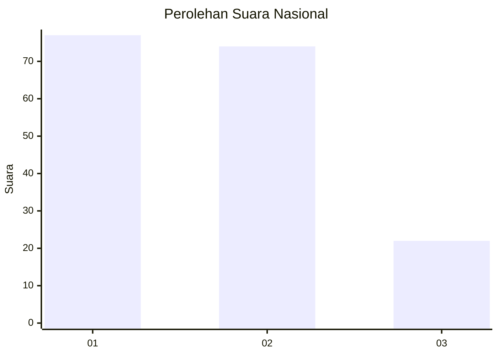
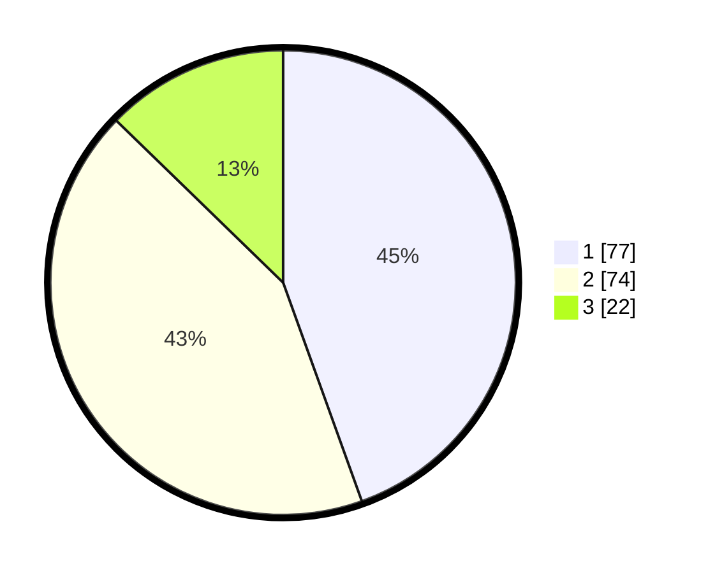

# Hasil

## Grafik

## Tabel

| No.    | Nama Paslon    | Suara | Suara (raw) | Persentase |
|:------ |:-------------- | -----:| -----------:| ----------:|
| 100025 | ANIES MUHAIMIN | 77    | [77][p-1]   | 44,51      |
| 100026 | PRABOWO GIBRAN | 74    | [74][p-2]   | 42,77      |
| 100027 | GANJAR MAHFUD  | 22    | [22][p-3]   | 12,72      |

[p-1]: https://github.com/gigit-pemilu/pemilu-2024/blob/main/pilpres/hitung-suara/sub/31-dki-jakarta/sub/73-jakarta-barat/sub/06-kalideres/sub/1003-tegal-alur/sub/034-tps/sub/paslon-1.txt
[p-2]: https://github.com/gigit-pemilu/pemilu-2024/blob/main/pilpres/hitung-suara/sub/31-dki-jakarta/sub/73-jakarta-barat/sub/06-kalideres/sub/1003-tegal-alur/sub/034-tps/sub/paslon-2.txt
[p-3]: https://github.com/gigit-pemilu/pemilu-2024/blob/main/pilpres/hitung-suara/sub/31-dki-jakarta/sub/73-jakarta-barat/sub/06-kalideres/sub/1003-tegal-alur/sub/034-tps/sub/paslon-3.txt

## Foto C Plano

https://sirekap-obj-formc.kpu.go.id/408b/pemilu/ppwp/31/73/06/10/03/3173061003034-20240214-231939--8b297380-8041-438b-92be-be4a416e8390.jpg

https://sirekap-obj-formc.kpu.go.id/408b/pemilu/ppwp/31/73/06/10/03/3173061003034-20240214-232306--10653289-d898-40d2-b234-a76918009957.jpg

https://sirekap-obj-formc.kpu.go.id/408b/pemilu/ppwp/31/73/06/10/03/3173061003034-20240214-232652--4906a01b-0d3c-44e9-8bcd-82dc4cdfecc8.jpg

## Metadata

| Key        | Value               |
| ---------- | ------------------- |
| Time Stamp | 2024-02-16 16:25:10 |

