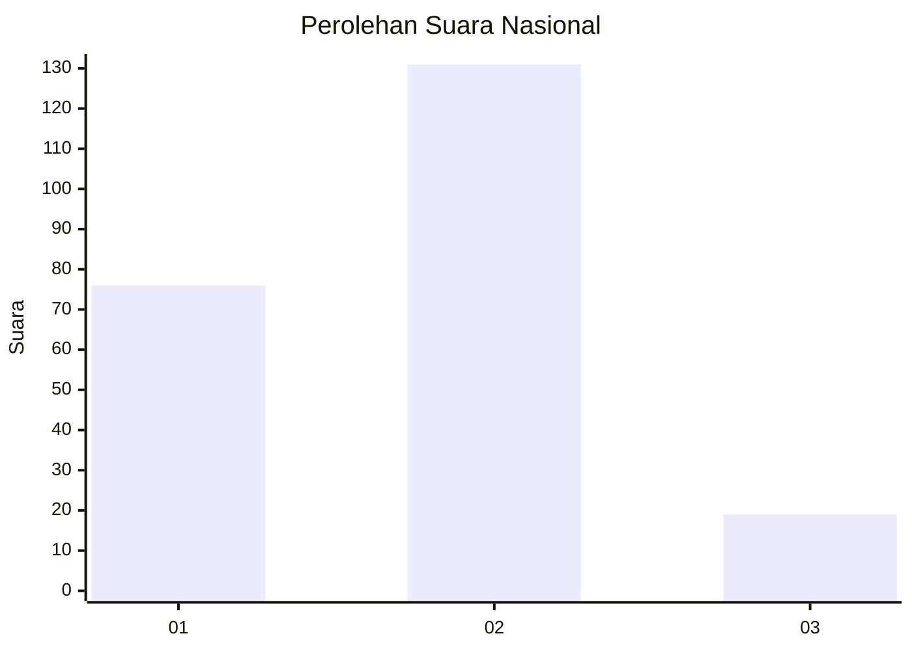
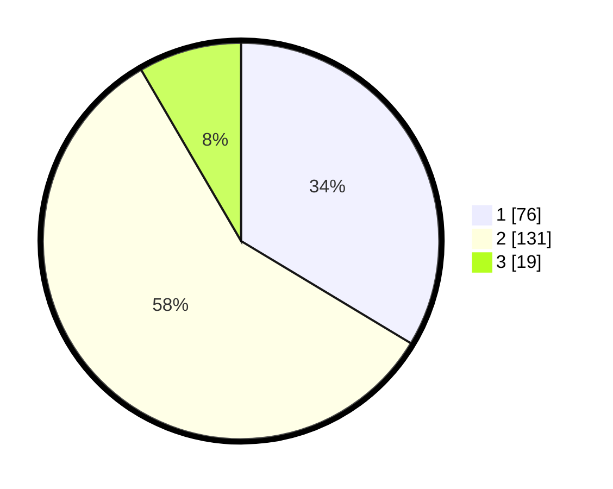

# Hasil

## Grafik

## Tabel

| No.    | Nama Paslon    | Suara | Suara (raw) | Persentase |
|:------ |:-------------- | -----:| -----------:| ----------:|
| 100025 | ANIES MUHAIMIN | 76    | [76][p-1]   | 33,63      |
| 100026 | PRABOWO GIBRAN | 131   | [131][p-2]  | 57,96      |
| 100027 | GANJAR MAHFUD  | 19    | [19][p-3]   | 8,41       |

[p-1]: https://github.com/gigit-pemilu/pemilu-2024/blob/main/pilpres/hitung-suara/sub/31-dki-jakarta/sub/73-jakarta-barat/sub/06-kalideres/sub/1003-tegal-alur/sub/048-tps/sub/paslon-1.txt
[p-2]: https://github.com/gigit-pemilu/pemilu-2024/blob/main/pilpres/hitung-suara/sub/31-dki-jakarta/sub/73-jakarta-barat/sub/06-kalideres/sub/1003-tegal-alur/sub/048-tps/sub/paslon-2.txt
[p-3]: https://github.com/gigit-pemilu/pemilu-2024/blob/main/pilpres/hitung-suara/sub/31-dki-jakarta/sub/73-jakarta-barat/sub/06-kalideres/sub/1003-tegal-alur/sub/048-tps/sub/paslon-3.txt

## Foto C Plano

https://sirekap-obj-formc.kpu.go.id/90a4/pemilu/ppwp/31/73/06/10/03/3173061003048-20240214-205214--11e1b412-b562-4820-b9f0-354e216ec107.jpg

https://sirekap-obj-formc.kpu.go.id/90a4/pemilu/ppwp/31/73/06/10/03/3173061003048-20240214-205338--e591f465-4448-482c-8092-ffdeb27c8a1b.jpg

https://sirekap-obj-formc.kpu.go.id/90a4/pemilu/ppwp/31/73/06/10/03/3173061003048-20240214-205506--8ea73684-c608-458e-9f24-5f5cfdcf354c.jpg

## Metadata

| Key        | Value               |
| ---------- | ------------------- |
| Time Stamp | 2024-02-19 06:16:00 |

