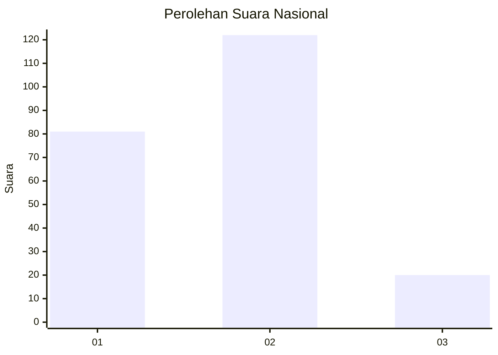

# Hasil

## Grafik

## Tabel

| No.    | Nama Paslon    | Suara | Suara (raw) | Persentase |
|:------ |:-------------- | -----:| -----------:| ----------:|
| 100025 | ANIES MUHAIMIN | 81    | [81][p-1]   | 36,32      |
| 100026 | PRABOWO GIBRAN | 122   | [122][p-2]  | 54,71      |
| 100027 | GANJAR MAHFUD  | 20    | [20][p-3]   | 8,97       |

[p-1]: https://github.com/gigit-pemilu/pemilu-2024/blob/main/pilpres/hitung-suara/sub/31-dki-jakarta/sub/73-jakarta-barat/sub/06-kalideres/sub/1003-tegal-alur/sub/058-tps/sub/paslon-1.txt
[p-2]: https://github.com/gigit-pemilu/pemilu-2024/blob/main/pilpres/hitung-suara/sub/31-dki-jakarta/sub/73-jakarta-barat/sub/06-kalideres/sub/1003-tegal-alur/sub/058-tps/sub/paslon-2.txt
[p-3]: https://github.com/gigit-pemilu/pemilu-2024/blob/main/pilpres/hitung-suara/sub/31-dki-jakarta/sub/73-jakarta-barat/sub/06-kalideres/sub/1003-tegal-alur/sub/058-tps/sub/paslon-3.txt

## Foto C Plano

https://sirekap-obj-formc.kpu.go.id/4be6/pemilu/ppwp/31/73/06/10/03/3173061003058-20240214-215834--b9304cde-dfdf-4e44-ac9c-d4d5128f1383.jpg

https://sirekap-obj-formc.kpu.go.id/4be6/pemilu/ppwp/31/73/06/10/03/3173061003058-20240214-220123--7229c53a-8f22-42d6-8b92-3d603ec3d1a5.jpg

https://sirekap-obj-formc.kpu.go.id/4be6/pemilu/ppwp/31/73/06/10/03/3173061003058-20240214-220214--454c4dc8-e73d-4563-a599-e75f627c8fbc.jpg

## Metadata

| Key        | Value               |
| ---------- | ------------------- |
| Time Stamp | 2024-02-19 06:16:00 |

