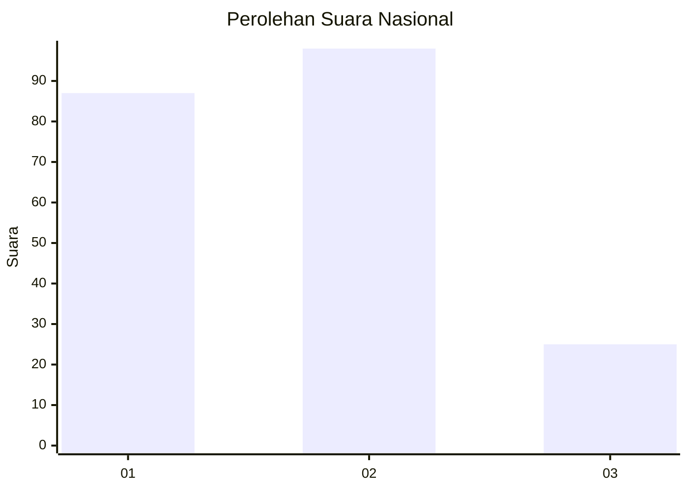
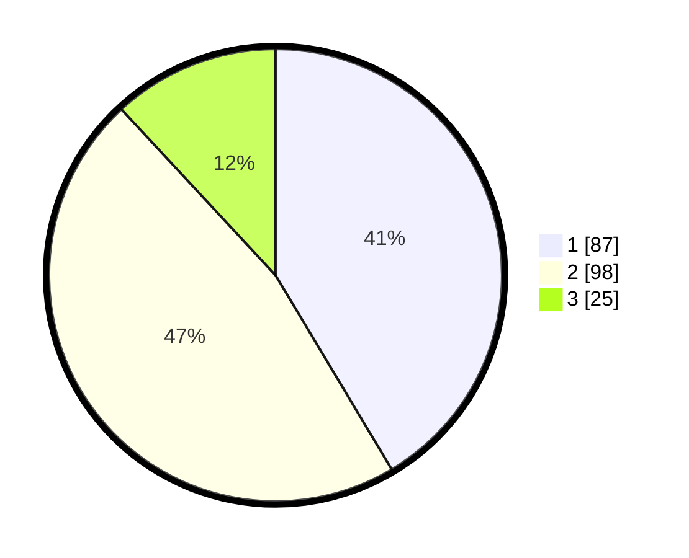

# Hasil

## Grafik

## Tabel

| No.    | Nama Paslon    | Suara | Suara (raw) | Persentase |
|:------ |:-------------- | -----:| -----------:| ----------:|
| 100025 | ANIES MUHAIMIN | 87    | [87][p-1]   | 41,43      |
| 100026 | PRABOWO GIBRAN | 98    | [98][p-2]   | 46,67      |
| 100027 | GANJAR MAHFUD  | 25    | [25][p-3]   | 11,90      |

[p-1]: https://github.com/gigit-pemilu/pemilu-2024/blob/main/pilpres/hitung-suara/sub/31-dki-jakarta/sub/73-jakarta-barat/sub/06-kalideres/sub/1003-tegal-alur/sub/060-tps/sub/paslon-1.txt
[p-2]: https://github.com/gigit-pemilu/pemilu-2024/blob/main/pilpres/hitung-suara/sub/31-dki-jakarta/sub/73-jakarta-barat/sub/06-kalideres/sub/1003-tegal-alur/sub/060-tps/sub/paslon-2.txt
[p-3]: https://github.com/gigit-pemilu/pemilu-2024/blob/main/pilpres/hitung-suara/sub/31-dki-jakarta/sub/73-jakarta-barat/sub/06-kalideres/sub/1003-tegal-alur/sub/060-tps/sub/paslon-3.txt

## Foto C Plano

https://sirekap-obj-formc.kpu.go.id/b2f4/pemilu/ppwp/31/73/06/10/03/3173061003060-20240214-220439--0897da17-5867-42d9-8501-96962a039448.jpg

https://sirekap-obj-formc.kpu.go.id/b2f4/pemilu/ppwp/31/73/06/10/03/3173061003060-20240214-220532--bd08a508-a9ea-4c33-bab8-bec0f759cd0b.jpg

https://sirekap-obj-formc.kpu.go.id/b2f4/pemilu/ppwp/31/73/06/10/03/3173061003060-20240214-220609--d1ff950e-0332-4a32-9d9d-6ca61ba48681.jpg

## Metadata

| Key        | Value               |
| ---------- | ------------------- |
| Time Stamp | 2024-02-16 22:30:00 |

