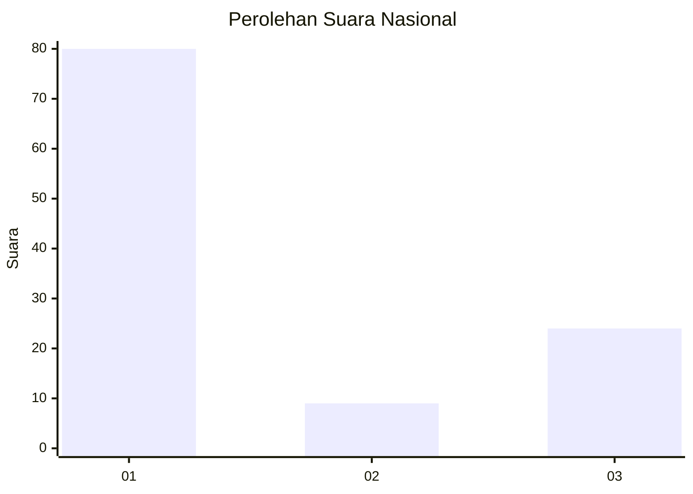
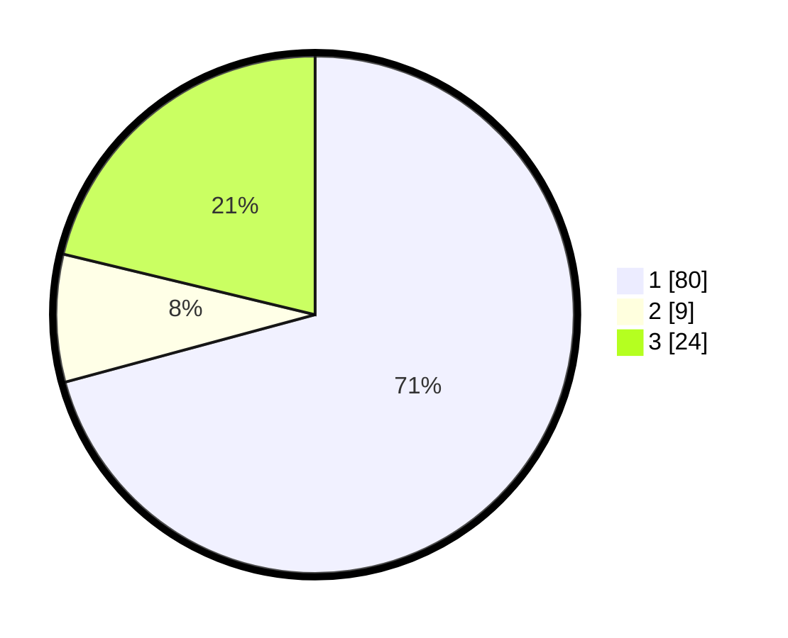

# Hasil

## Grafik

## Tabel

| No. | Nama Paslon    | Suara | Suara (raw) | Persentase |
|:--- |:-------------- | -----:| -----------:| ----------:|
| 1   | ANIES MUHAIMIN | 80    | [80][p-1]   | 70,80      |
| 2   | PRABOWO GIBRAN | 9     | [9][p-2]    | 7,96       |
| 3   | GANJAR MAHFUD  | 24    | [24][p-3]   | 21,24      |

[p-1]: https://github.com/gigit-pemilu/pemilu-2024/blob/main/pilpres/hitung-suara/sub/31-dki-jakarta/sub/73-jakarta-barat/sub/06-kalideres/sub/1003-tegal-alur/sub/076-tps/sub/paslon-1.txt
[p-2]: https://github.com/gigit-pemilu/pemilu-2024/blob/main/pilpres/hitung-suara/sub/31-dki-jakarta/sub/73-jakarta-barat/sub/06-kalideres/sub/1003-tegal-alur/sub/076-tps/sub/paslon-2.txt
[p-3]: https://github.com/gigit-pemilu/pemilu-2024/blob/main/pilpres/hitung-suara/sub/31-dki-jakarta/sub/73-jakarta-barat/sub/06-kalideres/sub/1003-tegal-alur/sub/076-tps/sub/paslon-3.txt

## Foto C Plano

https://sirekap-obj-formc.kpu.go.id/5c52/pemilu/ppwp/31/73/06/10/03/3173061003076-20240214-202815--51a2d49c-3655-4333-89af-b2f219c42c99.jpg

https://sirekap-obj-formc.kpu.go.id/5c52/pemilu/ppwp/31/73/06/10/03/3173061003076-20240214-203237--e1c8beb9-80c5-41f4-b6b8-c7a5f726acaf.jpg

https://sirekap-obj-formc.kpu.go.id/5c52/pemilu/ppwp/31/73/06/10/03/3173061003076-20240214-203401--bc63bfff-3680-4b04-9a5e-665ec153e48a.jpg

## Metadata

| Key        | Value               |
| ---------- | ------------------- |
| Time Stamp | 2024-02-14 21:46:01 |

