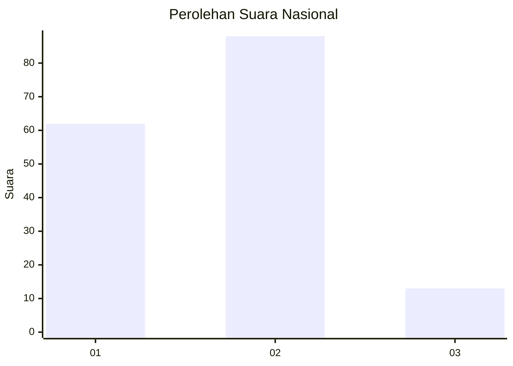
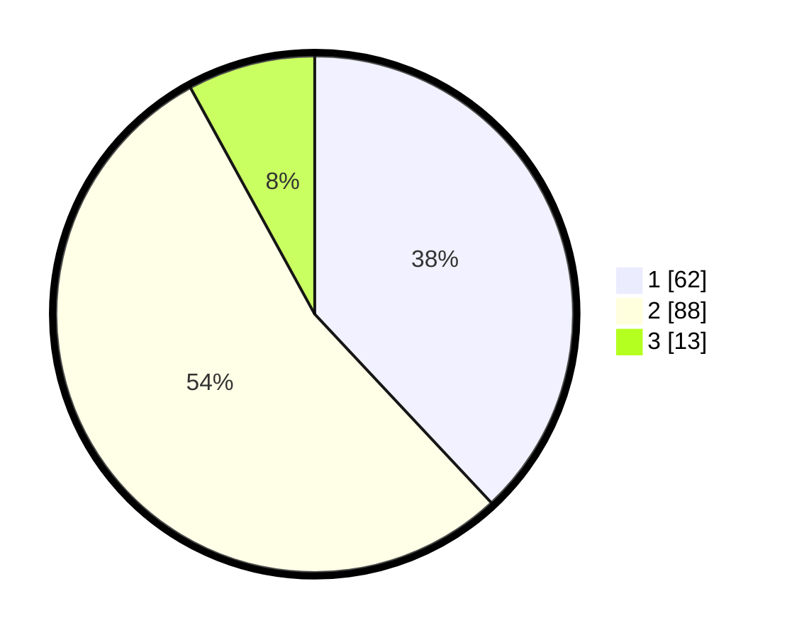

# Hasil

## Grafik

## Tabel

| No.    | Nama Paslon    | Suara | Suara (raw) | Persentase |
|:------ |:-------------- | -----:| -----------:| ----------:|
| 100025 | ANIES MUHAIMIN | 62    | [62][p-1]   | 38,04      |
| 100026 | PRABOWO GIBRAN | 88    | [88][p-2]   | 53,99      |
| 100027 | GANJAR MAHFUD  | 13    | [13][p-3]   | 7,98       |

[p-1]: https://github.com/gigit-pemilu/pemilu-2024/blob/main/pilpres/hitung-suara/sub/31-dki-jakarta/sub/73-jakarta-barat/sub/06-kalideres/sub/1003-tegal-alur/sub/077-tps/sub/paslon-1.txt
[p-2]: https://github.com/gigit-pemilu/pemilu-2024/blob/main/pilpres/hitung-suara/sub/31-dki-jakarta/sub/73-jakarta-barat/sub/06-kalideres/sub/1003-tegal-alur/sub/077-tps/sub/paslon-2.txt
[p-3]: https://github.com/gigit-pemilu/pemilu-2024/blob/main/pilpres/hitung-suara/sub/31-dki-jakarta/sub/73-jakarta-barat/sub/06-kalideres/sub/1003-tegal-alur/sub/077-tps/sub/paslon-3.txt

## Foto C Plano

https://sirekap-obj-formc.kpu.go.id/c399/pemilu/ppwp/31/73/06/10/03/3173061003077-20240214-221305--744eea8d-8efc-434e-908c-d4075b4fe5a6.jpg

https://sirekap-obj-formc.kpu.go.id/c399/pemilu/ppwp/31/73/06/10/03/3173061003077-20240214-221311--37c2bc7b-317b-4aa2-9da1-0c3a602a3dac.jpg

https://sirekap-obj-formc.kpu.go.id/c399/pemilu/ppwp/31/73/06/10/03/3173061003077-20240214-221316--e4384049-25cc-418c-8882-89a86e3e5a17.jpg

## Metadata

| Key        | Value               |
| ---------- | ------------------- |
| Time Stamp | 2024-02-21 17:00:00 |

