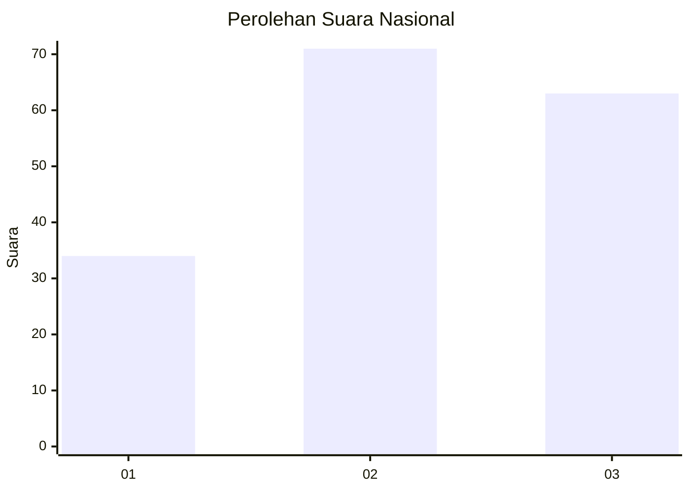
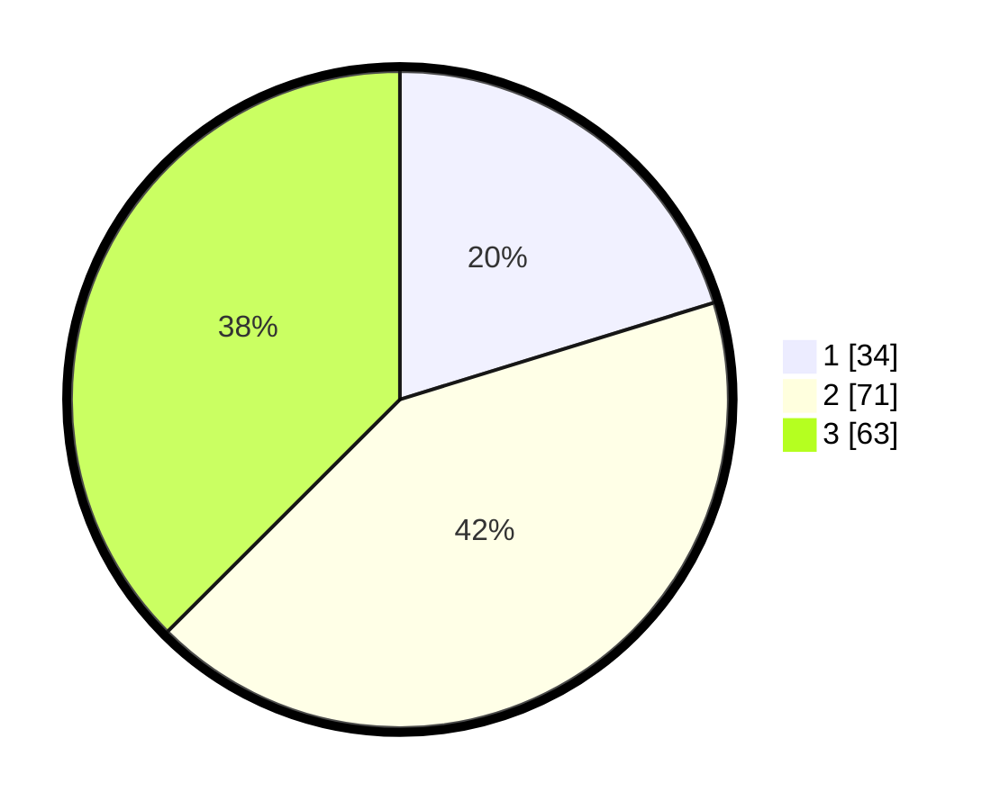

# Hasil

## Grafik

## Tabel

| No.    | Nama Paslon    | Suara | Suara (raw) | Persentase |
|:------ |:-------------- | -----:| -----------:| ----------:|
| 100025 | ANIES MUHAIMIN | 34    | [34][p-1]   | 20,24      |
| 100026 | PRABOWO GIBRAN | 71    | [71][p-2]   | 42,26      |
| 100027 | GANJAR MAHFUD  | 63    | [63][p-3]   | 37,50      |

[p-1]: https://github.com/gigit-pemilu/pemilu-2024/blob/main/pilpres/hitung-suara/sub/31-dki-jakarta/sub/73-jakarta-barat/sub/06-kalideres/sub/1003-tegal-alur/sub/120-tps/sub/paslon-1.txt
[p-2]: https://github.com/gigit-pemilu/pemilu-2024/blob/main/pilpres/hitung-suara/sub/31-dki-jakarta/sub/73-jakarta-barat/sub/06-kalideres/sub/1003-tegal-alur/sub/120-tps/sub/paslon-2.txt
[p-3]: https://github.com/gigit-pemilu/pemilu-2024/blob/main/pilpres/hitung-suara/sub/31-dki-jakarta/sub/73-jakarta-barat/sub/06-kalideres/sub/1003-tegal-alur/sub/120-tps/sub/paslon-3.txt

## Foto C Plano

https://sirekap-obj-formc.kpu.go.id/a05e/pemilu/ppwp/31/73/06/10/03/3173061003120-20240214-230338--d3f1c9d5-2f40-4ec7-ab47-6576df7bdcd0.jpg

https://sirekap-obj-formc.kpu.go.id/a05e/pemilu/ppwp/31/73/06/10/03/3173061003120-20240214-230724--18d78b58-ac34-41b4-8ad5-e97105c0c56c.jpg

https://sirekap-obj-formc.kpu.go.id/a05e/pemilu/ppwp/31/73/06/10/03/3173061003120-20240214-230910--ed45e629-a826-4aff-8875-82241044f5ff.jpg

## Metadata

| Key        | Value               |
| ---------- | ------------------- |
| Time Stamp | 2024-02-19 06:16:00 |

