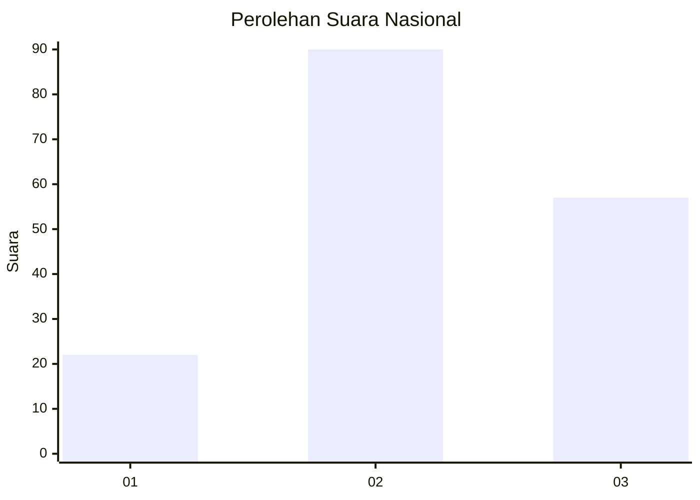
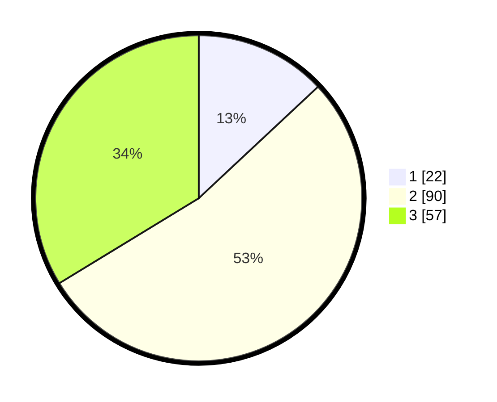

# Hasil

## Grafik

## Tabel

| No.    | Nama Paslon    | Suara | Suara (raw) | Persentase |
|:------ |:-------------- | -----:| -----------:| ----------:|
| 100025 | ANIES MUHAIMIN | 22    | [22][p-1]   | 13,02      |
| 100026 | PRABOWO GIBRAN | 90    | [90][p-2]   | 53,25      |
| 100027 | GANJAR MAHFUD  | 57    | [57][p-3]   | 33,73      |

[p-1]: https://github.com/gigit-pemilu/pemilu-2024/blob/main/pilpres/hitung-suara/sub/31-dki-jakarta/sub/73-jakarta-barat/sub/06-kalideres/sub/1003-tegal-alur/sub/140-tps/sub/paslon-1.txt
[p-2]: https://github.com/gigit-pemilu/pemilu-2024/blob/main/pilpres/hitung-suara/sub/31-dki-jakarta/sub/73-jakarta-barat/sub/06-kalideres/sub/1003-tegal-alur/sub/140-tps/sub/paslon-2.txt
[p-3]: https://github.com/gigit-pemilu/pemilu-2024/blob/main/pilpres/hitung-suara/sub/31-dki-jakarta/sub/73-jakarta-barat/sub/06-kalideres/sub/1003-tegal-alur/sub/140-tps/sub/paslon-3.txt

## Foto C Plano

https://sirekap-obj-formc.kpu.go.id/c5fd/pemilu/ppwp/31/73/06/10/03/3173061003140-20240215-002855--fc7ddcf4-2473-4008-b677-b959132bae17.jpg

https://sirekap-obj-formc.kpu.go.id/c5fd/pemilu/ppwp/31/73/06/10/03/3173061003140-20240214-212812--c12bf487-44c8-42f5-a61c-378e762df4a1.jpg

https://sirekap-obj-formc.kpu.go.id/c5fd/pemilu/ppwp/31/73/06/10/03/3173061003140-20240214-191559--7182ac13-f0e3-4148-ab5f-52d8b27e0dd4.jpg

## Metadata

| Key        | Value               |
| ---------- | ------------------- |
| Time Stamp | 2024-02-16 22:30:00 |

