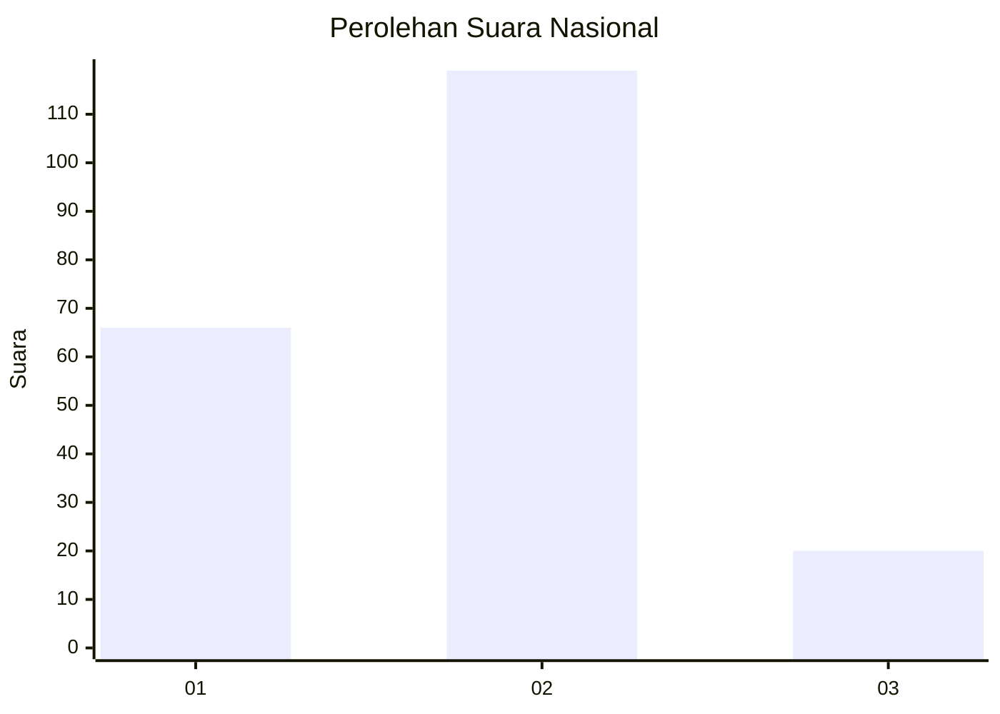
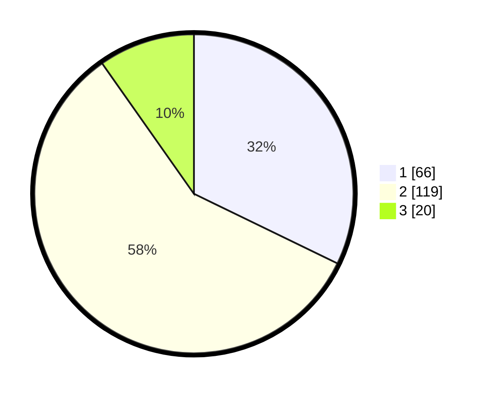

# Hasil

## Grafik

## Tabel

| No.    | Nama Paslon    | Suara | Suara (raw) | Persentase |
|:------ |:-------------- | -----:| -----------:| ----------:|
| 100025 | ANIES MUHAIMIN | 66    | [66][p-1]   | 32,20      |
| 100026 | PRABOWO GIBRAN | 119   | [119][p-2]  | 58,05      |
| 100027 | GANJAR MAHFUD  | 20    | [20][p-3]   | 9,76       |

[p-1]: https://github.com/gigit-pemilu/pemilu-2024/blob/main/pilpres/hitung-suara/sub/31-dki-jakarta/sub/73-jakarta-barat/sub/06-kalideres/sub/1003-tegal-alur/sub/153-tps/sub/paslon-1.txt
[p-2]: https://github.com/gigit-pemilu/pemilu-2024/blob/main/pilpres/hitung-suara/sub/31-dki-jakarta/sub/73-jakarta-barat/sub/06-kalideres/sub/1003-tegal-alur/sub/153-tps/sub/paslon-2.txt
[p-3]: https://github.com/gigit-pemilu/pemilu-2024/blob/main/pilpres/hitung-suara/sub/31-dki-jakarta/sub/73-jakarta-barat/sub/06-kalideres/sub/1003-tegal-alur/sub/153-tps/sub/paslon-3.txt

## Foto C Plano

https://sirekap-obj-formc.kpu.go.id/8fd1/pemilu/ppwp/31/73/06/10/03/3173061003153-20240215-003716--447f6af4-1f5b-4848-a275-b4e7168fba0a.jpg

https://sirekap-obj-formc.kpu.go.id/8fd1/pemilu/ppwp/31/73/06/10/03/3173061003153-20240215-004021--2d9215a2-ab5c-4938-9734-417338dbd7d8.jpg

https://sirekap-obj-formc.kpu.go.id/8fd1/pemilu/ppwp/31/73/06/10/03/3173061003153-20240215-003815--9aabac27-1b14-441c-a5ed-e518ececd2f8.jpg

## Metadata

| Key        | Value               |
| ---------- | ------------------- |
| Time Stamp | 2024-02-16 22:30:00 |

