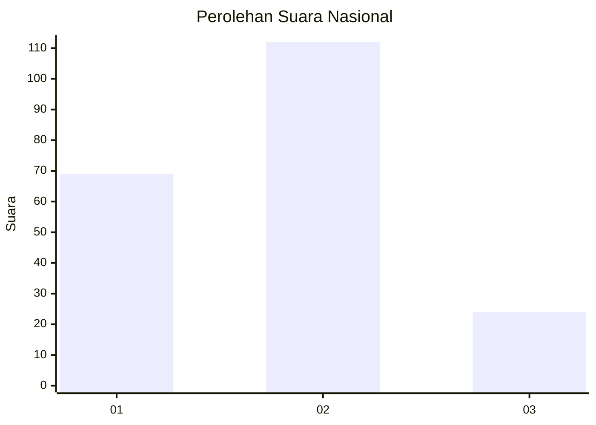
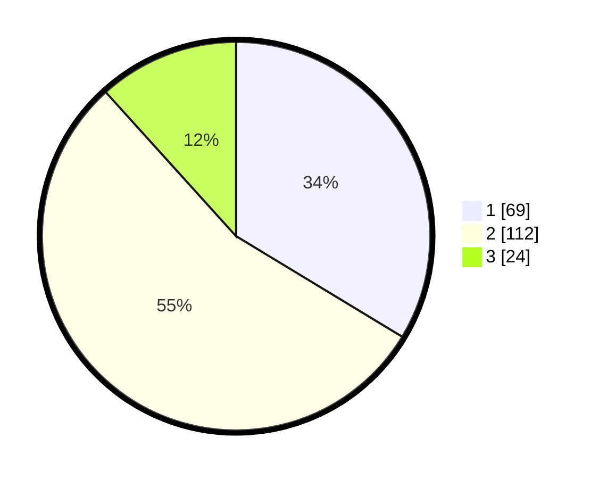

# Hasil

## Grafik

## Tabel

| No.    | Nama Paslon    | Suara | Suara (raw) | Persentase |
|:------ |:-------------- | -----:| -----------:| ----------:|
| 100025 | ANIES MUHAIMIN | 69    | [69][p-1]   | 33,66      |
| 100026 | PRABOWO GIBRAN | 112   | [112][p-2]  | 54,63      |
| 100027 | GANJAR MAHFUD  | 24    | [24][p-3]   | 11,71      |

[p-1]: https://github.com/gigit-pemilu/pemilu-2024/blob/main/pilpres/hitung-suara/sub/31-dki-jakarta/sub/73-jakarta-barat/sub/06-kalideres/sub/1003-tegal-alur/sub/166-tps/sub/paslon-1.txt
[p-2]: https://github.com/gigit-pemilu/pemilu-2024/blob/main/pilpres/hitung-suara/sub/31-dki-jakarta/sub/73-jakarta-barat/sub/06-kalideres/sub/1003-tegal-alur/sub/166-tps/sub/paslon-2.txt
[p-3]: https://github.com/gigit-pemilu/pemilu-2024/blob/main/pilpres/hitung-suara/sub/31-dki-jakarta/sub/73-jakarta-barat/sub/06-kalideres/sub/1003-tegal-alur/sub/166-tps/sub/paslon-3.txt

## Foto C Plano

https://sirekap-obj-formc.kpu.go.id/a615/pemilu/ppwp/31/73/06/10/03/3173061003166-20240214-231850--cbe07c99-7247-446d-8ab5-d0d10d86dd66.jpg

https://sirekap-obj-formc.kpu.go.id/a615/pemilu/ppwp/31/73/06/10/03/3173061003166-20240215-002656--0ce06d80-f8e5-4d73-9fa1-8ed868df43aa.jpg

https://sirekap-obj-formc.kpu.go.id/a615/pemilu/ppwp/31/73/06/10/03/3173061003166-20240214-235419--a40e04af-8c2b-4872-adde-7613b521587c.jpg

## Metadata

| Key        | Value               |
| ---------- | ------------------- |
| Time Stamp | 2024-02-19 06:16:00 |

