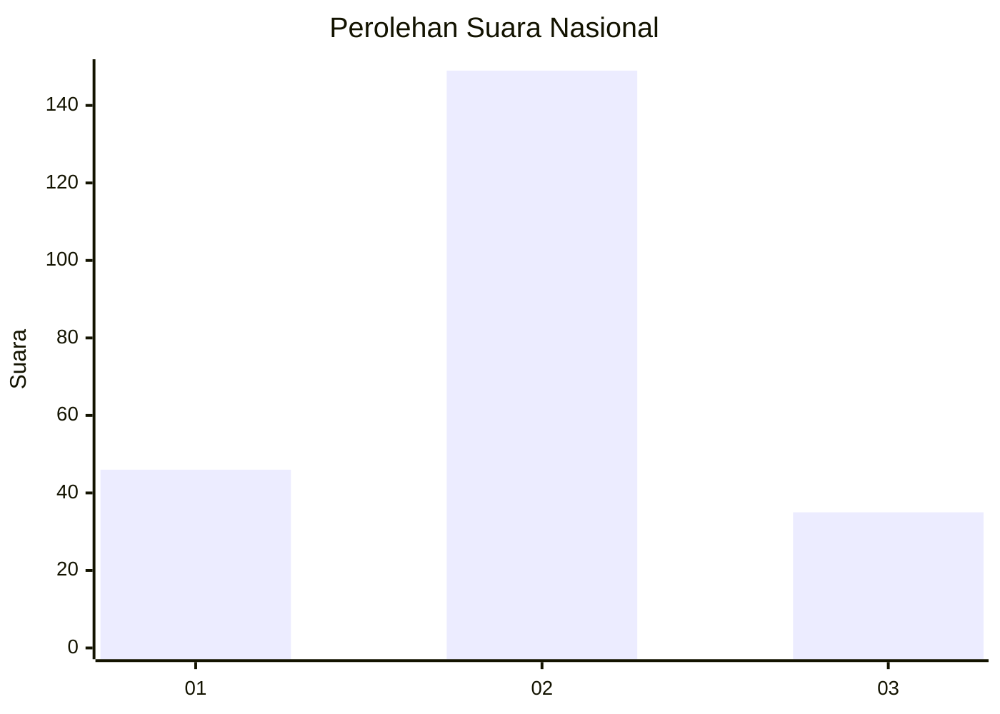
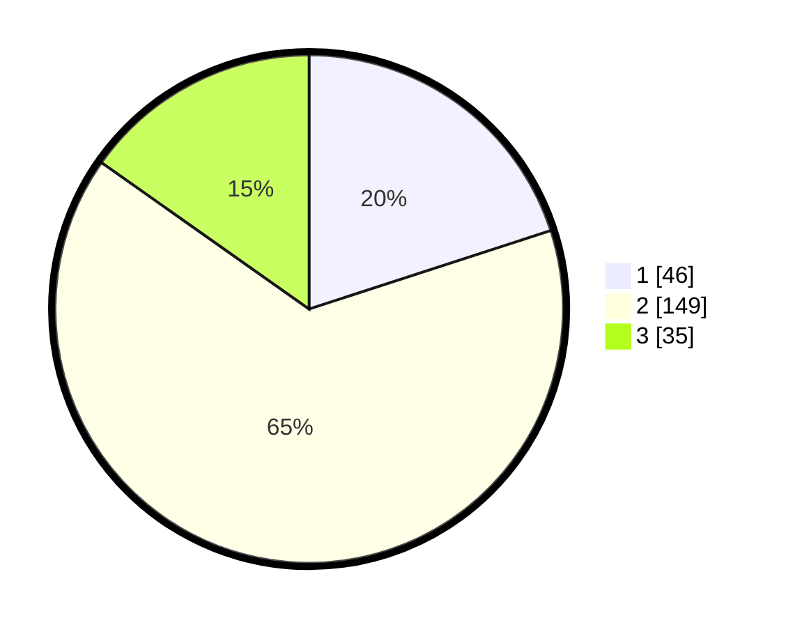

# Hasil

## Grafik

## Tabel

| No.    | Nama Paslon    | Suara | Suara (raw) | Persentase |
|:------ |:-------------- | -----:| -----------:| ----------:|
| 100025 | ANIES MUHAIMIN | 46    | [46][p-1]   | 20,00      |
| 100026 | PRABOWO GIBRAN | 149   | [149][p-2]  | 64,78      |
| 100027 | GANJAR MAHFUD  | 35    | [35][p-3]   | 15,22      |

[p-1]: https://github.com/gigit-pemilu/pemilu-2024/blob/main/pilpres/hitung-suara/sub/31-dki-jakarta/sub/73-jakarta-barat/sub/06-kalideres/sub/1003-tegal-alur/sub/183-tps/sub/paslon-1.txt
[p-2]: https://github.com/gigit-pemilu/pemilu-2024/blob/main/pilpres/hitung-suara/sub/31-dki-jakarta/sub/73-jakarta-barat/sub/06-kalideres/sub/1003-tegal-alur/sub/183-tps/sub/paslon-2.txt
[p-3]: https://github.com/gigit-pemilu/pemilu-2024/blob/main/pilpres/hitung-suara/sub/31-dki-jakarta/sub/73-jakarta-barat/sub/06-kalideres/sub/1003-tegal-alur/sub/183-tps/sub/paslon-3.txt

## Foto C Plano

https://sirekap-obj-formc.kpu.go.id/8ae2/pemilu/ppwp/31/73/06/10/03/3173061003183-20240214-213500--0d5f48ec-51e7-4d84-8ffa-a241ec8d50e0.jpg

https://sirekap-obj-formc.kpu.go.id/8ae2/pemilu/ppwp/31/73/06/10/03/3173061003183-20240214-213723--919c7e4d-179e-4ec4-8141-94ca3873ad6c.jpg

https://sirekap-obj-formc.kpu.go.id/8ae2/pemilu/ppwp/31/73/06/10/03/3173061003183-20240214-213845--ab0e0438-4498-48ea-83b4-937a31fe6e12.jpg

## Metadata

| Key        | Value               |
| ---------- | ------------------- |
| Time Stamp | 2024-02-16 22:30:00 |

