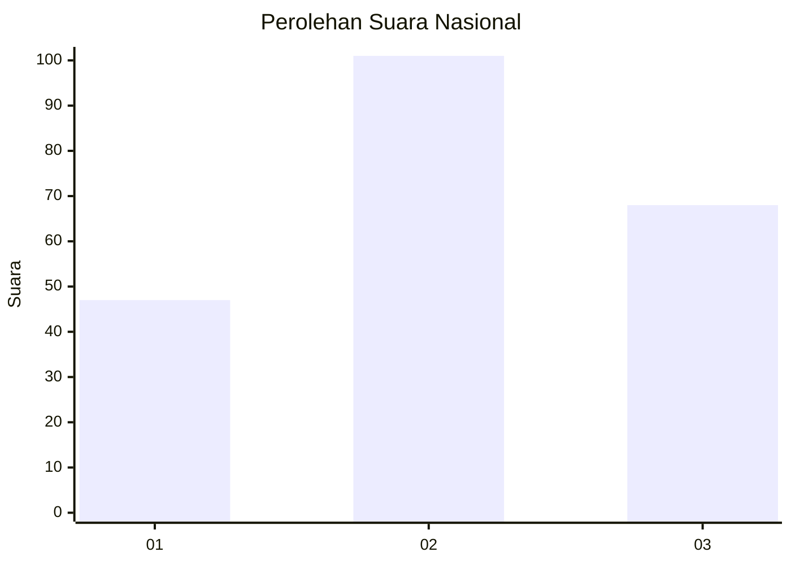
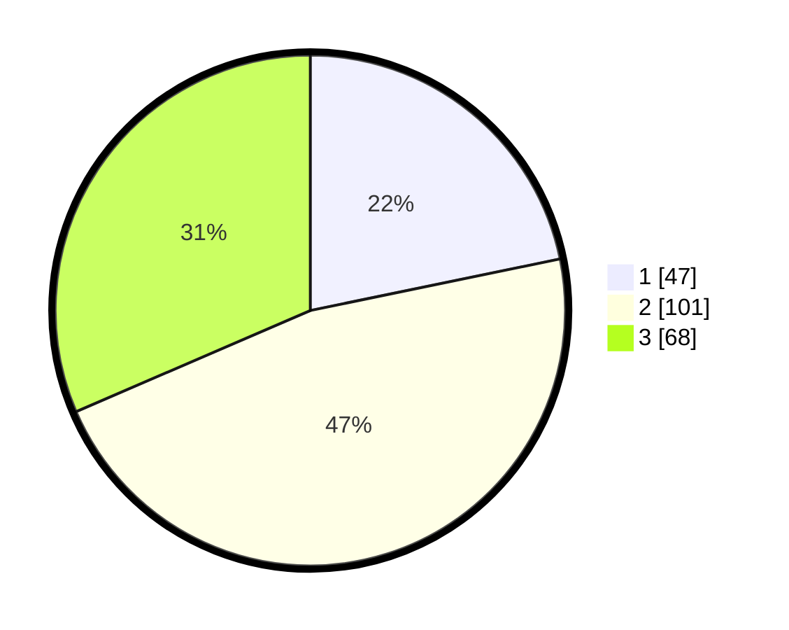

# Hasil

## Grafik

## Tabel

| No.    | Nama Paslon    | Suara | Suara (raw) | Persentase |
|:------ |:-------------- | -----:| -----------:| ----------:|
| 100025 | ANIES MUHAIMIN | 47    | [47][p-1]   | 21,76      |
| 100026 | PRABOWO GIBRAN | 101   | [101][p-2]  | 46,76      |
| 100027 | GANJAR MAHFUD  | 68    | [68][p-3]   | 31,48      |

[p-1]: https://github.com/gigit-pemilu/pemilu-2024/blob/main/pilpres/hitung-suara/sub/31-dki-jakarta/sub/73-jakarta-barat/sub/06-kalideres/sub/1003-tegal-alur/sub/188-tps/sub/paslon-1.txt
[p-2]: https://github.com/gigit-pemilu/pemilu-2024/blob/main/pilpres/hitung-suara/sub/31-dki-jakarta/sub/73-jakarta-barat/sub/06-kalideres/sub/1003-tegal-alur/sub/188-tps/sub/paslon-2.txt
[p-3]: https://github.com/gigit-pemilu/pemilu-2024/blob/main/pilpres/hitung-suara/sub/31-dki-jakarta/sub/73-jakarta-barat/sub/06-kalideres/sub/1003-tegal-alur/sub/188-tps/sub/paslon-3.txt

## Foto C Plano

https://sirekap-obj-formc.kpu.go.id/8a7f/pemilu/ppwp/31/73/06/10/03/3173061003188-20240214-221500--ad4680fe-c40f-48c6-8999-bc86040fa04b.jpg

https://sirekap-obj-formc.kpu.go.id/8a7f/pemilu/ppwp/31/73/06/10/03/3173061003188-20240214-221616--abadaf0a-b55a-49f2-ac70-b87273abc0ad.jpg

https://sirekap-obj-formc.kpu.go.id/8a7f/pemilu/ppwp/31/73/06/10/03/3173061003188-20240214-221747--c18cef75-641c-4379-a2e9-1387070c57c6.jpg

## Metadata

| Key        | Value               |
| ---------- | ------------------- |
| Time Stamp | 2024-02-17 13:37:34 |

