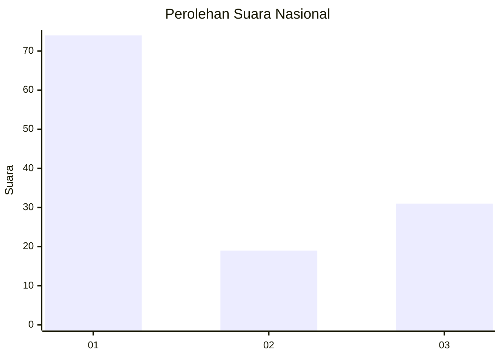
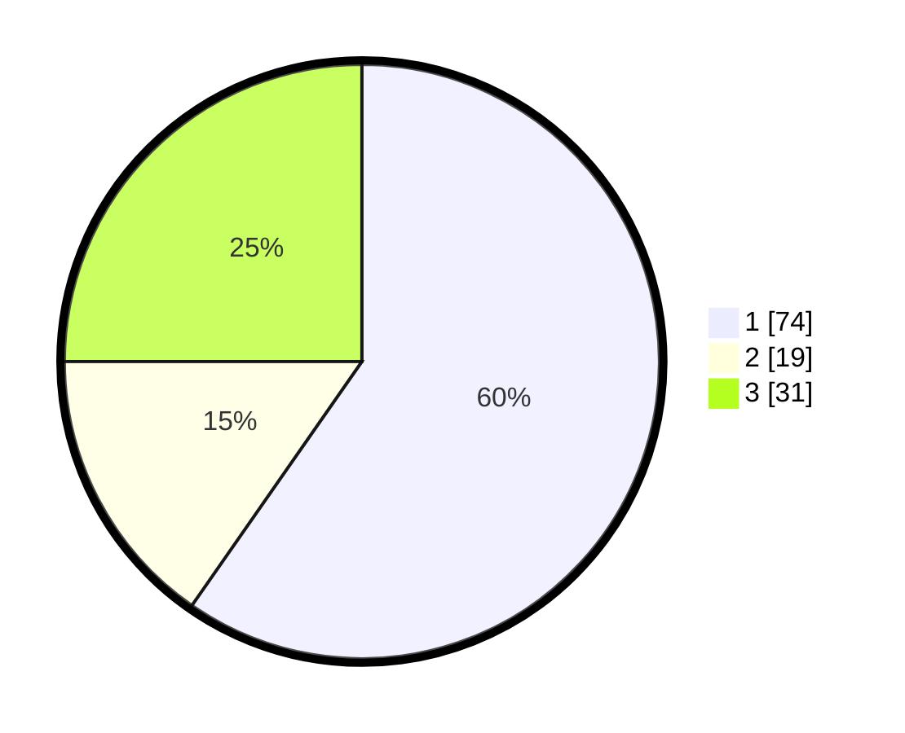

# Hasil

## Grafik

## Tabel

| No. | Nama Paslon    | Suara | Suara (raw) | Persentase |
|:--- |:-------------- | -----:| -----------:| ----------:|
| 1   | ANIES MUHAIMIN | 74    | [74][p-1]   | 59,68      |
| 2   | PRABOWO GIBRAN | 19    | [19][p-2]   | 15,32      |
| 3   | GANJAR MAHFUD  | 31    | [31][p-3]   | 25,00      |

[p-1]: https://github.com/gigit-pemilu/pemilu-2024/blob/main/pilpres/hitung-suara/sub/31-dki-jakarta/sub/73-jakarta-barat/sub/06-kalideres/sub/1003-tegal-alur/sub/194-tps/sub/paslon-1.txt
[p-2]: https://github.com/gigit-pemilu/pemilu-2024/blob/main/pilpres/hitung-suara/sub/31-dki-jakarta/sub/73-jakarta-barat/sub/06-kalideres/sub/1003-tegal-alur/sub/194-tps/sub/paslon-2.txt
[p-3]: https://github.com/gigit-pemilu/pemilu-2024/blob/main/pilpres/hitung-suara/sub/31-dki-jakarta/sub/73-jakarta-barat/sub/06-kalideres/sub/1003-tegal-alur/sub/194-tps/sub/paslon-3.txt

## Foto C Plano

https://sirekap-obj-formc.kpu.go.id/79df/pemilu/ppwp/31/73/06/10/03/3173061003194-20240214-222608--01d1b214-e81b-4afa-b7c8-7b07dba3afe6.jpg

https://sirekap-obj-formc.kpu.go.id/79df/pemilu/ppwp/31/73/06/10/03/3173061003194-20240214-223254--1dc4cea7-6c3d-42bb-9526-be97ffddcfea.jpg

https://sirekap-obj-formc.kpu.go.id/79df/pemilu/ppwp/31/73/06/10/03/3173061003194-20240214-222845--0b3d8401-d2a0-4c59-80ca-03c82d08e00d.jpg

## Metadata

| Key        | Value               |
| ---------- | ------------------- |
| Time Stamp | 2024-02-19 13:00:00 |

