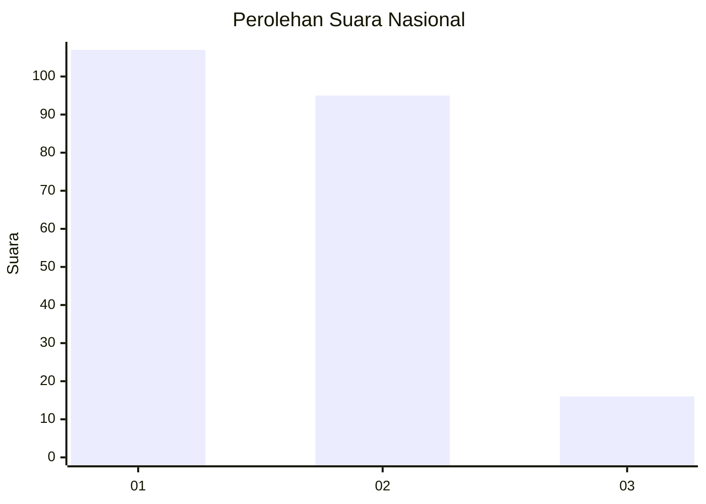
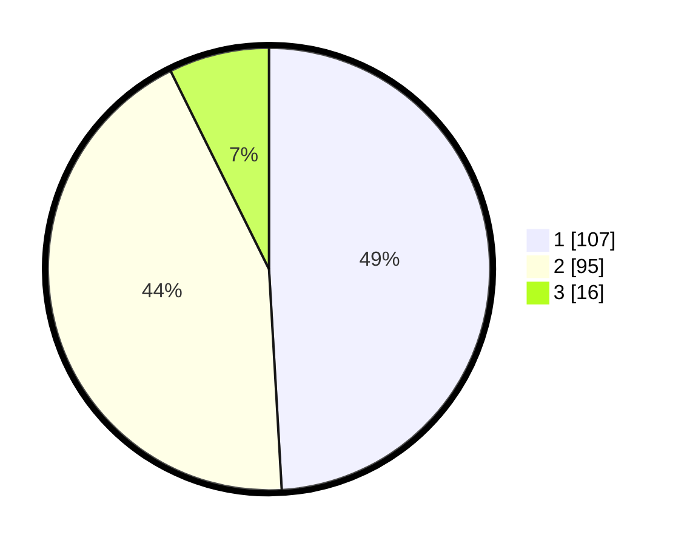

# Hasil

## Grafik

## Tabel

| No.    | Nama Paslon    | Suara | Suara (raw) | Persentase |
|:------ |:-------------- | -----:| -----------:| ----------:|
| 100025 | ANIES MUHAIMIN | 107   | [107][p-1]  | 49,08      |
| 100026 | PRABOWO GIBRAN | 95    | [95][p-2]   | 43,58      |
| 100027 | GANJAR MAHFUD  | 16    | [16][p-3]   | 7,34       |

[p-1]: https://github.com/gigit-pemilu/pemilu-2024/blob/main/pilpres/hitung-suara/sub/31-dki-jakarta/sub/73-jakarta-barat/sub/06-kalideres/sub/1003-tegal-alur/sub/198-tps/sub/paslon-1.txt
[p-2]: https://github.com/gigit-pemilu/pemilu-2024/blob/main/pilpres/hitung-suara/sub/31-dki-jakarta/sub/73-jakarta-barat/sub/06-kalideres/sub/1003-tegal-alur/sub/198-tps/sub/paslon-2.txt
[p-3]: https://github.com/gigit-pemilu/pemilu-2024/blob/main/pilpres/hitung-suara/sub/31-dki-jakarta/sub/73-jakarta-barat/sub/06-kalideres/sub/1003-tegal-alur/sub/198-tps/sub/paslon-3.txt

## Foto C Plano

https://sirekap-obj-formc.kpu.go.id/2f8a/pemilu/ppwp/31/73/06/10/03/3173061003198-20240214-223829--9b155a17-9a27-4d0e-a0ae-64372a545ae7.jpg

https://sirekap-obj-formc.kpu.go.id/2f8a/pemilu/ppwp/31/73/06/10/03/3173061003198-20240214-223913--6b4f94f7-012b-4542-bf1e-4d30637a3802.jpg

https://sirekap-obj-formc.kpu.go.id/2f8a/pemilu/ppwp/31/73/06/10/03/3173061003198-20240214-221734--a3a0514b-592d-446d-93de-0f3092ee9562.jpg

## Metadata

| Key        | Value               |
| ---------- | ------------------- |
| Time Stamp | 2024-02-17 13:37:34 |

