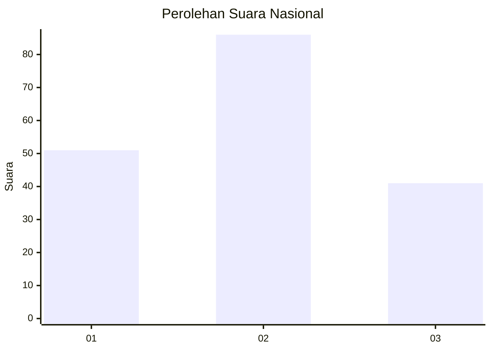
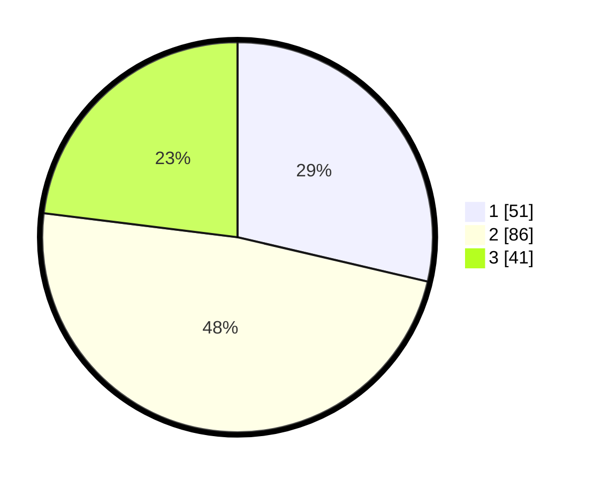

# Hasil

## Grafik

## Tabel

| No.    | Nama Paslon    | Suara | Suara (raw) | Persentase |
|:------ |:-------------- | -----:| -----------:| ----------:|
| 100025 | ANIES MUHAIMIN | 51    | [51][p-1]   | 28,65      |
| 100026 | PRABOWO GIBRAN | 86    | [86][p-2]   | 48,31      |
| 100027 | GANJAR MAHFUD  | 41    | [41][p-3]   | 23,03      |

[p-1]: https://github.com/gigit-pemilu/pemilu-2024/blob/main/pilpres/hitung-suara/sub/31-dki-jakarta/sub/73-jakarta-barat/sub/06-kalideres/sub/1003-tegal-alur/sub/209-tps/sub/paslon-1.txt
[p-2]: https://github.com/gigit-pemilu/pemilu-2024/blob/main/pilpres/hitung-suara/sub/31-dki-jakarta/sub/73-jakarta-barat/sub/06-kalideres/sub/1003-tegal-alur/sub/209-tps/sub/paslon-2.txt
[p-3]: https://github.com/gigit-pemilu/pemilu-2024/blob/main/pilpres/hitung-suara/sub/31-dki-jakarta/sub/73-jakarta-barat/sub/06-kalideres/sub/1003-tegal-alur/sub/209-tps/sub/paslon-3.txt

## Foto C Plano

https://sirekap-obj-formc.kpu.go.id/af01/pemilu/ppwp/31/73/06/10/03/3173061003209-20240214-225809--b64d1f09-9a98-410b-be5b-0e512721a1fe.jpg

https://sirekap-obj-formc.kpu.go.id/af01/pemilu/ppwp/31/73/06/10/03/3173061003209-20240214-225835--b8ef8713-4313-4c05-a0ac-a99e7907d922.jpg

https://sirekap-obj-formc.kpu.go.id/af01/pemilu/ppwp/31/73/06/10/03/3173061003209-20240214-225858--070b4f13-f797-434d-bc3b-cc0c2627c4f4.jpg

## Metadata

| Key        | Value               |
| ---------- | ------------------- |
| Time Stamp | 2024-02-17 13:37:34 |

