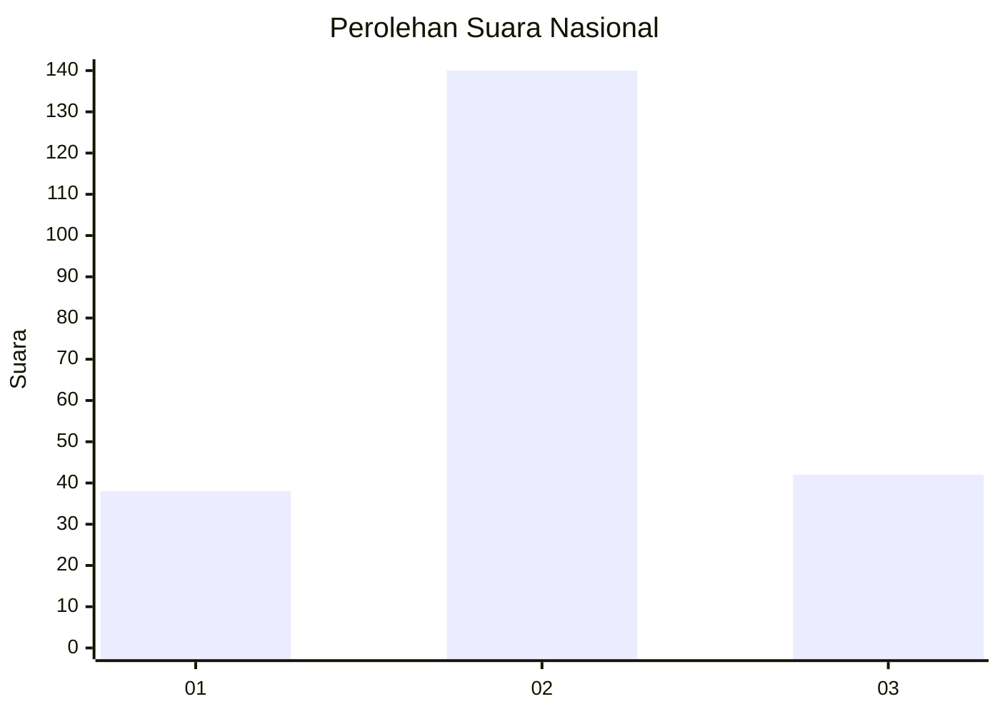
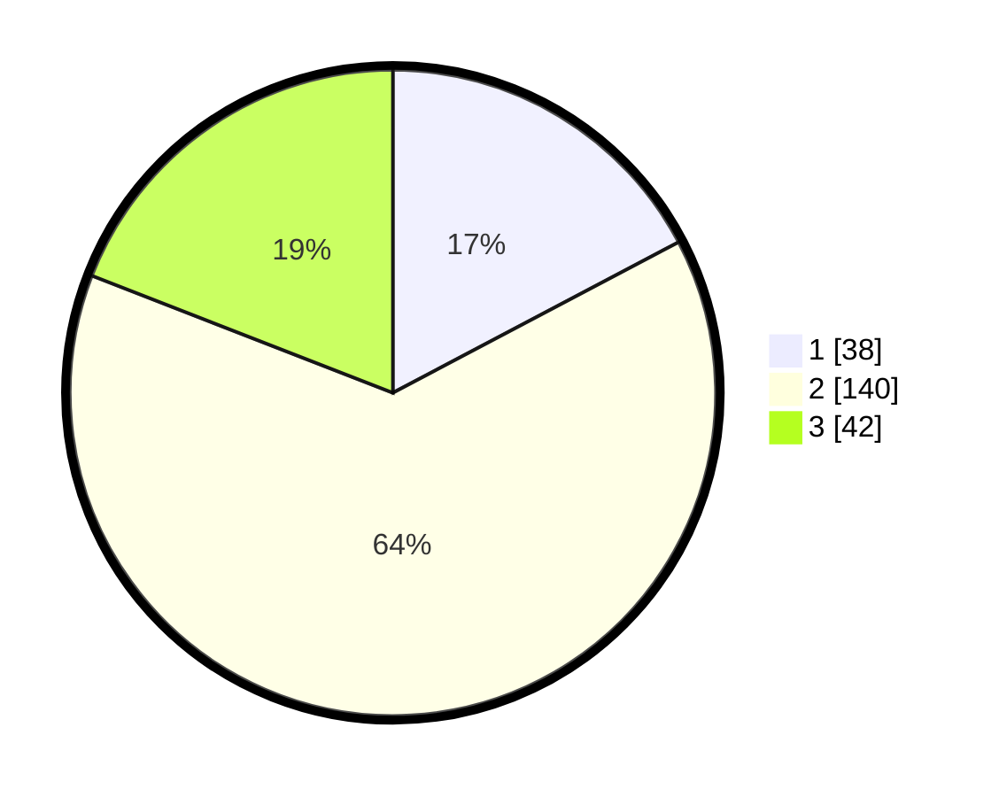

# Hasil

## Grafik

## Tabel

| No.    | Nama Paslon    | Suara | Suara (raw) | Persentase |
|:------ |:-------------- | -----:| -----------:| ----------:|
| 100025 | ANIES MUHAIMIN | 38    | [38][p-1]   | 17,27      |
| 100026 | PRABOWO GIBRAN | 140   | [140][p-2]  | 63,64      |
| 100027 | GANJAR MAHFUD  | 42    | [42][p-3]   | 19,09      |

[p-1]: https://github.com/gigit-pemilu/pemilu-2024/blob/main/pilpres/hitung-suara/sub/31-dki-jakarta/sub/73-jakarta-barat/sub/06-kalideres/sub/1003-tegal-alur/sub/215-tps/sub/paslon-1.txt
[p-2]: https://github.com/gigit-pemilu/pemilu-2024/blob/main/pilpres/hitung-suara/sub/31-dki-jakarta/sub/73-jakarta-barat/sub/06-kalideres/sub/1003-tegal-alur/sub/215-tps/sub/paslon-2.txt
[p-3]: https://github.com/gigit-pemilu/pemilu-2024/blob/main/pilpres/hitung-suara/sub/31-dki-jakarta/sub/73-jakarta-barat/sub/06-kalideres/sub/1003-tegal-alur/sub/215-tps/sub/paslon-3.txt

## Foto C Plano

https://sirekap-obj-formc.kpu.go.id/dc6a/pemilu/ppwp/31/73/06/10/03/3173061003215-20240214-224830--f2bf66f1-65ef-40e5-98f2-fa4f6abbde65.jpg

https://sirekap-obj-formc.kpu.go.id/dc6a/pemilu/ppwp/31/73/06/10/03/3173061003215-20240214-214006--2444fc40-3da9-4ba2-9276-0b2d0b2bf341.jpg

https://sirekap-obj-formc.kpu.go.id/dc6a/pemilu/ppwp/31/73/06/10/03/3173061003215-20240214-214230--c7ca3725-248b-4830-bd79-7249a2841e34.jpg

## Metadata

| Key        | Value               |
| ---------- | ------------------- |
| Time Stamp | 2024-02-16 16:25:10 |

