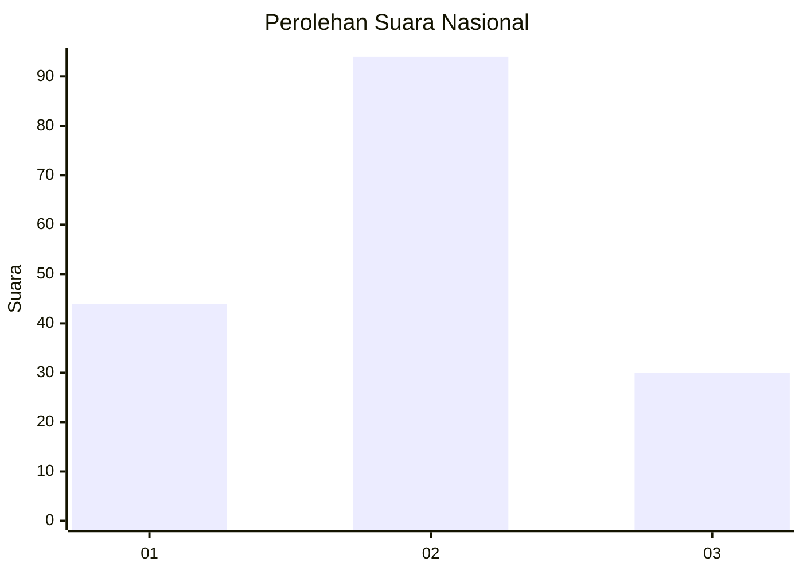
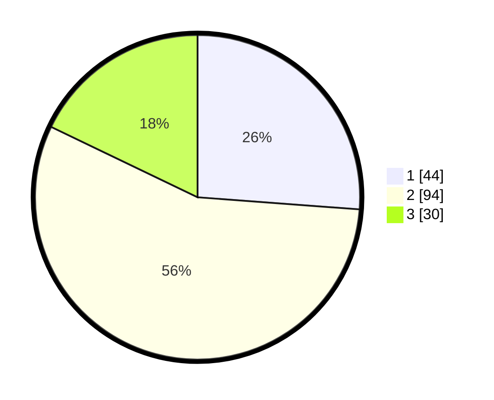

# Hasil

## Grafik

## Tabel

| No.    | Nama Paslon    | Suara | Suara (raw) | Persentase |
|:------ |:-------------- | -----:| -----------:| ----------:|
| 100025 | ANIES MUHAIMIN | 44    | [44][p-1]   | 26,19      |
| 100026 | PRABOWO GIBRAN | 94    | [94][p-2]   | 55,95      |
| 100027 | GANJAR MAHFUD  | 30    | [30][p-3]   | 17,86      |

[p-1]: https://github.com/gigit-pemilu/pemilu-2024/blob/main/pilpres/hitung-suara/sub/31-dki-jakarta/sub/73-jakarta-barat/sub/06-kalideres/sub/1003-tegal-alur/sub/218-tps/sub/paslon-1.txt
[p-2]: https://github.com/gigit-pemilu/pemilu-2024/blob/main/pilpres/hitung-suara/sub/31-dki-jakarta/sub/73-jakarta-barat/sub/06-kalideres/sub/1003-tegal-alur/sub/218-tps/sub/paslon-2.txt
[p-3]: https://github.com/gigit-pemilu/pemilu-2024/blob/main/pilpres/hitung-suara/sub/31-dki-jakarta/sub/73-jakarta-barat/sub/06-kalideres/sub/1003-tegal-alur/sub/218-tps/sub/paslon-3.txt

## Foto C Plano

https://sirekap-obj-formc.kpu.go.id/f01a/pemilu/ppwp/31/73/06/10/03/3173061003218-20240215-101743--e5f54cac-f7c6-427a-9074-ef0a5f08cf5b.jpg

https://sirekap-obj-formc.kpu.go.id/f01a/pemilu/ppwp/31/73/06/10/03/3173061003218-20240214-232019--0951a637-7a16-41e4-9bf8-8f1f9135f218.jpg

https://sirekap-obj-formc.kpu.go.id/f01a/pemilu/ppwp/31/73/06/10/03/3173061003218-20240214-232149--ce6da34c-04ad-4ca4-9edb-6f3b0beffe3f.jpg

## Metadata

| Key        | Value               |
| ---------- | ------------------- |
| Time Stamp | 2024-02-19 13:00:00 |

