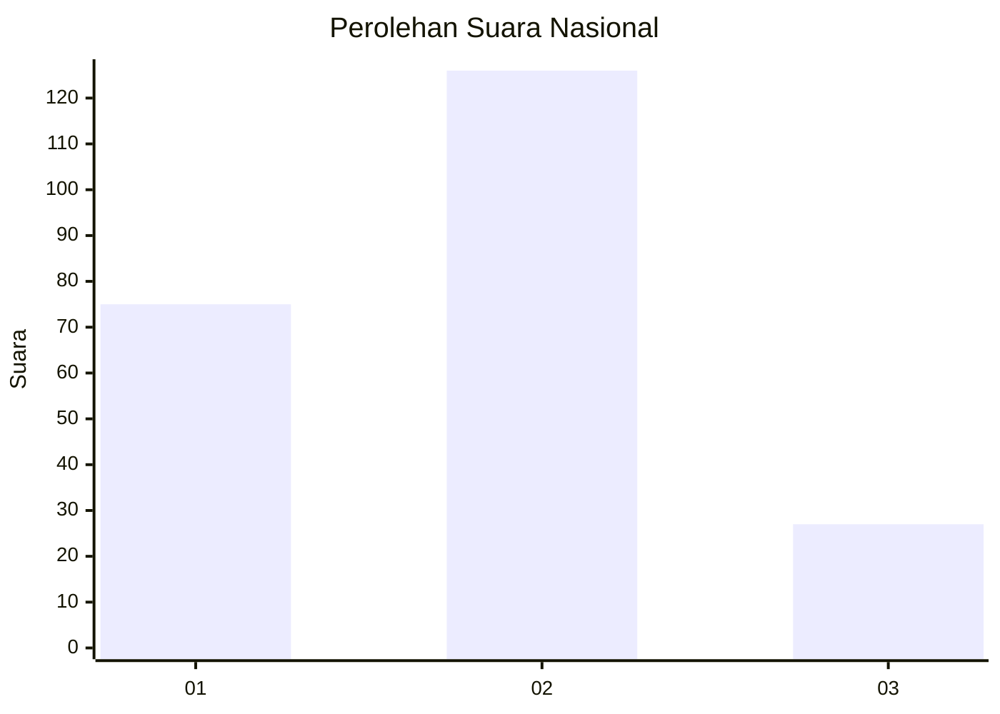
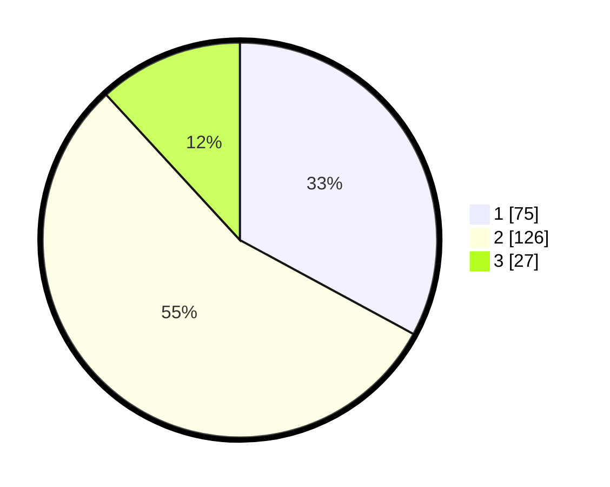

# Hasil

## Grafik

## Tabel

| No.    | Nama Paslon    | Suara | Suara (raw) | Persentase |
|:------ |:-------------- | -----:| -----------:| ----------:|
| 100025 | ANIES MUHAIMIN | 75    | [75][p-1]   | 32,89      |
| 100026 | PRABOWO GIBRAN | 126   | [126][p-2]  | 55,26      |
| 100027 | GANJAR MAHFUD  | 27    | [27][p-3]   | 11,84      |

[p-1]: https://github.com/gigit-pemilu/pemilu-2024/blob/main/pilpres/hitung-suara/sub/31-dki-jakarta/sub/73-jakarta-barat/sub/06-kalideres/sub/1003-tegal-alur/sub/239-tps/sub/paslon-1.txt
[p-2]: https://github.com/gigit-pemilu/pemilu-2024/blob/main/pilpres/hitung-suara/sub/31-dki-jakarta/sub/73-jakarta-barat/sub/06-kalideres/sub/1003-tegal-alur/sub/239-tps/sub/paslon-2.txt
[p-3]: https://github.com/gigit-pemilu/pemilu-2024/blob/main/pilpres/hitung-suara/sub/31-dki-jakarta/sub/73-jakarta-barat/sub/06-kalideres/sub/1003-tegal-alur/sub/239-tps/sub/paslon-3.txt

## Foto C Plano

https://sirekap-obj-formc.kpu.go.id/cb33/pemilu/ppwp/31/73/06/10/03/3173061003239-20240214-212809--3e6d2142-f1bc-4b7e-8436-6a506cc60600.jpg

https://sirekap-obj-formc.kpu.go.id/cb33/pemilu/ppwp/31/73/06/10/03/3173061003239-20240214-211044--d68a0011-c87e-4f54-bf2b-535ee5b2cd91.jpg

https://sirekap-obj-formc.kpu.go.id/cb33/pemilu/ppwp/31/73/06/10/03/3173061003239-20240214-212954--8a2cae05-8e9c-4342-ab1c-4ff6f3b8bb34.jpg

## Metadata

| Key        | Value               |
| ---------- | ------------------- |
| Time Stamp | 2024-02-19 14:00:00 |

