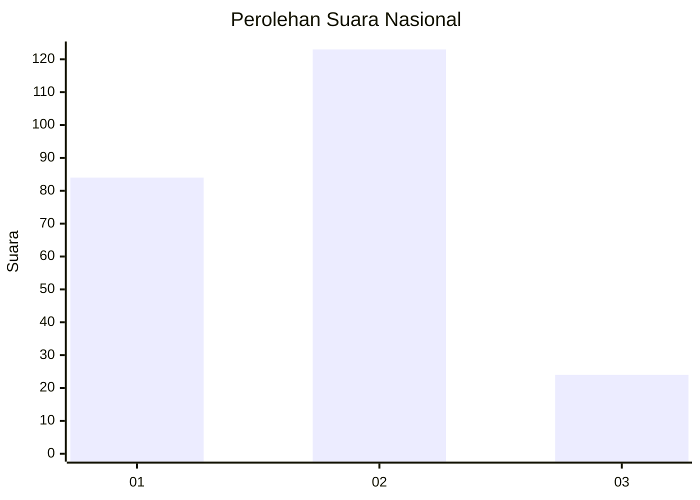

# Hasil

## Grafik

## Tabel

| No.    | Nama Paslon    | Suara | Suara (raw) | Persentase |
|:------ |:-------------- | -----:| -----------:| ----------:|
| 100025 | ANIES MUHAIMIN | 84    | [84][p-1]   | 36,36      |
| 100026 | PRABOWO GIBRAN | 123   | [123][p-2]  | 53,25      |
| 100027 | GANJAR MAHFUD  | 24    | [24][p-3]   | 10,39      |

[p-1]: https://github.com/gigit-pemilu/pemilu-2024/blob/main/pilpres/hitung-suara/sub/31-dki-jakarta/sub/73-jakarta-barat/sub/06-kalideres/sub/1003-tegal-alur/sub/253-tps/sub/paslon-1.txt
[p-2]: https://github.com/gigit-pemilu/pemilu-2024/blob/main/pilpres/hitung-suara/sub/31-dki-jakarta/sub/73-jakarta-barat/sub/06-kalideres/sub/1003-tegal-alur/sub/253-tps/sub/paslon-2.txt
[p-3]: https://github.com/gigit-pemilu/pemilu-2024/blob/main/pilpres/hitung-suara/sub/31-dki-jakarta/sub/73-jakarta-barat/sub/06-kalideres/sub/1003-tegal-alur/sub/253-tps/sub/paslon-3.txt

## Foto C Plano

https://sirekap-obj-formc.kpu.go.id/0447/pemilu/ppwp/31/73/06/10/03/3173061003253-20240214-211818--eaf91599-9196-4e12-99e0-bb5ca35bcdf3.jpg

https://sirekap-obj-formc.kpu.go.id/0447/pemilu/ppwp/31/73/06/10/03/3173061003253-20240214-211931--2d9e228d-60cb-4be2-a0bb-721e3a4c3eaa.jpg

https://sirekap-obj-formc.kpu.go.id/0447/pemilu/ppwp/31/73/06/10/03/3173061003253-20240214-211834--8a54cc9e-238a-4c3f-8835-a3e61c3f0f13.jpg

## Metadata

| Key        | Value               |
| ---------- | ------------------- |
| Time Stamp | 2024-02-15 12:00:28 |

