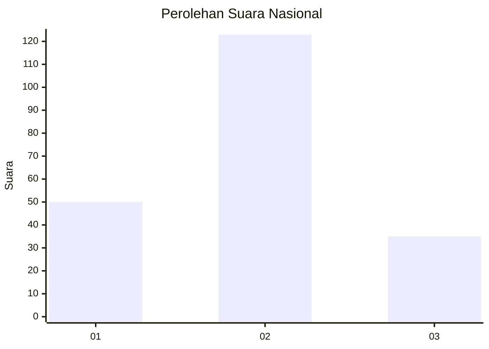

# Hasil

## Grafik

## Tabel

| No.    | Nama Paslon    | Suara | Suara (raw) | Persentase |
|:------ |:-------------- | -----:| -----------:| ----------:|
| 100025 | ANIES MUHAIMIN | 50    | [50][p-1]   | 24,04      |
| 100026 | PRABOWO GIBRAN | 123   | [123][p-2]  | 59,13      |
| 100027 | GANJAR MAHFUD  | 35    | [35][p-3]   | 16,83      |

[p-1]: https://github.com/gigit-pemilu/pemilu-2024/blob/main/pilpres/hitung-suara/sub/31-dki-jakarta/sub/73-jakarta-barat/sub/06-kalideres/sub/1003-tegal-alur/sub/259-tps/sub/paslon-1.txt
[p-2]: https://github.com/gigit-pemilu/pemilu-2024/blob/main/pilpres/hitung-suara/sub/31-dki-jakarta/sub/73-jakarta-barat/sub/06-kalideres/sub/1003-tegal-alur/sub/259-tps/sub/paslon-2.txt
[p-3]: https://github.com/gigit-pemilu/pemilu-2024/blob/main/pilpres/hitung-suara/sub/31-dki-jakarta/sub/73-jakarta-barat/sub/06-kalideres/sub/1003-tegal-alur/sub/259-tps/sub/paslon-3.txt

## Foto C Plano

https://sirekap-obj-formc.kpu.go.id/828d/pemilu/ppwp/31/73/06/10/03/3173061003259-20240215-024026--5b3cf6ce-a587-4a9d-a739-cd339b4e785e.jpg

https://sirekap-obj-formc.kpu.go.id/828d/pemilu/ppwp/31/73/06/10/03/3173061003259-20240215-023847--e6ef0c6b-c661-4384-9994-d9d97b472607.jpg

https://sirekap-obj-formc.kpu.go.id/828d/pemilu/ppwp/31/73/06/10/03/3173061003259-20240215-025345--831112c1-ba6c-48a0-ba95-4a3508911730.jpg

## Metadata

| Key        | Value               |
| ---------- | ------------------- |
| Time Stamp | 2024-02-17 13:37:34 |

