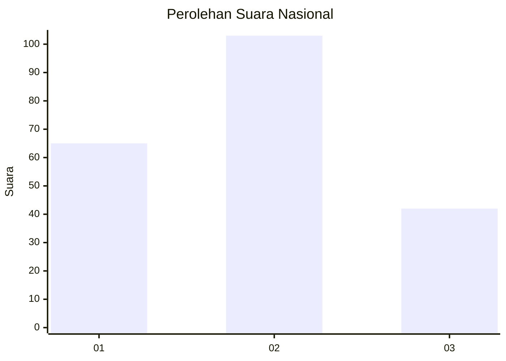
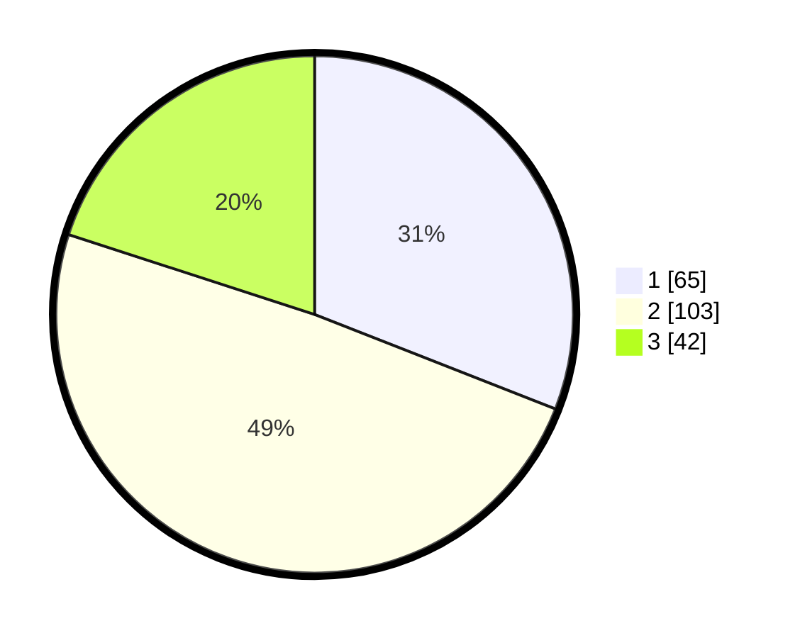

# Hasil

## Grafik

## Tabel

| No.    | Nama Paslon    | Suara | Suara (raw) | Persentase |
|:------ |:-------------- | -----:| -----------:| ----------:|
| 100025 | ANIES MUHAIMIN | 65    | [65][p-1]   | 30,95      |
| 100026 | PRABOWO GIBRAN | 103   | [103][p-2]  | 49,05      |
| 100027 | GANJAR MAHFUD  | 42    | [42][p-3]   | 20,00      |

[p-1]: https://github.com/gigit-pemilu/pemilu-2024/blob/main/pilpres/hitung-suara/sub/31-dki-jakarta/sub/73-jakarta-barat/sub/06-kalideres/sub/1003-tegal-alur/sub/275-tps/sub/paslon-1.txt
[p-2]: https://github.com/gigit-pemilu/pemilu-2024/blob/main/pilpres/hitung-suara/sub/31-dki-jakarta/sub/73-jakarta-barat/sub/06-kalideres/sub/1003-tegal-alur/sub/275-tps/sub/paslon-2.txt
[p-3]: https://github.com/gigit-pemilu/pemilu-2024/blob/main/pilpres/hitung-suara/sub/31-dki-jakarta/sub/73-jakarta-barat/sub/06-kalideres/sub/1003-tegal-alur/sub/275-tps/sub/paslon-3.txt

## Foto C Plano

https://sirekap-obj-formc.kpu.go.id/fac1/pemilu/ppwp/31/73/06/10/03/3173061003275-20240214-233006--41a1d4c8-5fb6-4d8f-b02c-1d4861c4d99f.jpg

https://sirekap-obj-formc.kpu.go.id/fac1/pemilu/ppwp/31/73/06/10/03/3173061003275-20240214-233051--895d34dd-aa5f-4525-8e1b-594bdb5a6cda.jpg

https://sirekap-obj-formc.kpu.go.id/fac1/pemilu/ppwp/31/73/06/10/03/3173061003275-20240214-233150--54739a1f-8333-42ff-a965-95a367295129.jpg

## Metadata

| Key        | Value               |
| ---------- | ------------------- |
| Time Stamp | 2024-02-19 14:00:00 |

