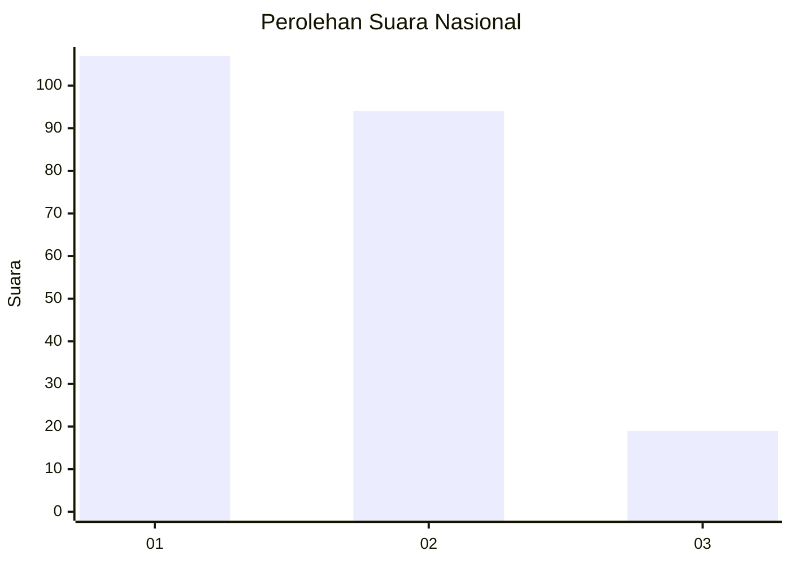
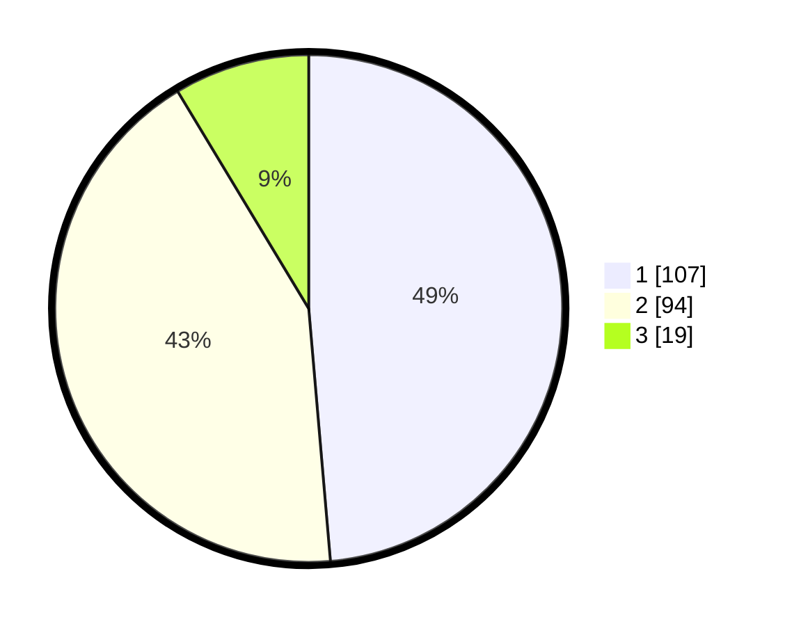

# Hasil

## Grafik

## Tabel

| No.    | Nama Paslon    | Suara | Suara (raw) | Persentase |
|:------ |:-------------- | -----:| -----------:| ----------:|
| 100025 | ANIES MUHAIMIN | 107   | [107][p-1]  | 48,64      |
| 100026 | PRABOWO GIBRAN | 94    | [94][p-2]   | 42,73      |
| 100027 | GANJAR MAHFUD  | 19    | [19][p-3]   | 8,64       |

[p-1]: https://github.com/gigit-pemilu/pemilu-2024/blob/main/pilpres/hitung-suara/sub/31-dki-jakarta/sub/73-jakarta-barat/sub/06-kalideres/sub/1004-kamal/sub/011-tps/sub/paslon-1.txt
[p-2]: https://github.com/gigit-pemilu/pemilu-2024/blob/main/pilpres/hitung-suara/sub/31-dki-jakarta/sub/73-jakarta-barat/sub/06-kalideres/sub/1004-kamal/sub/011-tps/sub/paslon-2.txt
[p-3]: https://github.com/gigit-pemilu/pemilu-2024/blob/main/pilpres/hitung-suara/sub/31-dki-jakarta/sub/73-jakarta-barat/sub/06-kalideres/sub/1004-kamal/sub/011-tps/sub/paslon-3.txt

## Foto C Plano

https://sirekap-obj-formc.kpu.go.id/01c6/pemilu/ppwp/31/73/06/10/04/3173061004011-20240214-234242--ee9ee54f-e136-4d15-94f6-c36c975af18a.jpg

https://sirekap-obj-formc.kpu.go.id/01c6/pemilu/ppwp/31/73/06/10/04/3173061004011-20240214-234307--ac003ce5-a7e7-4bd2-9a40-666cd325e049.jpg

https://sirekap-obj-formc.kpu.go.id/01c6/pemilu/ppwp/31/73/06/10/04/3173061004011-20240214-234332--a822f4f9-d073-4b90-99bf-038d534761b4.jpg

## Metadata

| Key        | Value               |
| ---------- | ------------------- |
| Time Stamp | 2024-02-17 14:45:18 |

