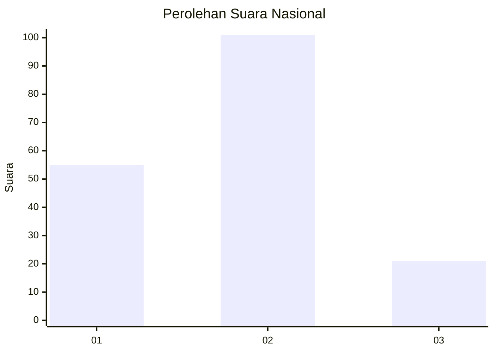
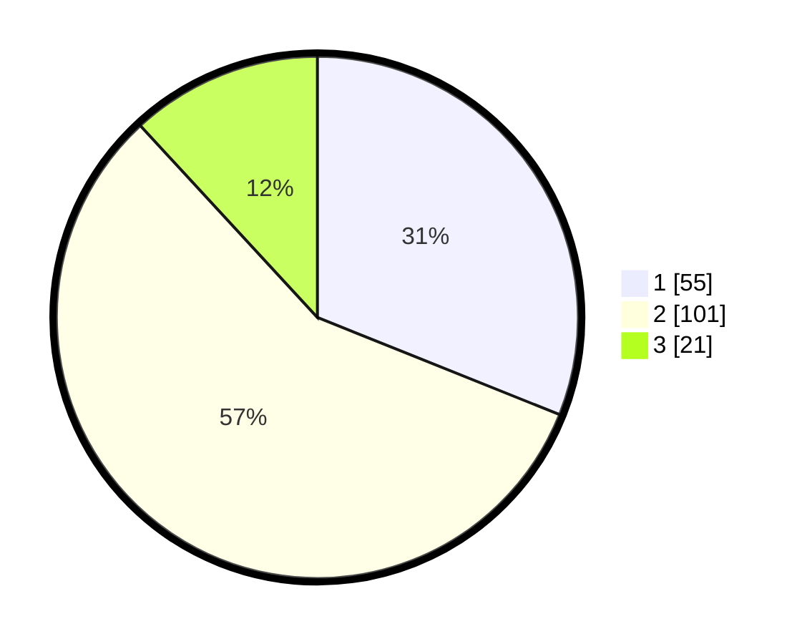

# Hasil

## Grafik

## Tabel

| No.    | Nama Paslon    | Suara | Suara (raw) | Persentase |
|:------ |:-------------- | -----:| -----------:| ----------:|
| 100025 | ANIES MUHAIMIN | 55    | [55][p-1]   | 31,07      |
| 100026 | PRABOWO GIBRAN | 101   | [101][p-2]  | 57,06      |
| 100027 | GANJAR MAHFUD  | 21    | [21][p-3]   | 11,86      |

[p-1]: https://github.com/gigit-pemilu/pemilu-2024/blob/main/pilpres/hitung-suara/sub/31-dki-jakarta/sub/73-jakarta-barat/sub/06-kalideres/sub/1004-kamal/sub/030-tps/sub/paslon-1.txt
[p-2]: https://github.com/gigit-pemilu/pemilu-2024/blob/main/pilpres/hitung-suara/sub/31-dki-jakarta/sub/73-jakarta-barat/sub/06-kalideres/sub/1004-kamal/sub/030-tps/sub/paslon-2.txt
[p-3]: https://github.com/gigit-pemilu/pemilu-2024/blob/main/pilpres/hitung-suara/sub/31-dki-jakarta/sub/73-jakarta-barat/sub/06-kalideres/sub/1004-kamal/sub/030-tps/sub/paslon-3.txt

## Foto C Plano

https://sirekap-obj-formc.kpu.go.id/44bb/pemilu/ppwp/31/73/06/10/04/3173061004030-20240214-224643--c6ba7263-76f0-4e23-866f-4eca26ae43ea.jpg

https://sirekap-obj-formc.kpu.go.id/44bb/pemilu/ppwp/31/73/06/10/04/3173061004030-20240214-224652--011b409e-b4a9-461f-a670-33d87cae9da7.jpg

https://sirekap-obj-formc.kpu.go.id/44bb/pemilu/ppwp/31/73/06/10/04/3173061004030-20240214-224702--4a8d986d-7cd4-4001-911c-1191171c240d.jpg

## Metadata

| Key        | Value               |
| ---------- | ------------------- |
| Time Stamp | 2024-02-19 06:16:00 |

