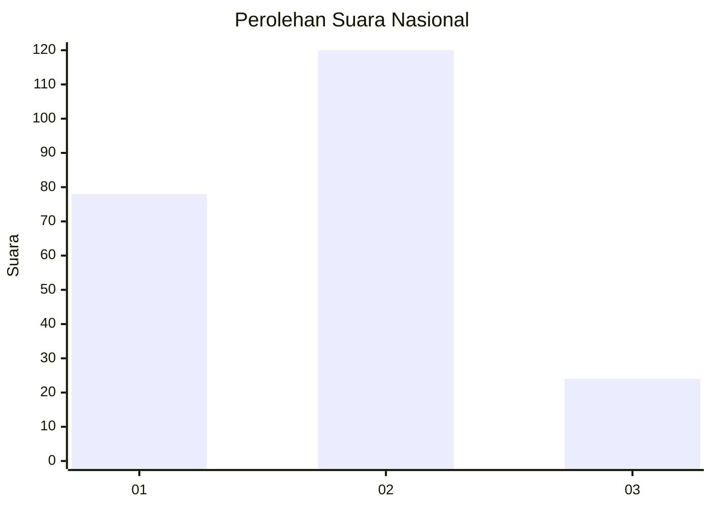
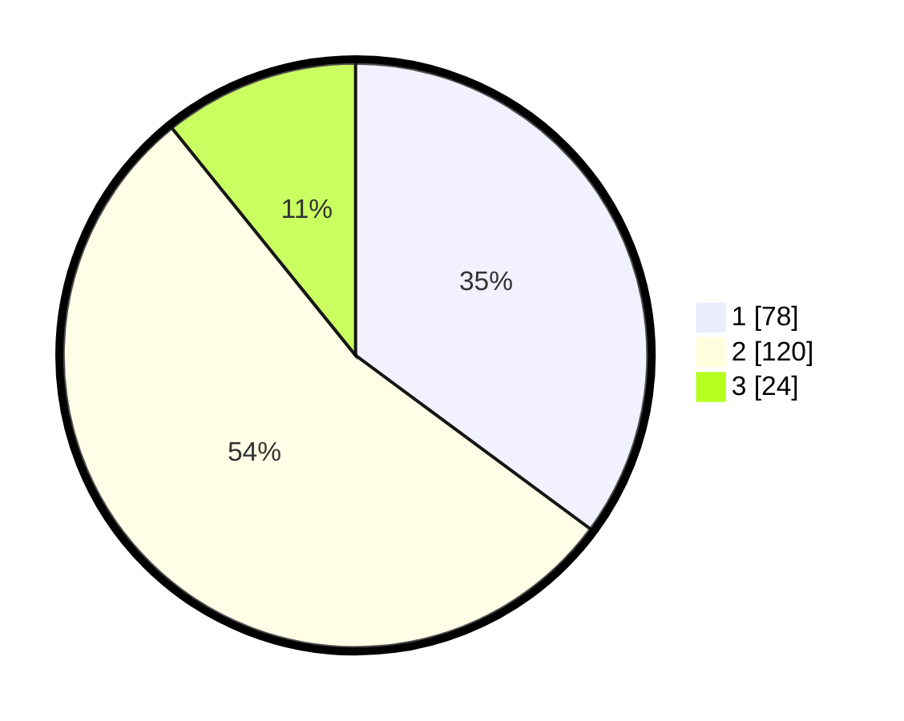

# Hasil

## Grafik

## Tabel

| No.    | Nama Paslon    | Suara | Suara (raw) | Persentase |
|:------ |:-------------- | -----:| -----------:| ----------:|
| 100025 | ANIES MUHAIMIN | 78    | [78][p-1]   | 35,14      |
| 100026 | PRABOWO GIBRAN | 120   | [120][p-2]  | 54,05      |
| 100027 | GANJAR MAHFUD  | 24    | [24][p-3]   | 10,81      |

[p-1]: https://github.com/gigit-pemilu/pemilu-2024/blob/main/pilpres/hitung-suara/sub/31-dki-jakarta/sub/73-jakarta-barat/sub/06-kalideres/sub/1004-kamal/sub/066-tps/sub/paslon-1.txt
[p-2]: https://github.com/gigit-pemilu/pemilu-2024/blob/main/pilpres/hitung-suara/sub/31-dki-jakarta/sub/73-jakarta-barat/sub/06-kalideres/sub/1004-kamal/sub/066-tps/sub/paslon-2.txt
[p-3]: https://github.com/gigit-pemilu/pemilu-2024/blob/main/pilpres/hitung-suara/sub/31-dki-jakarta/sub/73-jakarta-barat/sub/06-kalideres/sub/1004-kamal/sub/066-tps/sub/paslon-3.txt

## Foto C Plano

https://sirekap-obj-formc.kpu.go.id/6ce8/pemilu/ppwp/31/73/06/10/04/3173061004066-20240214-191729--60a3fcd5-9fdc-43d3-a3fc-c2570324d75e.jpg

https://sirekap-obj-formc.kpu.go.id/6ce8/pemilu/ppwp/31/73/06/10/04/3173061004066-20240214-205111--de8f61b4-e544-498c-a81d-3148c9776765.jpg

https://sirekap-obj-formc.kpu.go.id/6ce8/pemilu/ppwp/31/73/06/10/04/3173061004066-20240214-210213--c41519a6-40c2-417e-87dd-4881e482b164.jpg

## Metadata

| Key        | Value               |
| ---------- | ------------------- |
| Time Stamp | 2024-02-19 13:00:00 |

