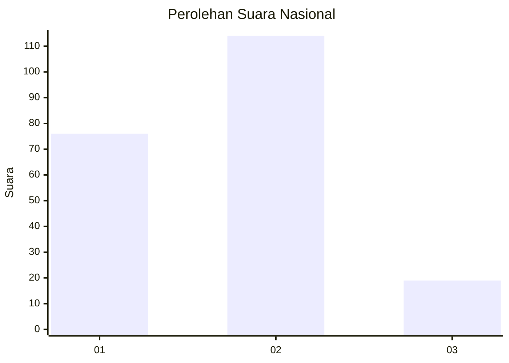

# Hasil

## Grafik

## Tabel

| No.    | Nama Paslon    | Suara | Suara (raw) | Persentase |
|:------ |:-------------- | -----:| -----------:| ----------:|
| 100025 | ANIES MUHAIMIN | 76    | [76][p-1]   | 36,36      |
| 100026 | PRABOWO GIBRAN | 114   | [114][p-2]  | 54,55      |
| 100027 | GANJAR MAHFUD  | 19    | [19][p-3]   | 9,09       |

[p-1]: https://github.com/gigit-pemilu/pemilu-2024/blob/main/pilpres/hitung-suara/sub/31-dki-jakarta/sub/73-jakarta-barat/sub/06-kalideres/sub/1004-kamal/sub/074-tps/sub/paslon-1.txt
[p-2]: https://github.com/gigit-pemilu/pemilu-2024/blob/main/pilpres/hitung-suara/sub/31-dki-jakarta/sub/73-jakarta-barat/sub/06-kalideres/sub/1004-kamal/sub/074-tps/sub/paslon-2.txt
[p-3]: https://github.com/gigit-pemilu/pemilu-2024/blob/main/pilpres/hitung-suara/sub/31-dki-jakarta/sub/73-jakarta-barat/sub/06-kalideres/sub/1004-kamal/sub/074-tps/sub/paslon-3.txt

## Foto C Plano

https://sirekap-obj-formc.kpu.go.id/7d8a/pemilu/ppwp/31/73/06/10/04/3173061004074-20240214-202652--8c7da6cd-85ec-421d-951a-c09695a3ca52.jpg

https://sirekap-obj-formc.kpu.go.id/7d8a/pemilu/ppwp/31/73/06/10/04/3173061004074-20240214-202718--2d8fe8e9-21d6-4172-b97e-7f1563db6ed5.jpg

https://sirekap-obj-formc.kpu.go.id/7d8a/pemilu/ppwp/31/73/06/10/04/3173061004074-20240214-202738--e1e9d07f-ca1e-492f-8636-5d9b92b36cc8.jpg

## Metadata

| Key        | Value               |
| ---------- | ------------------- |
| Time Stamp | 2024-02-15 01:47:43 |

