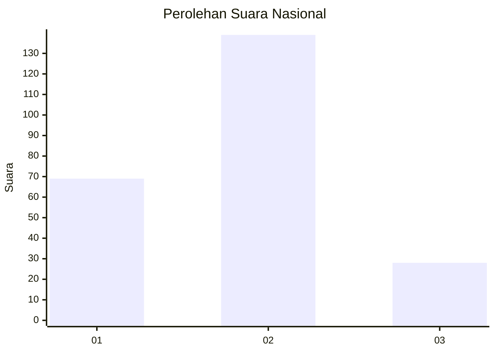
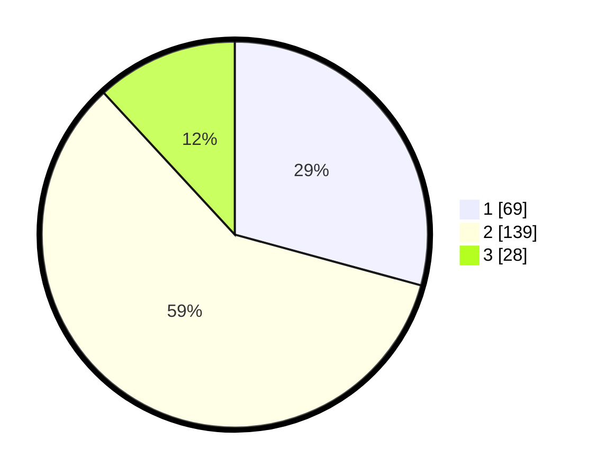

# Hasil

## Grafik

## Tabel

| No.    | Nama Paslon    | Suara | Suara (raw) | Persentase |
|:------ |:-------------- | -----:| -----------:| ----------:|
| 100025 | ANIES MUHAIMIN | 69    | [69][p-1]   | 29,24      |
| 100026 | PRABOWO GIBRAN | 139   | [139][p-2]  | 58,90      |
| 100027 | GANJAR MAHFUD  | 28    | [28][p-3]   | 11,86      |

[p-1]: https://github.com/gigit-pemilu/pemilu-2024/blob/main/pilpres/hitung-suara/sub/31-dki-jakarta/sub/73-jakarta-barat/sub/06-kalideres/sub/1004-kamal/sub/083-tps/sub/paslon-1.txt
[p-2]: https://github.com/gigit-pemilu/pemilu-2024/blob/main/pilpres/hitung-suara/sub/31-dki-jakarta/sub/73-jakarta-barat/sub/06-kalideres/sub/1004-kamal/sub/083-tps/sub/paslon-2.txt
[p-3]: https://github.com/gigit-pemilu/pemilu-2024/blob/main/pilpres/hitung-suara/sub/31-dki-jakarta/sub/73-jakarta-barat/sub/06-kalideres/sub/1004-kamal/sub/083-tps/sub/paslon-3.txt

## Foto C Plano

https://sirekap-obj-formc.kpu.go.id/937c/pemilu/ppwp/31/73/06/10/04/3173061004083-20240214-235003--538aeef7-952a-473e-a280-d9169edb6306.jpg

https://sirekap-obj-formc.kpu.go.id/937c/pemilu/ppwp/31/73/06/10/04/3173061004083-20240214-235058--ce9a817b-c4fd-49b4-8899-248b15456d8e.jpg

https://sirekap-obj-formc.kpu.go.id/937c/pemilu/ppwp/31/73/06/10/04/3173061004083-20240214-235140--44be4c72-fbda-4b45-923d-b771f85cb1a5.jpg

## Metadata

| Key        | Value               |
| ---------- | ------------------- |
| Time Stamp | 2024-02-17 18:00:00 |

