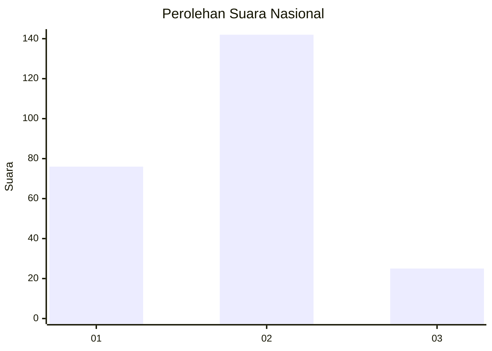
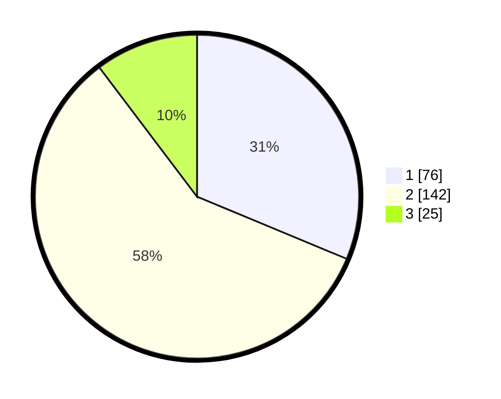

# Hasil

## Grafik

## Tabel

| No.    | Nama Paslon    | Suara | Suara (raw) | Persentase |
|:------ |:-------------- | -----:| -----------:| ----------:|
| 100025 | ANIES MUHAIMIN | 76    | [76][p-1]   | 31,28      |
| 100026 | PRABOWO GIBRAN | 142   | [142][p-2]  | 58,44      |
| 100027 | GANJAR MAHFUD  | 25    | [25][p-3]   | 10,29      |

[p-1]: https://github.com/gigit-pemilu/pemilu-2024/blob/main/pilpres/hitung-suara/sub/31-dki-jakarta/sub/73-jakarta-barat/sub/06-kalideres/sub/1004-kamal/sub/085-tps/sub/paslon-1.txt
[p-2]: https://github.com/gigit-pemilu/pemilu-2024/blob/main/pilpres/hitung-suara/sub/31-dki-jakarta/sub/73-jakarta-barat/sub/06-kalideres/sub/1004-kamal/sub/085-tps/sub/paslon-2.txt
[p-3]: https://github.com/gigit-pemilu/pemilu-2024/blob/main/pilpres/hitung-suara/sub/31-dki-jakarta/sub/73-jakarta-barat/sub/06-kalideres/sub/1004-kamal/sub/085-tps/sub/paslon-3.txt

## Foto C Plano

https://sirekap-obj-formc.kpu.go.id/fce8/pemilu/ppwp/31/73/06/10/04/3173061004085-20240214-231054--b941730d-6bb7-4bc3-83d7-ae73e442a1af.jpg

https://sirekap-obj-formc.kpu.go.id/fce8/pemilu/ppwp/31/73/06/10/04/3173061004085-20240214-231215--ac81846c-01ee-4d36-a6f9-99ebc5044c26.jpg

https://sirekap-obj-formc.kpu.go.id/fce8/pemilu/ppwp/31/73/06/10/04/3173061004085-20240214-231317--9f5df088-8be6-451f-8fcd-a8d823fa9ed9.jpg

## Metadata

| Key        | Value               |
| ---------- | ------------------- |
| Time Stamp | 2024-02-16 16:25:10 |

