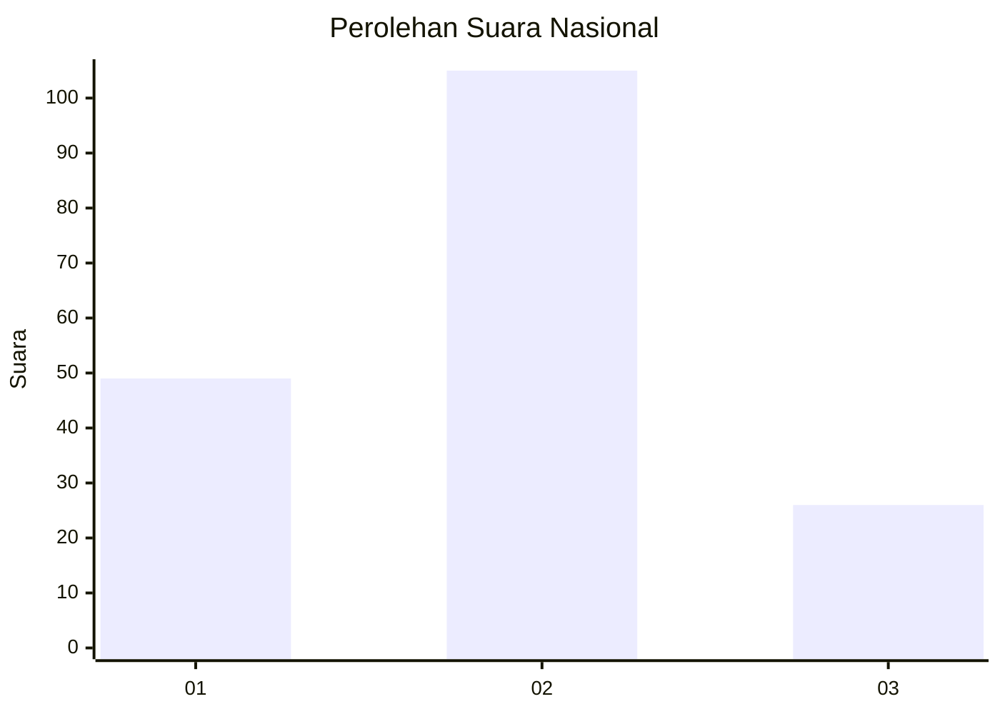
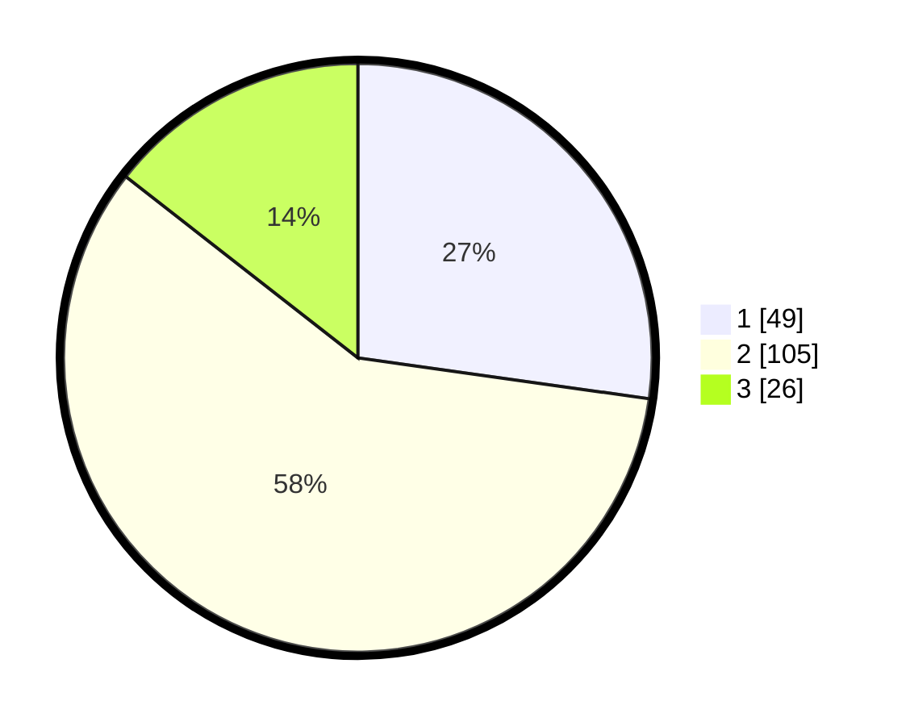

# Hasil

## Grafik

## Tabel

| No.    | Nama Paslon    | Suara | Suara (raw) | Persentase |
|:------ |:-------------- | -----:| -----------:| ----------:|
| 100025 | ANIES MUHAIMIN | 49    | [49][p-1]   | 27,22      |
| 100026 | PRABOWO GIBRAN | 105   | [105][p-2]  | 58,33      |
| 100027 | GANJAR MAHFUD  | 26    | [26][p-3]   | 14,44      |

[p-1]: https://github.com/gigit-pemilu/pemilu-2024/blob/main/pilpres/hitung-suara/sub/31-dki-jakarta/sub/73-jakarta-barat/sub/06-kalideres/sub/1004-kamal/sub/141-tps/sub/paslon-1.txt
[p-2]: https://github.com/gigit-pemilu/pemilu-2024/blob/main/pilpres/hitung-suara/sub/31-dki-jakarta/sub/73-jakarta-barat/sub/06-kalideres/sub/1004-kamal/sub/141-tps/sub/paslon-2.txt
[p-3]: https://github.com/gigit-pemilu/pemilu-2024/blob/main/pilpres/hitung-suara/sub/31-dki-jakarta/sub/73-jakarta-barat/sub/06-kalideres/sub/1004-kamal/sub/141-tps/sub/paslon-3.txt

## Foto C Plano

https://sirekap-obj-formc.kpu.go.id/3d84/pemilu/ppwp/31/73/06/10/04/3173061004141-20240214-223522--0131f8b4-15cd-49aa-bf65-cf16941e8078.jpg

https://sirekap-obj-formc.kpu.go.id/3d84/pemilu/ppwp/31/73/06/10/04/3173061004141-20240214-220129--cfae4786-12f7-4318-a908-8abb4531d6d7.jpg

https://sirekap-obj-formc.kpu.go.id/3d84/pemilu/ppwp/31/73/06/10/04/3173061004141-20240214-223639--c1161b9c-bd45-4bf2-8970-acf55459bb70.jpg

## Metadata

| Key        | Value               |
| ---------- | ------------------- |
| Time Stamp | 2024-02-19 13:00:00 |

