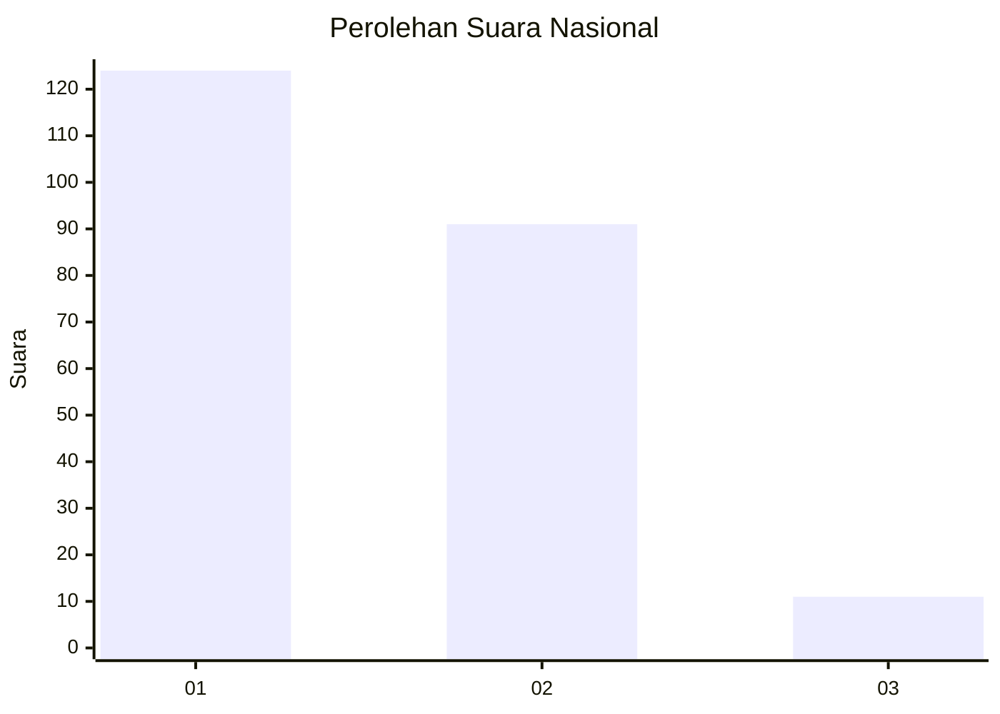
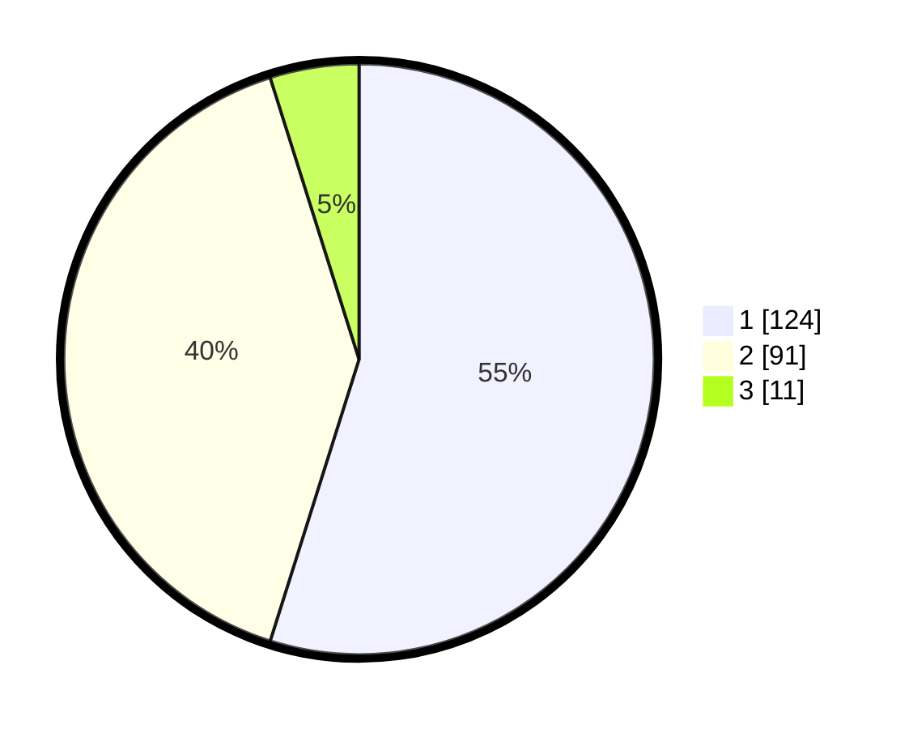

# Hasil

## Grafik

## Tabel

| No.    | Nama Paslon    | Suara | Suara (raw) | Persentase |
|:------ |:-------------- | -----:| -----------:| ----------:|
| 100025 | ANIES MUHAIMIN | 124   | [124][p-1]  | 54,87      |
| 100026 | PRABOWO GIBRAN | 91    | [91][p-2]   | 40,27      |
| 100027 | GANJAR MAHFUD  | 11    | [11][p-3]   | 4,87       |

[p-1]: https://github.com/gigit-pemilu/pemilu-2024/blob/main/pilpres/hitung-suara/sub/31-dki-jakarta/sub/73-jakarta-barat/sub/06-kalideres/sub/1004-kamal/sub/156-tps/sub/paslon-1.txt
[p-2]: https://github.com/gigit-pemilu/pemilu-2024/blob/main/pilpres/hitung-suara/sub/31-dki-jakarta/sub/73-jakarta-barat/sub/06-kalideres/sub/1004-kamal/sub/156-tps/sub/paslon-2.txt
[p-3]: https://github.com/gigit-pemilu/pemilu-2024/blob/main/pilpres/hitung-suara/sub/31-dki-jakarta/sub/73-jakarta-barat/sub/06-kalideres/sub/1004-kamal/sub/156-tps/sub/paslon-3.txt

## Foto C Plano

https://sirekap-obj-formc.kpu.go.id/2fc7/pemilu/ppwp/31/73/06/10/04/3173061004156-20240214-195215--d1c24861-cbf1-4a6c-a2c3-f11149a4ea15.jpg

https://sirekap-obj-formc.kpu.go.id/2fc7/pemilu/ppwp/31/73/06/10/04/3173061004156-20240215-231144--f241c35f-d49f-4595-a6cf-c1b4b2cee149.jpg

https://sirekap-obj-formc.kpu.go.id/2fc7/pemilu/ppwp/31/73/06/10/04/3173061004156-20240214-195557--83227776-517e-4c0d-a6b1-8765b43a9bc8.jpg

## Metadata

| Key        | Value               |
| ---------- | ------------------- |
| Time Stamp | 2024-02-15 23:29:50 |

