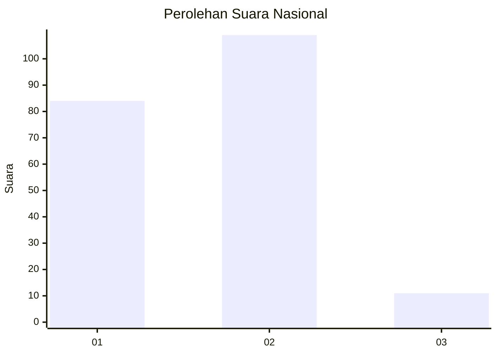
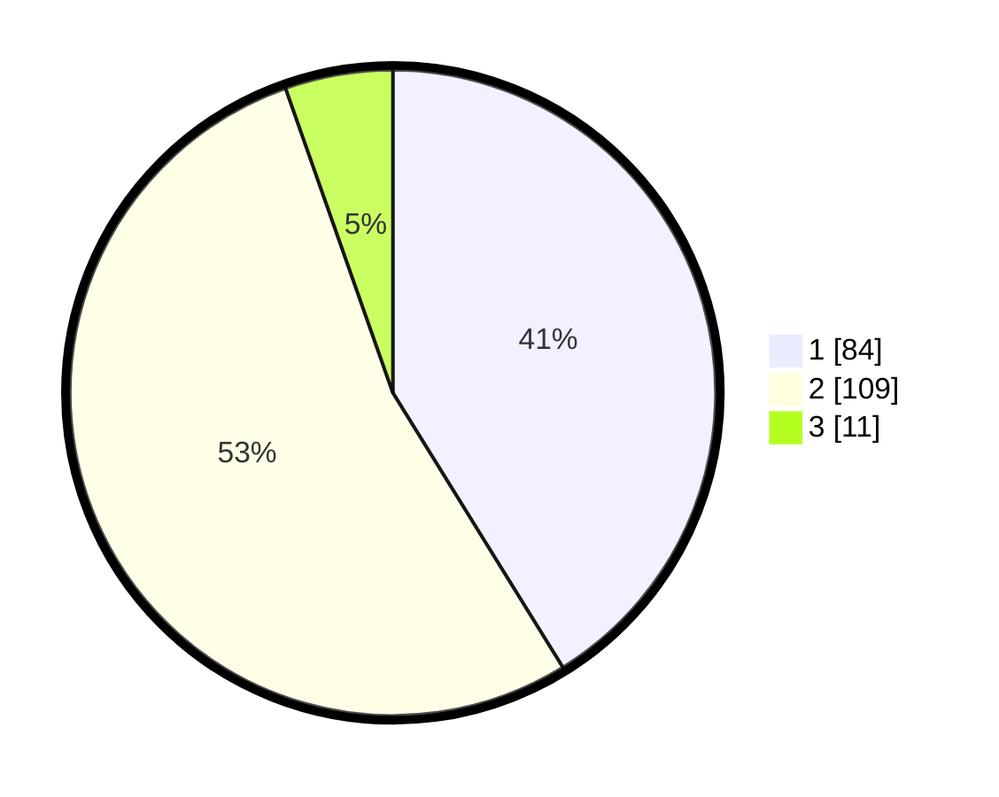

# Hasil

## Grafik

## Tabel

| No.    | Nama Paslon    | Suara | Suara (raw) | Persentase |
|:------ |:-------------- | -----:| -----------:| ----------:|
| 100025 | ANIES MUHAIMIN | 84    | [84][p-1]   | 41,18      |
| 100026 | PRABOWO GIBRAN | 109   | [109][p-2]  | 53,43      |
| 100027 | GANJAR MAHFUD  | 11    | [11][p-3]   | 5,39       |

[p-1]: https://github.com/gigit-pemilu/pemilu-2024/blob/main/pilpres/hitung-suara/sub/31-dki-jakarta/sub/73-jakarta-barat/sub/06-kalideres/sub/1005-pegadungan/sub/002-tps/sub/paslon-1.txt
[p-2]: https://github.com/gigit-pemilu/pemilu-2024/blob/main/pilpres/hitung-suara/sub/31-dki-jakarta/sub/73-jakarta-barat/sub/06-kalideres/sub/1005-pegadungan/sub/002-tps/sub/paslon-2.txt
[p-3]: https://github.com/gigit-pemilu/pemilu-2024/blob/main/pilpres/hitung-suara/sub/31-dki-jakarta/sub/73-jakarta-barat/sub/06-kalideres/sub/1005-pegadungan/sub/002-tps/sub/paslon-3.txt

## Foto C Plano

https://sirekap-obj-formc.kpu.go.id/b807/pemilu/ppwp/31/73/06/10/05/3173061005002-20240214-234159--eab53ddd-b9f1-45c0-8098-9b454165d066.jpg

https://sirekap-obj-formc.kpu.go.id/b807/pemilu/ppwp/31/73/06/10/05/3173061005002-20240214-234436--177e64d7-3d74-4237-ba68-2a044a577017.jpg

https://sirekap-obj-formc.kpu.go.id/b807/pemilu/ppwp/31/73/06/10/05/3173061005002-20240214-234625--d6189194-78b4-42fb-9702-d426c79e8dda.jpg

## Metadata

| Key        | Value               |
| ---------- | ------------------- |
| Time Stamp | 2024-02-16 16:25:10 |

