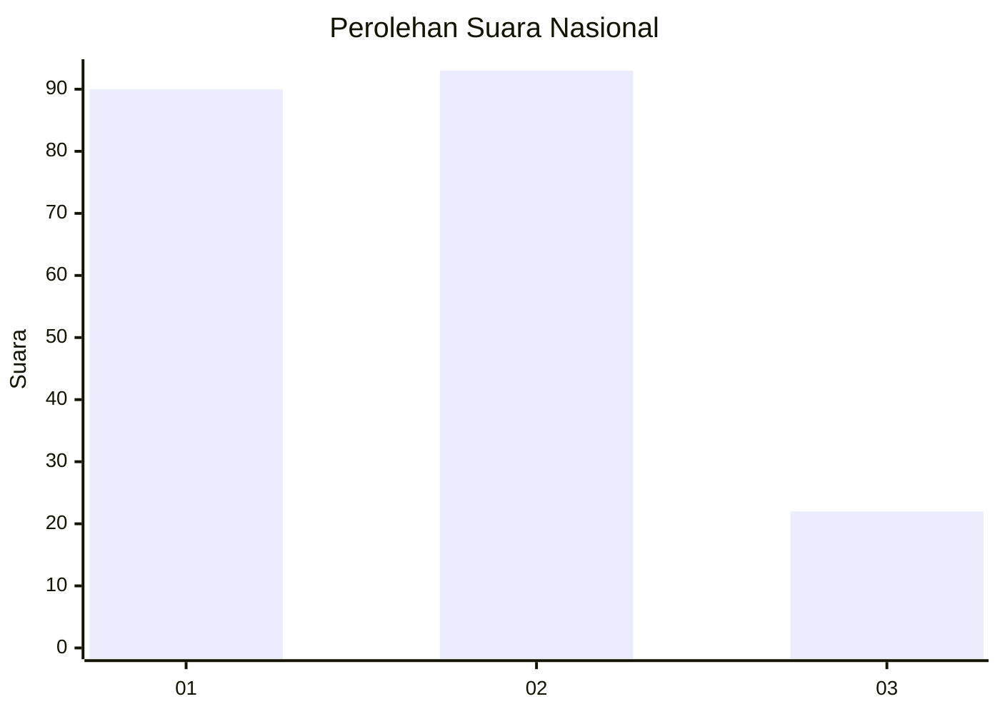
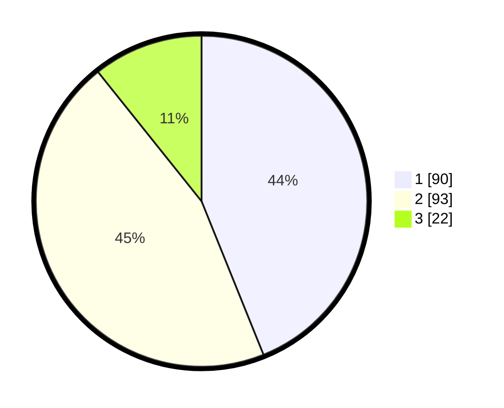

# Hasil

## Grafik

## Tabel

| No.    | Nama Paslon    | Suara | Suara (raw) | Persentase |
|:------ |:-------------- | -----:| -----------:| ----------:|
| 100025 | ANIES MUHAIMIN | 90    | [90][p-1]   | 43,90      |
| 100026 | PRABOWO GIBRAN | 93    | [93][p-2]   | 45,37      |
| 100027 | GANJAR MAHFUD  | 22    | [22][p-3]   | 10,73      |

[p-1]: https://github.com/gigit-pemilu/pemilu-2024/blob/main/pilpres/hitung-suara/sub/31-dki-jakarta/sub/73-jakarta-barat/sub/06-kalideres/sub/1005-pegadungan/sub/011-tps/sub/paslon-1.txt
[p-2]: https://github.com/gigit-pemilu/pemilu-2024/blob/main/pilpres/hitung-suara/sub/31-dki-jakarta/sub/73-jakarta-barat/sub/06-kalideres/sub/1005-pegadungan/sub/011-tps/sub/paslon-2.txt
[p-3]: https://github.com/gigit-pemilu/pemilu-2024/blob/main/pilpres/hitung-suara/sub/31-dki-jakarta/sub/73-jakarta-barat/sub/06-kalideres/sub/1005-pegadungan/sub/011-tps/sub/paslon-3.txt

## Foto C Plano

https://sirekap-obj-formc.kpu.go.id/9b22/pemilu/ppwp/31/73/06/10/05/3173061005011-20240214-224102--4342c7c6-0edf-498d-ad96-1d1d25a6c928.jpg

https://sirekap-obj-formc.kpu.go.id/9b22/pemilu/ppwp/31/73/06/10/05/3173061005011-20240214-224218--baa0da18-6ef5-4b0a-afbc-1dfd56ed9455.jpg

https://sirekap-obj-formc.kpu.go.id/9b22/pemilu/ppwp/31/73/06/10/05/3173061005011-20240214-224327--5c5ea392-cb79-4fa4-b7df-11f4b74e454d.jpg

## Metadata

| Key        | Value               |
| ---------- | ------------------- |
| Time Stamp | 2024-02-17 14:45:18 |

