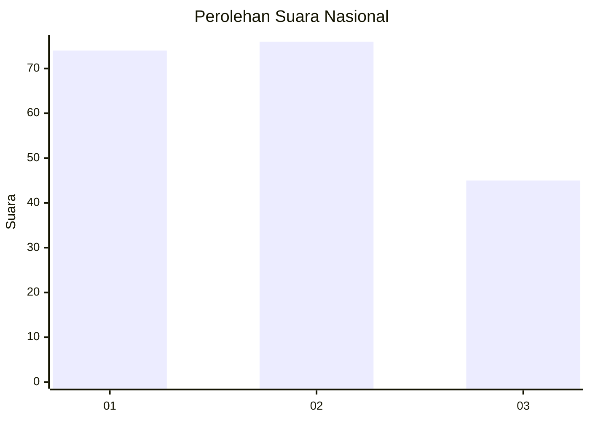
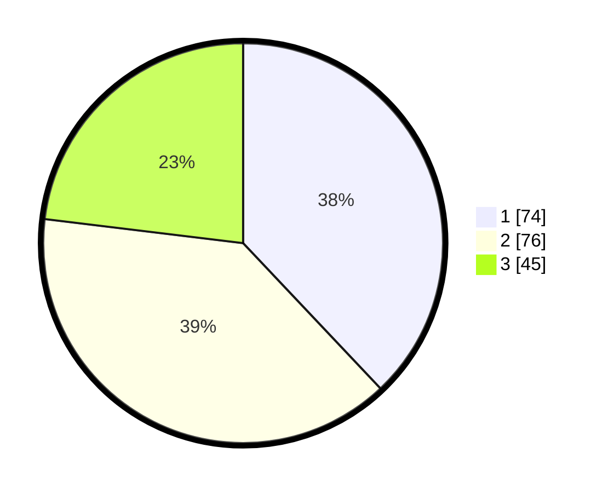

# Hasil

## Grafik

## Tabel

| No.    | Nama Paslon    | Suara | Suara (raw) | Persentase |
|:------ |:-------------- | -----:| -----------:| ----------:|
| 100025 | ANIES MUHAIMIN | 74    | [74][p-1]   | 37,95      |
| 100026 | PRABOWO GIBRAN | 76    | [76][p-2]   | 38,97      |
| 100027 | GANJAR MAHFUD  | 45    | [45][p-3]   | 23,08      |

[p-1]: https://github.com/gigit-pemilu/pemilu-2024/blob/main/pilpres/hitung-suara/sub/31-dki-jakarta/sub/73-jakarta-barat/sub/06-kalideres/sub/1005-pegadungan/sub/032-tps/sub/paslon-1.txt
[p-2]: https://github.com/gigit-pemilu/pemilu-2024/blob/main/pilpres/hitung-suara/sub/31-dki-jakarta/sub/73-jakarta-barat/sub/06-kalideres/sub/1005-pegadungan/sub/032-tps/sub/paslon-2.txt
[p-3]: https://github.com/gigit-pemilu/pemilu-2024/blob/main/pilpres/hitung-suara/sub/31-dki-jakarta/sub/73-jakarta-barat/sub/06-kalideres/sub/1005-pegadungan/sub/032-tps/sub/paslon-3.txt

## Foto C Plano

https://sirekap-obj-formc.kpu.go.id/9a08/pemilu/ppwp/31/73/06/10/05/3173061005032-20240214-212445--2706ec68-20fa-442c-b578-9822f3df6490.jpg

https://sirekap-obj-formc.kpu.go.id/9a08/pemilu/ppwp/31/73/06/10/05/3173061005032-20240214-212811--ef2d43a2-f0ee-4f5b-af5c-13e5267d9f15.jpg

https://sirekap-obj-formc.kpu.go.id/9a08/pemilu/ppwp/31/73/06/10/05/3173061005032-20240214-212942--c2c5a81f-a1fa-4bb2-b2e3-e5b7b0037c0a.jpg

## Metadata

| Key        | Value               |
| ---------- | ------------------- |
| Time Stamp | 2024-02-17 14:45:18 |

