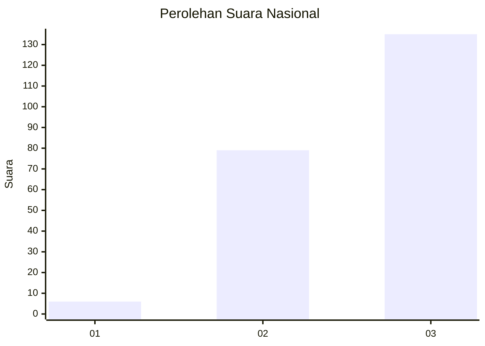
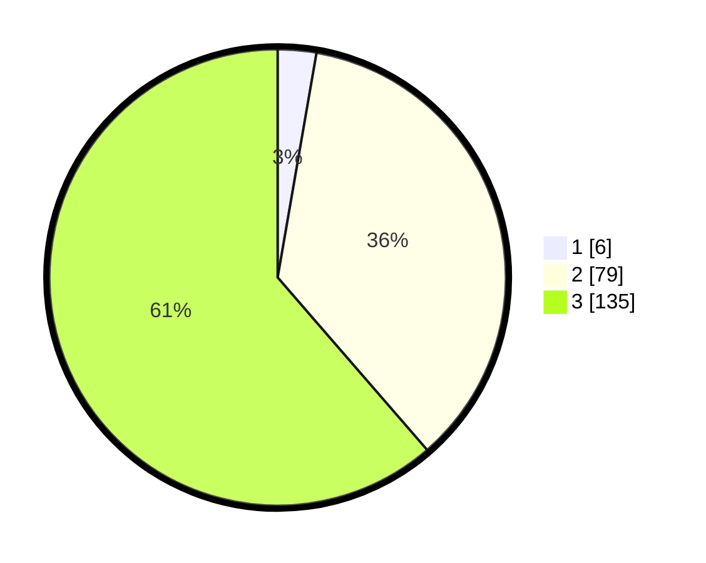

# Hasil

## Grafik

## Tabel

| No.    | Nama Paslon    | Suara | Suara (raw) | Persentase |
|:------ |:-------------- | -----:| -----------:| ----------:|
| 100025 | ANIES MUHAIMIN | 6     | [6][p-1]    | 2,73       |
| 100026 | PRABOWO GIBRAN | 79    | [79][p-2]   | 35,91      |
| 100027 | GANJAR MAHFUD  | 135   | [135][p-3]  | 61,36      |

[p-1]: https://github.com/gigit-pemilu/pemilu-2024/blob/main/pilpres/hitung-suara/sub/31-dki-jakarta/sub/73-jakarta-barat/sub/06-kalideres/sub/1005-pegadungan/sub/043-tps/sub/paslon-1.txt
[p-2]: https://github.com/gigit-pemilu/pemilu-2024/blob/main/pilpres/hitung-suara/sub/31-dki-jakarta/sub/73-jakarta-barat/sub/06-kalideres/sub/1005-pegadungan/sub/043-tps/sub/paslon-2.txt
[p-3]: https://github.com/gigit-pemilu/pemilu-2024/blob/main/pilpres/hitung-suara/sub/31-dki-jakarta/sub/73-jakarta-barat/sub/06-kalideres/sub/1005-pegadungan/sub/043-tps/sub/paslon-3.txt

## Foto C Plano

https://sirekap-obj-formc.kpu.go.id/e17d/pemilu/ppwp/31/73/06/10/05/3173061005043-20240214-204828--dd032725-f029-4c46-be89-6019ca3d8db6.jpg

https://sirekap-obj-formc.kpu.go.id/e17d/pemilu/ppwp/31/73/06/10/05/3173061005043-20240214-214543--3f79f274-27ed-469a-8219-750706686d93.jpg

https://sirekap-obj-formc.kpu.go.id/e17d/pemilu/ppwp/31/73/06/10/05/3173061005043-20240214-214434--d258c866-92f3-4408-b178-42307a68e22b.jpg

## Metadata

| Key        | Value               |
| ---------- | ------------------- |
| Time Stamp | 2024-02-17 14:45:18 |

