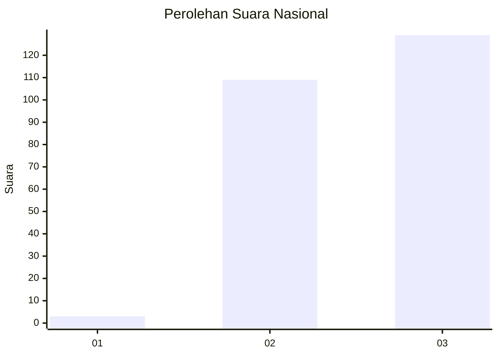
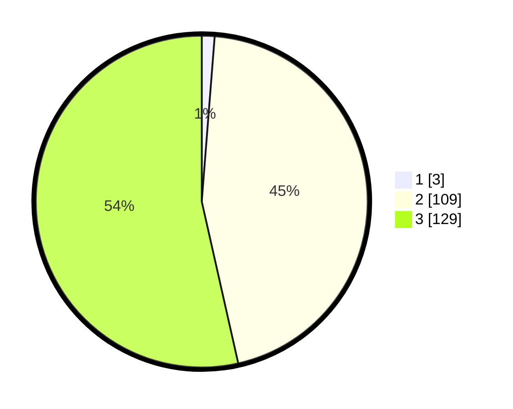

# Hasil

## Grafik

## Tabel

| No.    | Nama Paslon    | Suara | Suara (raw) | Persentase |
|:------ |:-------------- | -----:| -----------:| ----------:|
| 100025 | ANIES MUHAIMIN | 3     | [3][p-1]    | 1,24       |
| 100026 | PRABOWO GIBRAN | 109   | [109][p-2]  | 45,23      |
| 100027 | GANJAR MAHFUD  | 129   | [129][p-3]  | 53,53      |

[p-1]: https://github.com/gigit-pemilu/pemilu-2024/blob/main/pilpres/hitung-suara/sub/31-dki-jakarta/sub/73-jakarta-barat/sub/06-kalideres/sub/1005-pegadungan/sub/045-tps/sub/paslon-1.txt
[p-2]: https://github.com/gigit-pemilu/pemilu-2024/blob/main/pilpres/hitung-suara/sub/31-dki-jakarta/sub/73-jakarta-barat/sub/06-kalideres/sub/1005-pegadungan/sub/045-tps/sub/paslon-2.txt
[p-3]: https://github.com/gigit-pemilu/pemilu-2024/blob/main/pilpres/hitung-suara/sub/31-dki-jakarta/sub/73-jakarta-barat/sub/06-kalideres/sub/1005-pegadungan/sub/045-tps/sub/paslon-3.txt

## Foto C Plano

https://sirekap-obj-formc.kpu.go.id/ac14/pemilu/ppwp/31/73/06/10/05/3173061005045-20240214-203821--60d4d1fe-6408-4a2c-aaf1-f64560636bab.jpg

https://sirekap-obj-formc.kpu.go.id/ac14/pemilu/ppwp/31/73/06/10/05/3173061005045-20240214-203841--ce282bce-358e-4064-9e19-d8749d791580.jpg

https://sirekap-obj-formc.kpu.go.id/ac14/pemilu/ppwp/31/73/06/10/05/3173061005045-20240214-203916--1dabb6b5-5a53-4483-9580-bc8f22fdad62.jpg

## Metadata

| Key        | Value               |
| ---------- | ------------------- |
| Time Stamp | 2024-02-19 06:16:00 |

