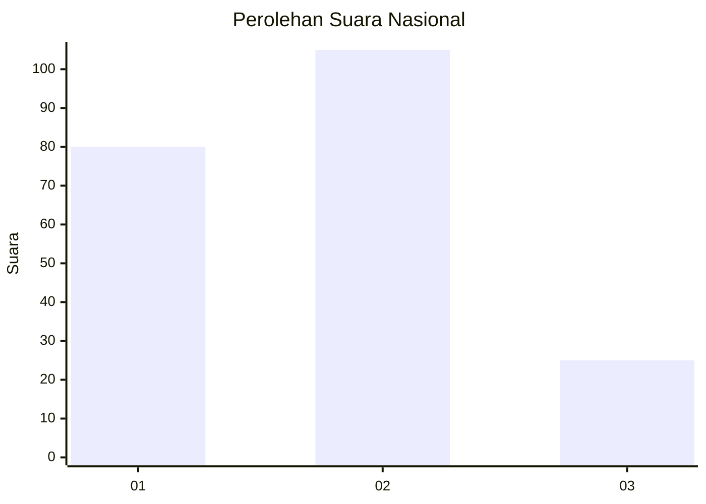
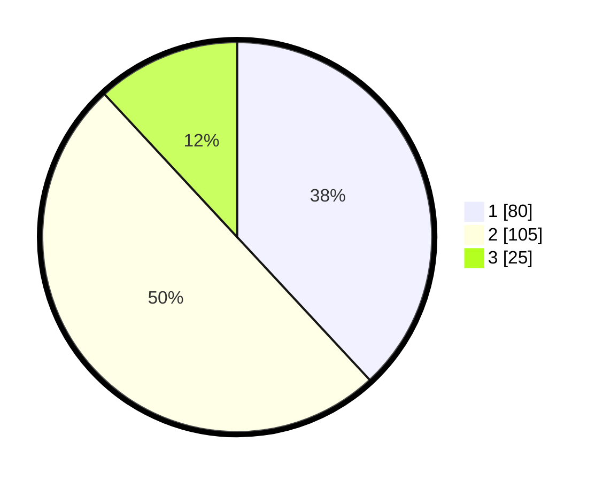

# Hasil

## Grafik

## Tabel

| No.    | Nama Paslon    | Suara | Suara (raw) | Persentase |
|:------ |:-------------- | -----:| -----------:| ----------:|
| 100025 | ANIES MUHAIMIN | 80    | [80][p-1]   | 38,10      |
| 100026 | PRABOWO GIBRAN | 105   | [105][p-2]  | 50,00      |
| 100027 | GANJAR MAHFUD  | 25    | [25][p-3]   | 11,90      |

[p-1]: https://github.com/gigit-pemilu/pemilu-2024/blob/main/pilpres/hitung-suara/sub/31-dki-jakarta/sub/73-jakarta-barat/sub/06-kalideres/sub/1005-pegadungan/sub/054-tps/sub/paslon-1.txt
[p-2]: https://github.com/gigit-pemilu/pemilu-2024/blob/main/pilpres/hitung-suara/sub/31-dki-jakarta/sub/73-jakarta-barat/sub/06-kalideres/sub/1005-pegadungan/sub/054-tps/sub/paslon-2.txt
[p-3]: https://github.com/gigit-pemilu/pemilu-2024/blob/main/pilpres/hitung-suara/sub/31-dki-jakarta/sub/73-jakarta-barat/sub/06-kalideres/sub/1005-pegadungan/sub/054-tps/sub/paslon-3.txt

## Foto C Plano

https://sirekap-obj-formc.kpu.go.id/c788/pemilu/ppwp/31/73/06/10/05/3173061005054-20240215-002211--42de5019-beb9-4212-b11b-51d0896d69ca.jpg

https://sirekap-obj-formc.kpu.go.id/c788/pemilu/ppwp/31/73/06/10/05/3173061005054-20240215-002253--53a0287c-042e-4406-9a41-01258a4d2831.jpg

https://sirekap-obj-formc.kpu.go.id/c788/pemilu/ppwp/31/73/06/10/05/3173061005054-20240215-002318--692f7129-c914-460c-a78b-c44e0efabd43.jpg

## Metadata

| Key        | Value               |
| ---------- | ------------------- |
| Time Stamp | 2024-02-19 14:00:00 |

