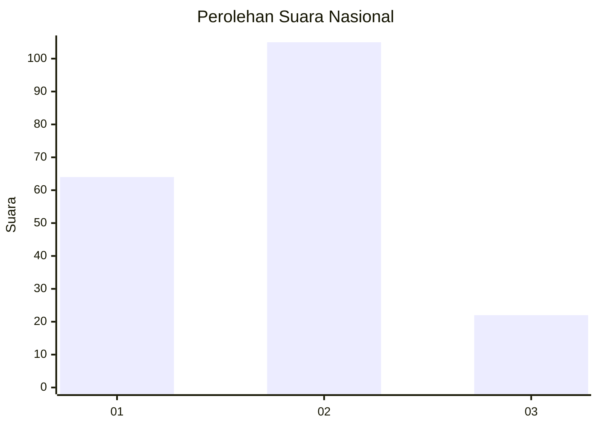
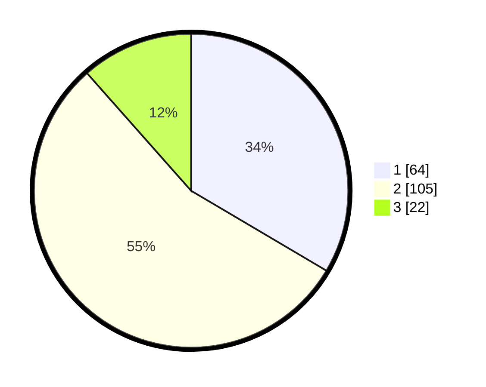

# Hasil

## Grafik

## Tabel

| No.    | Nama Paslon    | Suara | Suara (raw) | Persentase |
|:------ |:-------------- | -----:| -----------:| ----------:|
| 100025 | ANIES MUHAIMIN | 64    | [64][p-1]   | 33,51      |
| 100026 | PRABOWO GIBRAN | 105   | [105][p-2]  | 54,97      |
| 100027 | GANJAR MAHFUD  | 22    | [22][p-3]   | 11,52      |

[p-1]: https://github.com/gigit-pemilu/pemilu-2024/blob/main/pilpres/hitung-suara/sub/31-dki-jakarta/sub/73-jakarta-barat/sub/06-kalideres/sub/1005-pegadungan/sub/060-tps/sub/paslon-1.txt
[p-2]: https://github.com/gigit-pemilu/pemilu-2024/blob/main/pilpres/hitung-suara/sub/31-dki-jakarta/sub/73-jakarta-barat/sub/06-kalideres/sub/1005-pegadungan/sub/060-tps/sub/paslon-2.txt
[p-3]: https://github.com/gigit-pemilu/pemilu-2024/blob/main/pilpres/hitung-suara/sub/31-dki-jakarta/sub/73-jakarta-barat/sub/06-kalideres/sub/1005-pegadungan/sub/060-tps/sub/paslon-3.txt

## Foto C Plano

https://sirekap-obj-formc.kpu.go.id/e5d0/pemilu/ppwp/31/73/06/10/05/3173061005060-20240215-010329--0b8a0022-2bd3-4d34-8474-4d5174a8c3d6.jpg

https://sirekap-obj-formc.kpu.go.id/e5d0/pemilu/ppwp/31/73/06/10/05/3173061005060-20240215-010449--756dfdd5-e9cf-4f85-9e97-47edc4bddf32.jpg

https://sirekap-obj-formc.kpu.go.id/e5d0/pemilu/ppwp/31/73/06/10/05/3173061005060-20240215-010600--a6527d44-5d60-4215-8c57-3cc3645dfaba.jpg

## Metadata

| Key        | Value               |
| ---------- | ------------------- |
| Time Stamp | 2024-02-19 14:00:00 |

