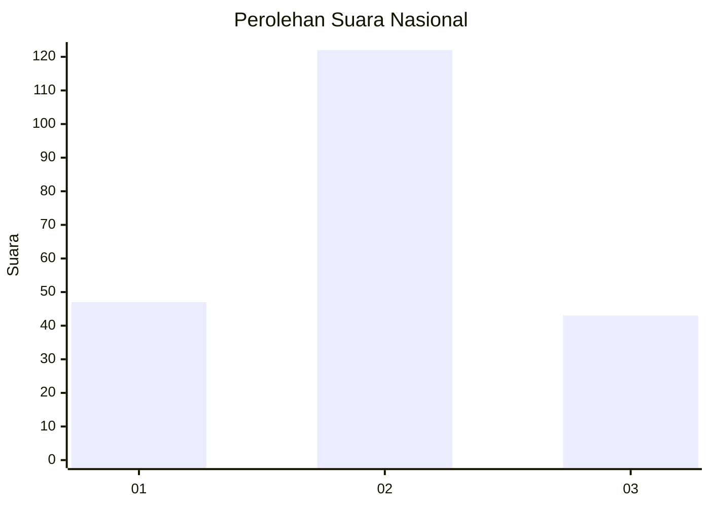
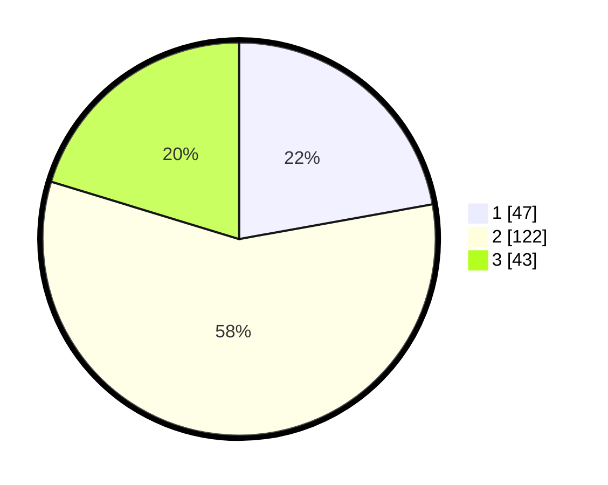

# Hasil

## Grafik

## Tabel

| No.    | Nama Paslon    | Suara | Suara (raw) | Persentase |
|:------ |:-------------- | -----:| -----------:| ----------:|
| 100025 | ANIES MUHAIMIN | 47    | [47][p-1]   | 22,17      |
| 100026 | PRABOWO GIBRAN | 122   | [122][p-2]  | 57,55      |
| 100027 | GANJAR MAHFUD  | 43    | [43][p-3]   | 20,28      |

[p-1]: https://github.com/gigit-pemilu/pemilu-2024/blob/main/pilpres/hitung-suara/sub/31-dki-jakarta/sub/73-jakarta-barat/sub/06-kalideres/sub/1005-pegadungan/sub/074-tps/sub/paslon-1.txt
[p-2]: https://github.com/gigit-pemilu/pemilu-2024/blob/main/pilpres/hitung-suara/sub/31-dki-jakarta/sub/73-jakarta-barat/sub/06-kalideres/sub/1005-pegadungan/sub/074-tps/sub/paslon-2.txt
[p-3]: https://github.com/gigit-pemilu/pemilu-2024/blob/main/pilpres/hitung-suara/sub/31-dki-jakarta/sub/73-jakarta-barat/sub/06-kalideres/sub/1005-pegadungan/sub/074-tps/sub/paslon-3.txt

## Foto C Plano

https://sirekap-obj-formc.kpu.go.id/fb8f/pemilu/ppwp/31/73/06/10/05/3173061005074-20240214-231321--a3631ab3-78b9-42cf-bd86-371a8f2a989d.jpg

https://sirekap-obj-formc.kpu.go.id/fb8f/pemilu/ppwp/31/73/06/10/05/3173061005074-20240214-231628--e2438fd1-e172-4f05-a08c-d267a7d92f07.jpg

https://sirekap-obj-formc.kpu.go.id/fb8f/pemilu/ppwp/31/73/06/10/05/3173061005074-20240214-231753--14beefa2-f1a0-44dc-bbae-c67b7bfcebb3.jpg

## Metadata

| Key        | Value               |
| ---------- | ------------------- |
| Time Stamp | 2024-02-15 17:00:25 |

