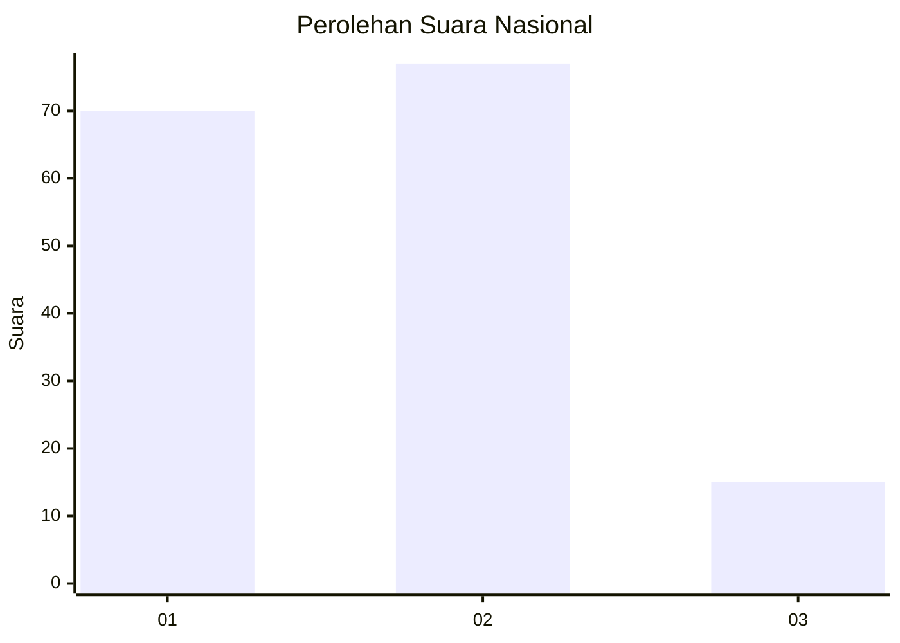
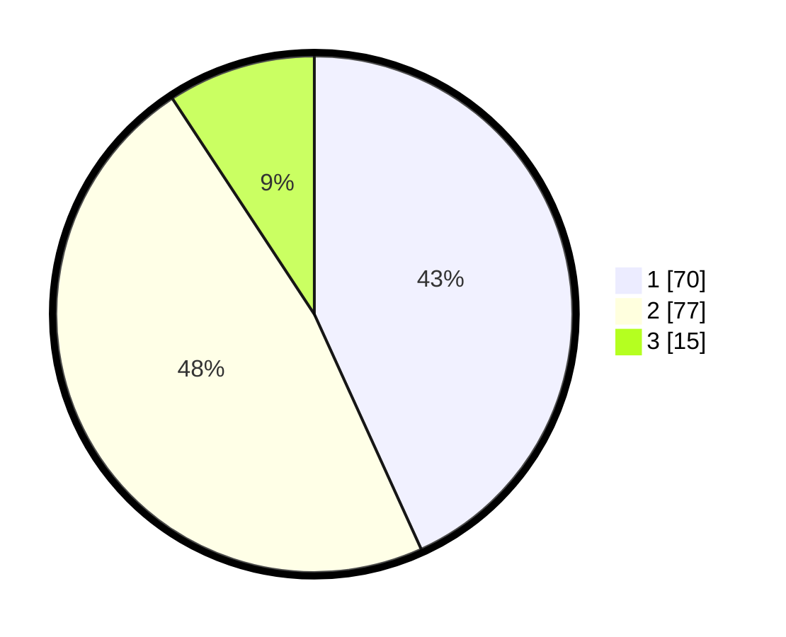

# Hasil

## Grafik

## Tabel

| No.    | Nama Paslon    | Suara | Suara (raw) | Persentase |
|:------ |:-------------- | -----:| -----------:| ----------:|
| 100025 | ANIES MUHAIMIN | 70    | [70][p-1]   | 43,21      |
| 100026 | PRABOWO GIBRAN | 77    | [77][p-2]   | 47,53      |
| 100027 | GANJAR MAHFUD  | 15    | [15][p-3]   | 9,26       |

[p-1]: https://github.com/gigit-pemilu/pemilu-2024/blob/main/pilpres/hitung-suara/sub/31-dki-jakarta/sub/73-jakarta-barat/sub/06-kalideres/sub/1005-pegadungan/sub/101-tps/sub/paslon-1.txt
[p-2]: https://github.com/gigit-pemilu/pemilu-2024/blob/main/pilpres/hitung-suara/sub/31-dki-jakarta/sub/73-jakarta-barat/sub/06-kalideres/sub/1005-pegadungan/sub/101-tps/sub/paslon-2.txt
[p-3]: https://github.com/gigit-pemilu/pemilu-2024/blob/main/pilpres/hitung-suara/sub/31-dki-jakarta/sub/73-jakarta-barat/sub/06-kalideres/sub/1005-pegadungan/sub/101-tps/sub/paslon-3.txt

## Foto C Plano

https://sirekap-obj-formc.kpu.go.id/3149/pemilu/ppwp/31/73/06/10/05/3173061005101-20240214-231722--1cfaf265-95a1-496b-a70e-4c1069276d83.jpg

https://sirekap-obj-formc.kpu.go.id/3149/pemilu/ppwp/31/73/06/10/05/3173061005101-20240214-231818--6d425b69-b1b9-4444-b0a1-0361f85008f6.jpg

https://sirekap-obj-formc.kpu.go.id/3149/pemilu/ppwp/31/73/06/10/05/3173061005101-20240214-231923--fa4db586-1875-4782-8a50-e37edc8aad98.jpg

## Metadata

| Key        | Value               |
| ---------- | ------------------- |
| Time Stamp | 2024-02-19 18:00:00 |

