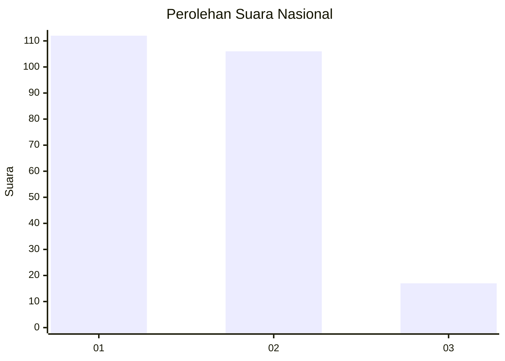
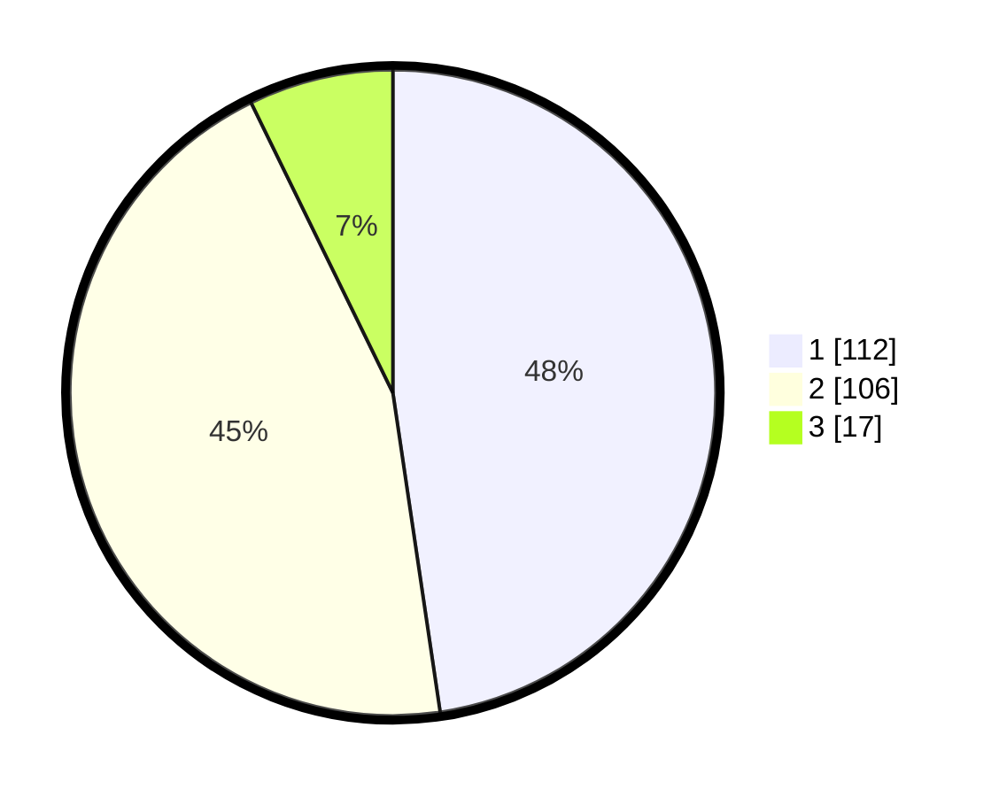

# Hasil

## Grafik

## Tabel

| No.    | Nama Paslon    | Suara | Suara (raw) | Persentase |
|:------ |:-------------- | -----:| -----------:| ----------:|
| 100025 | ANIES MUHAIMIN | 112   | [112][p-1]  | 47,66      |
| 100026 | PRABOWO GIBRAN | 106   | [106][p-2]  | 45,11      |
| 100027 | GANJAR MAHFUD  | 17    | [17][p-3]   | 7,23       |

[p-1]: https://github.com/gigit-pemilu/pemilu-2024/blob/main/pilpres/hitung-suara/sub/31-dki-jakarta/sub/73-jakarta-barat/sub/06-kalideres/sub/1005-pegadungan/sub/111-tps/sub/paslon-1.txt
[p-2]: https://github.com/gigit-pemilu/pemilu-2024/blob/main/pilpres/hitung-suara/sub/31-dki-jakarta/sub/73-jakarta-barat/sub/06-kalideres/sub/1005-pegadungan/sub/111-tps/sub/paslon-2.txt
[p-3]: https://github.com/gigit-pemilu/pemilu-2024/blob/main/pilpres/hitung-suara/sub/31-dki-jakarta/sub/73-jakarta-barat/sub/06-kalideres/sub/1005-pegadungan/sub/111-tps/sub/paslon-3.txt

## Foto C Plano

https://sirekap-obj-formc.kpu.go.id/e2b0/pemilu/ppwp/31/73/06/10/05/3173061005111-20240214-213913--07f38b48-ed4d-40af-8bf8-1557a50b8737.jpg

https://sirekap-obj-formc.kpu.go.id/e2b0/pemilu/ppwp/31/73/06/10/05/3173061005111-20240214-214019--56b85bf5-dbee-4475-bb26-f62337bc4c38.jpg

https://sirekap-obj-formc.kpu.go.id/e2b0/pemilu/ppwp/31/73/06/10/05/3173061005111-20240214-214105--3afcf953-cdaf-4a1e-ad05-b94df4534057.jpg

## Metadata

| Key        | Value               |
| ---------- | ------------------- |
| Time Stamp | 2024-02-19 14:00:00 |

