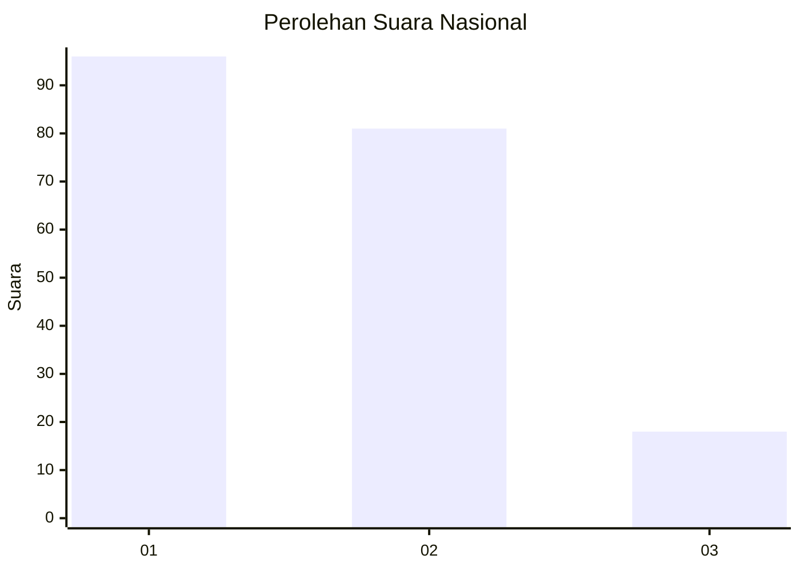
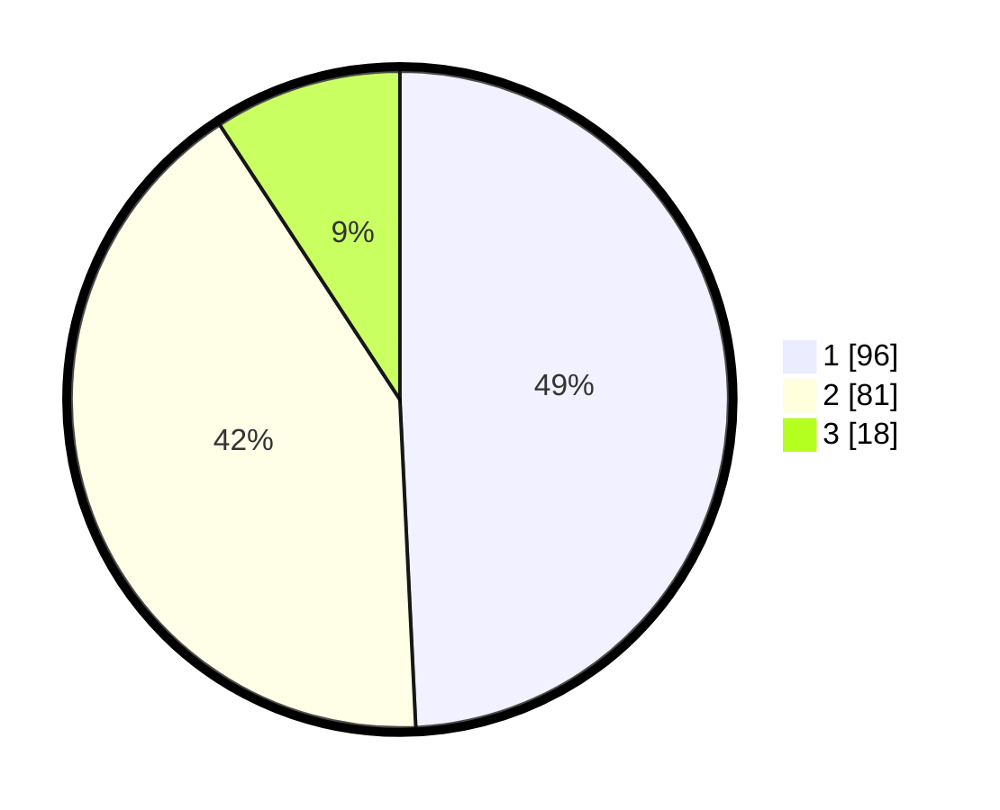

# Hasil

## Grafik

## Tabel

| No.    | Nama Paslon    | Suara | Suara (raw) | Persentase |
|:------ |:-------------- | -----:| -----------:| ----------:|
| 100025 | ANIES MUHAIMIN | 96    | [96][p-1]   | 49,23      |
| 100026 | PRABOWO GIBRAN | 81    | [81][p-2]   | 41,54      |
| 100027 | GANJAR MAHFUD  | 18    | [18][p-3]   | 9,23       |

[p-1]: https://github.com/gigit-pemilu/pemilu-2024/blob/main/pilpres/hitung-suara/sub/31-dki-jakarta/sub/73-jakarta-barat/sub/06-kalideres/sub/1005-pegadungan/sub/114-tps/sub/paslon-1.txt
[p-2]: https://github.com/gigit-pemilu/pemilu-2024/blob/main/pilpres/hitung-suara/sub/31-dki-jakarta/sub/73-jakarta-barat/sub/06-kalideres/sub/1005-pegadungan/sub/114-tps/sub/paslon-2.txt
[p-3]: https://github.com/gigit-pemilu/pemilu-2024/blob/main/pilpres/hitung-suara/sub/31-dki-jakarta/sub/73-jakarta-barat/sub/06-kalideres/sub/1005-pegadungan/sub/114-tps/sub/paslon-3.txt

## Foto C Plano

https://sirekap-obj-formc.kpu.go.id/9e48/pemilu/ppwp/31/73/06/10/05/3173061005114-20240215-011326--2f7a4824-062d-40a3-94a2-45e4b638ba27.jpg

https://sirekap-obj-formc.kpu.go.id/9e48/pemilu/ppwp/31/73/06/10/05/3173061005114-20240215-011417--f7f863d4-35a4-4cc5-9702-0819214b7ed0.jpg

https://sirekap-obj-formc.kpu.go.id/9e48/pemilu/ppwp/31/73/06/10/05/3173061005114-20240215-011456--a32f3ef9-eebb-451a-8e97-2bc49d245fa0.jpg

## Metadata

| Key        | Value               |
| ---------- | ------------------- |
| Time Stamp | 2024-02-19 14:00:00 |

