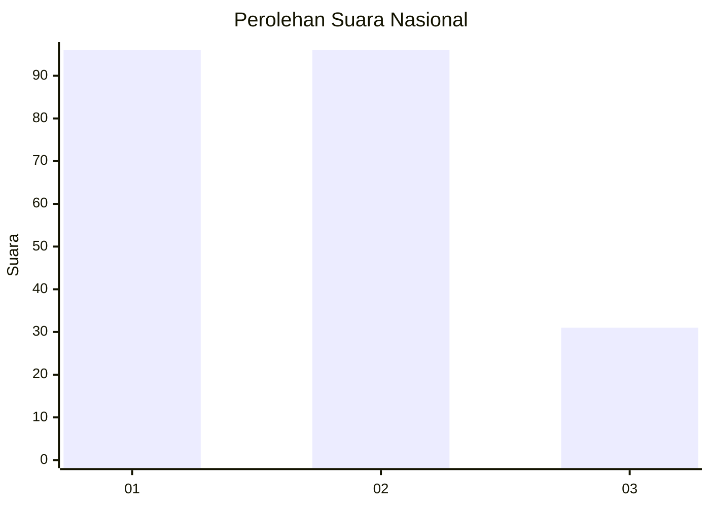
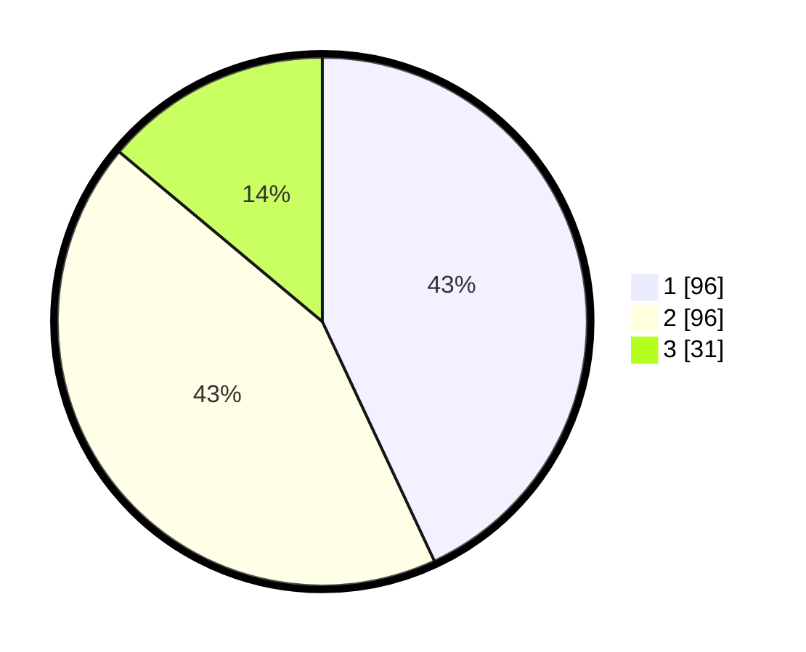

# Hasil

## Grafik

## Tabel

| No.    | Nama Paslon    | Suara | Suara (raw) | Persentase |
|:------ |:-------------- | -----:| -----------:| ----------:|
| 100025 | ANIES MUHAIMIN | 96    | [96][p-1]   | 43,05      |
| 100026 | PRABOWO GIBRAN | 96    | [96][p-2]   | 43,05      |
| 100027 | GANJAR MAHFUD  | 31    | [31][p-3]   | 13,90      |

[p-1]: https://github.com/gigit-pemilu/pemilu-2024/blob/main/pilpres/hitung-suara/sub/31-dki-jakarta/sub/73-jakarta-barat/sub/06-kalideres/sub/1005-pegadungan/sub/119-tps/sub/paslon-1.txt
[p-2]: https://github.com/gigit-pemilu/pemilu-2024/blob/main/pilpres/hitung-suara/sub/31-dki-jakarta/sub/73-jakarta-barat/sub/06-kalideres/sub/1005-pegadungan/sub/119-tps/sub/paslon-2.txt
[p-3]: https://github.com/gigit-pemilu/pemilu-2024/blob/main/pilpres/hitung-suara/sub/31-dki-jakarta/sub/73-jakarta-barat/sub/06-kalideres/sub/1005-pegadungan/sub/119-tps/sub/paslon-3.txt

## Foto C Plano

https://sirekap-obj-formc.kpu.go.id/2f26/pemilu/ppwp/31/73/06/10/05/3173061005119-20240214-221850--26320723-b961-4382-aae2-5f4a7375039f.jpg

https://sirekap-obj-formc.kpu.go.id/2f26/pemilu/ppwp/31/73/06/10/05/3173061005119-20240214-221955--74ca57fc-be2b-4007-a12e-7f4661424ff0.jpg

https://sirekap-obj-formc.kpu.go.id/2f26/pemilu/ppwp/31/73/06/10/05/3173061005119-20240214-222021--e90458eb-1ee1-4f40-b4fb-52b23943393d.jpg

## Metadata

| Key        | Value               |
| ---------- | ------------------- |
| Time Stamp | 2024-02-17 14:45:18 |

