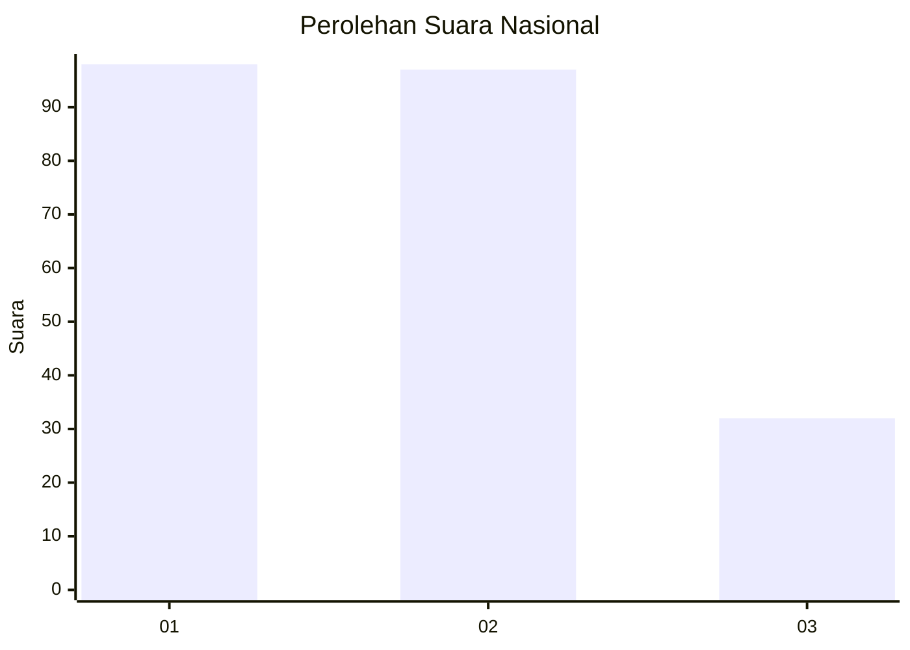
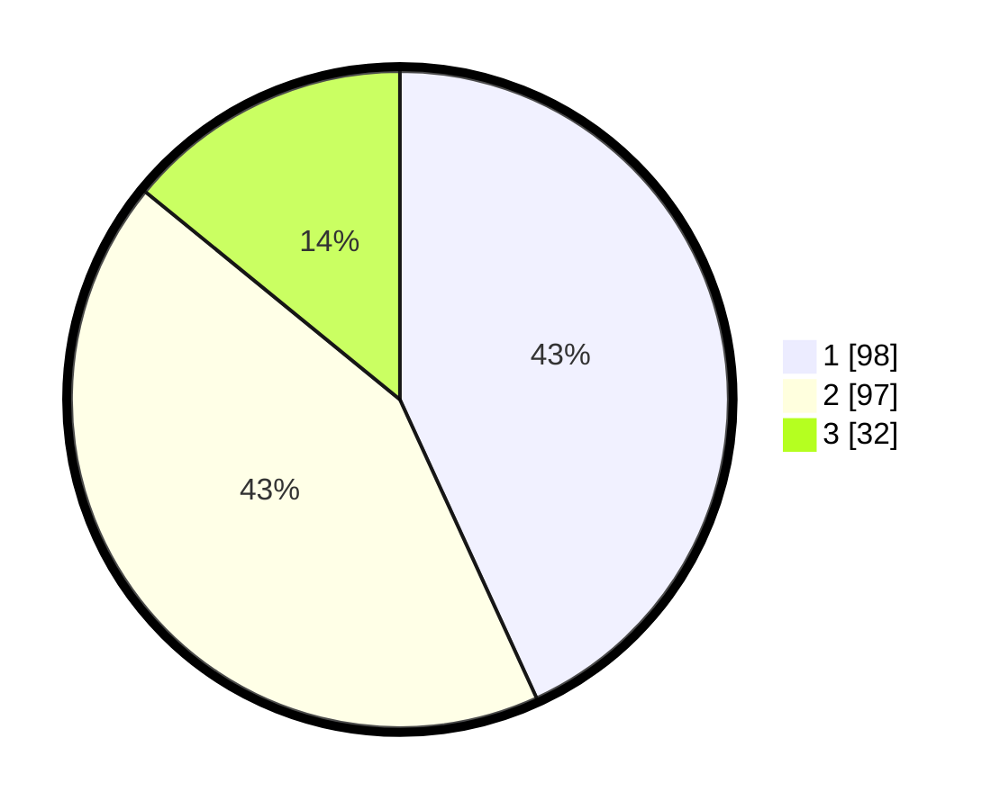

# Hasil

## Grafik

## Tabel

| No.    | Nama Paslon    | Suara | Suara (raw) | Persentase |
|:------ |:-------------- | -----:| -----------:| ----------:|
| 100025 | ANIES MUHAIMIN | 98    | [98][p-1]   | 43,17      |
| 100026 | PRABOWO GIBRAN | 97    | [97][p-2]   | 42,73      |
| 100027 | GANJAR MAHFUD  | 32    | [32][p-3]   | 14,10      |

[p-1]: https://github.com/gigit-pemilu/pemilu-2024/blob/main/pilpres/hitung-suara/sub/31-dki-jakarta/sub/73-jakarta-barat/sub/06-kalideres/sub/1005-pegadungan/sub/136-tps/sub/paslon-1.txt
[p-2]: https://github.com/gigit-pemilu/pemilu-2024/blob/main/pilpres/hitung-suara/sub/31-dki-jakarta/sub/73-jakarta-barat/sub/06-kalideres/sub/1005-pegadungan/sub/136-tps/sub/paslon-2.txt
[p-3]: https://github.com/gigit-pemilu/pemilu-2024/blob/main/pilpres/hitung-suara/sub/31-dki-jakarta/sub/73-jakarta-barat/sub/06-kalideres/sub/1005-pegadungan/sub/136-tps/sub/paslon-3.txt

## Foto C Plano

https://sirekap-obj-formc.kpu.go.id/d2df/pemilu/ppwp/31/73/06/10/05/3173061005136-20240214-233132--dd07ac89-0dee-4928-9a33-5378bda2c664.jpg

https://sirekap-obj-formc.kpu.go.id/d2df/pemilu/ppwp/31/73/06/10/05/3173061005136-20240214-233241--f26c2c02-dc92-44ae-bba0-b4482780520b.jpg

https://sirekap-obj-formc.kpu.go.id/d2df/pemilu/ppwp/31/73/06/10/05/3173061005136-20240214-233356--0500bbd1-2d2d-4bda-905e-43f596c6725e.jpg

## Metadata

| Key        | Value               |
| ---------- | ------------------- |
| Time Stamp | 2024-02-17 14:45:18 |

