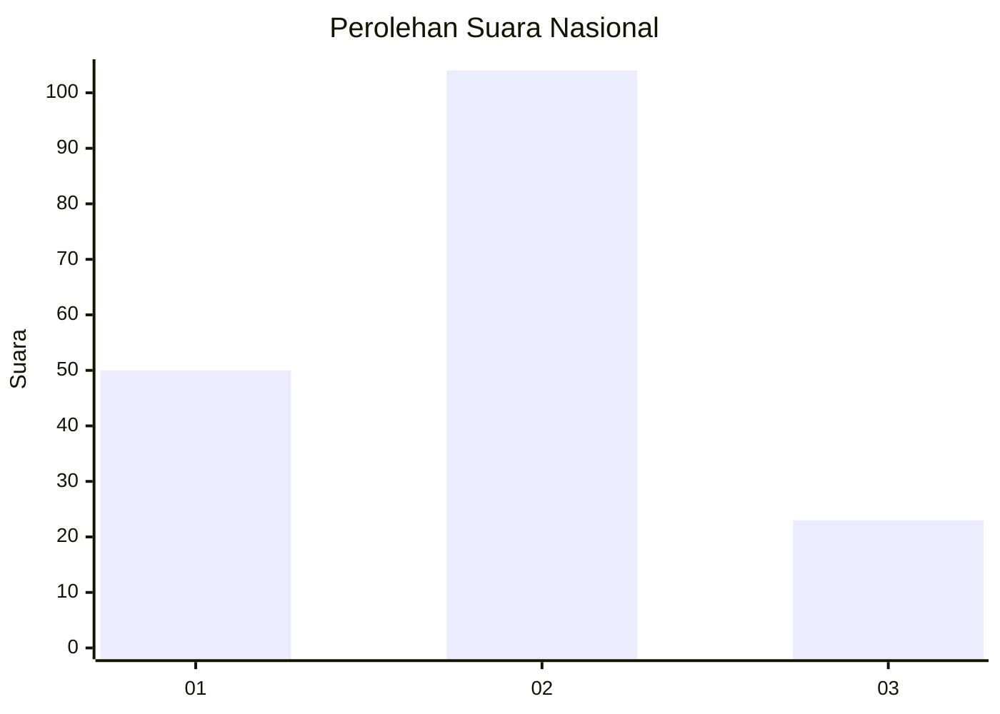
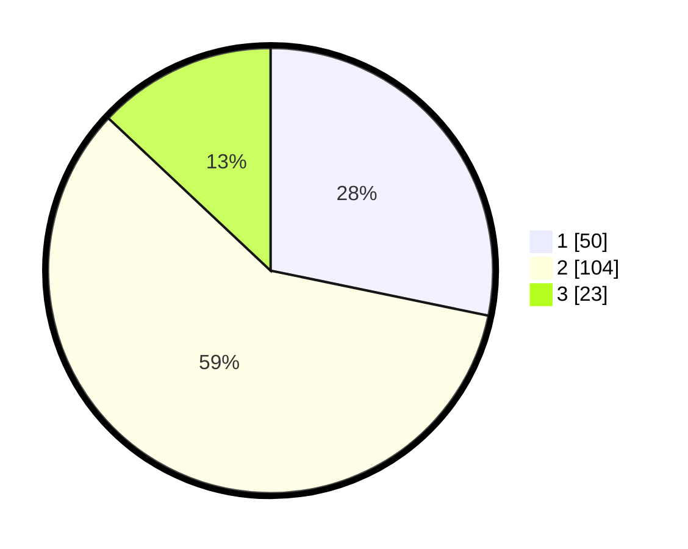

# Hasil

## Grafik

## Tabel

| No.    | Nama Paslon    | Suara | Suara (raw) | Persentase |
|:------ |:-------------- | -----:| -----------:| ----------:|
| 100025 | ANIES MUHAIMIN | 50    | [50][p-1]   | 28,25      |
| 100026 | PRABOWO GIBRAN | 104   | [104][p-2]  | 58,76      |
| 100027 | GANJAR MAHFUD  | 23    | [23][p-3]   | 12,99      |

[p-1]: https://github.com/gigit-pemilu/pemilu-2024/blob/main/pilpres/hitung-suara/sub/31-dki-jakarta/sub/73-jakarta-barat/sub/06-kalideres/sub/1005-pegadungan/sub/152-tps/sub/paslon-1.txt
[p-2]: https://github.com/gigit-pemilu/pemilu-2024/blob/main/pilpres/hitung-suara/sub/31-dki-jakarta/sub/73-jakarta-barat/sub/06-kalideres/sub/1005-pegadungan/sub/152-tps/sub/paslon-2.txt
[p-3]: https://github.com/gigit-pemilu/pemilu-2024/blob/main/pilpres/hitung-suara/sub/31-dki-jakarta/sub/73-jakarta-barat/sub/06-kalideres/sub/1005-pegadungan/sub/152-tps/sub/paslon-3.txt

## Foto C Plano

https://sirekap-obj-formc.kpu.go.id/6f40/pemilu/ppwp/31/73/06/10/05/3173061005152-20240214-214318--e10ab0a5-9a98-4d8b-9e47-d84bf4a33728.jpg

https://sirekap-obj-formc.kpu.go.id/6f40/pemilu/ppwp/31/73/06/10/05/3173061005152-20240214-214331--d88cbf4d-3461-4db5-917e-285730feb681.jpg

https://sirekap-obj-formc.kpu.go.id/6f40/pemilu/ppwp/31/73/06/10/05/3173061005152-20240214-214344--f978da85-f2ca-4df5-afb5-1c98b79bd4a2.jpg

## Metadata

| Key        | Value               |
| ---------- | ------------------- |
| Time Stamp | 2024-02-19 14:00:00 |

