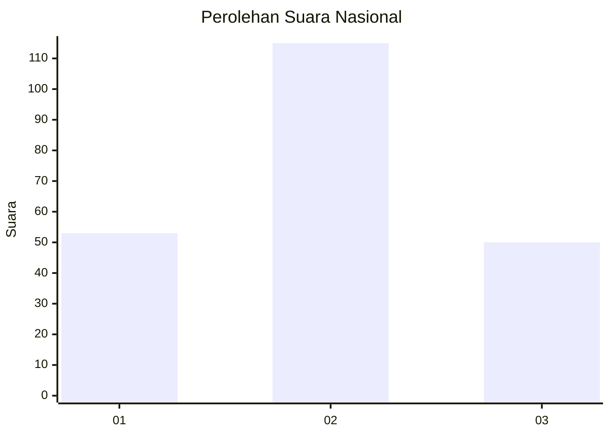
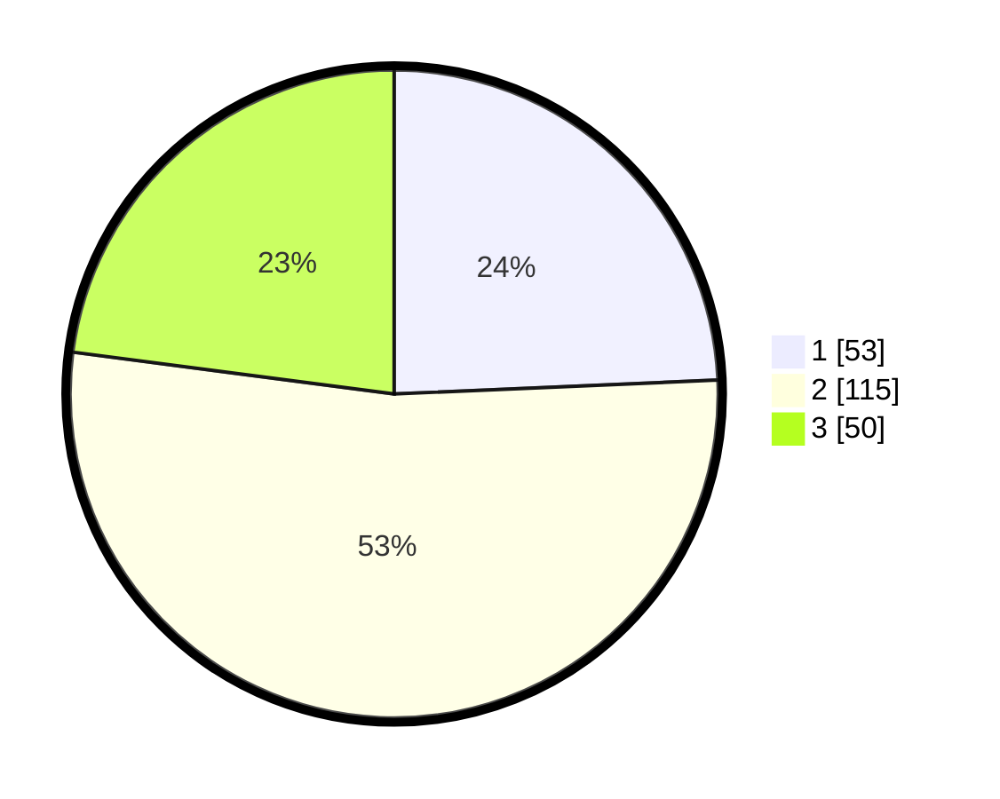

# Hasil

## Grafik

## Tabel

| No.    | Nama Paslon    | Suara | Suara (raw) | Persentase |
|:------ |:-------------- | -----:| -----------:| ----------:|
| 100025 | ANIES MUHAIMIN | 53    | [53][p-1]   | 24,31      |
| 100026 | PRABOWO GIBRAN | 115   | [115][p-2]  | 52,75      |
| 100027 | GANJAR MAHFUD  | 50    | [50][p-3]   | 22,94      |

[p-1]: https://github.com/gigit-pemilu/pemilu-2024/blob/main/pilpres/hitung-suara/sub/31-dki-jakarta/sub/73-jakarta-barat/sub/06-kalideres/sub/1005-pegadungan/sub/176-tps/sub/paslon-1.txt
[p-2]: https://github.com/gigit-pemilu/pemilu-2024/blob/main/pilpres/hitung-suara/sub/31-dki-jakarta/sub/73-jakarta-barat/sub/06-kalideres/sub/1005-pegadungan/sub/176-tps/sub/paslon-2.txt
[p-3]: https://github.com/gigit-pemilu/pemilu-2024/blob/main/pilpres/hitung-suara/sub/31-dki-jakarta/sub/73-jakarta-barat/sub/06-kalideres/sub/1005-pegadungan/sub/176-tps/sub/paslon-3.txt

## Foto C Plano

https://sirekap-obj-formc.kpu.go.id/c234/pemilu/ppwp/31/73/06/10/05/3173061005176-20240214-214236--048a8358-88e3-4611-8001-045ff7da9c12.jpg

https://sirekap-obj-formc.kpu.go.id/c234/pemilu/ppwp/31/73/06/10/05/3173061005176-20240214-214648--0924de3d-262a-4d61-acf2-e40d1b9e27c9.jpg

https://sirekap-obj-formc.kpu.go.id/c234/pemilu/ppwp/31/73/06/10/05/3173061005176-20240214-215157--9718dc6b-c135-465e-9111-3deae103d7ff.jpg

## Metadata

| Key        | Value               |
| ---------- | ------------------- |
| Time Stamp | 2024-02-15 21:30:27 |

