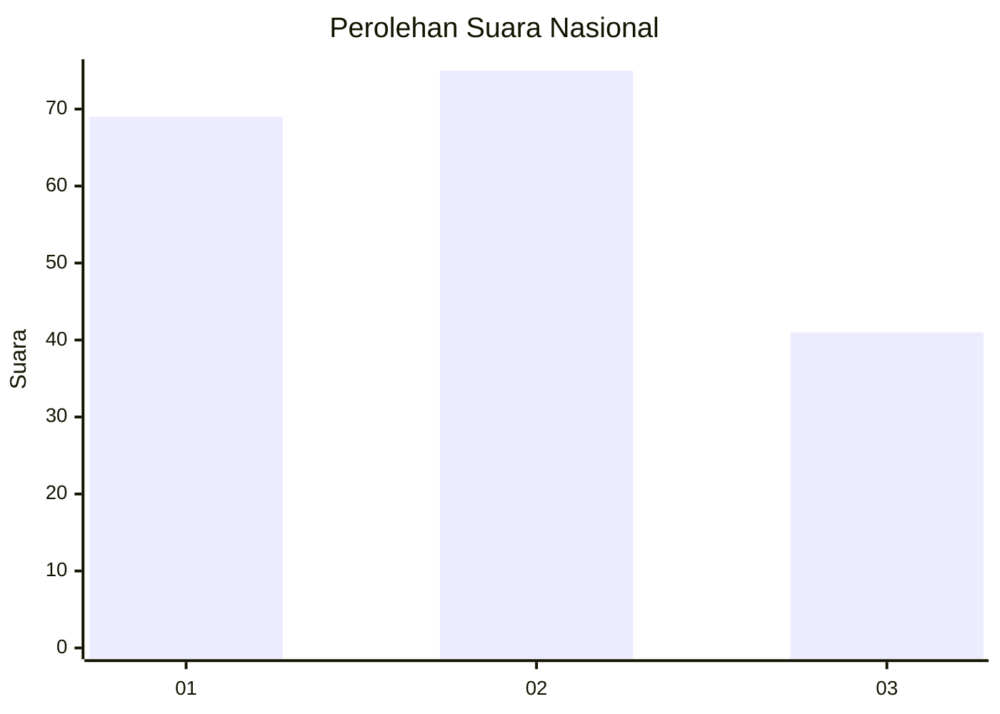
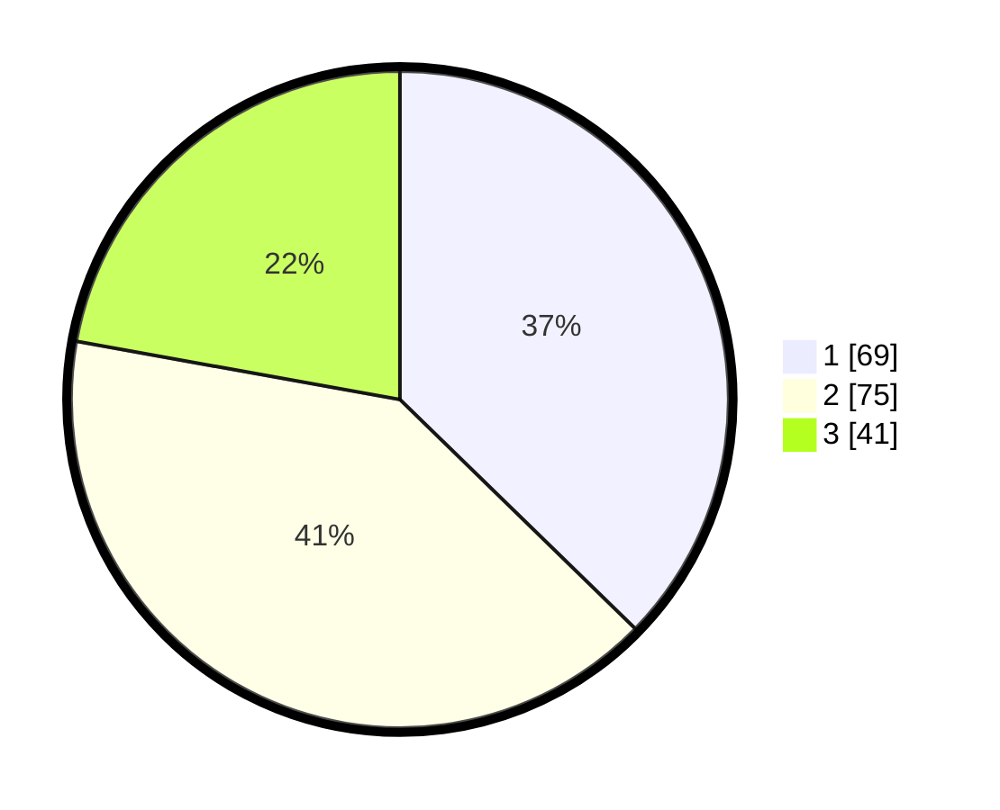

# Hasil

## Grafik

## Tabel

| No.    | Nama Paslon    | Suara | Suara (raw) | Persentase |
|:------ |:-------------- | -----:| -----------:| ----------:|
| 100025 | ANIES MUHAIMIN | 69    | [69][p-1]   | 37,30      |
| 100026 | PRABOWO GIBRAN | 75    | [75][p-2]   | 40,54      |
| 100027 | GANJAR MAHFUD  | 41    | [41][p-3]   | 22,16      |

[p-1]: https://github.com/gigit-pemilu/pemilu-2024/blob/main/pilpres/hitung-suara/sub/31-dki-jakarta/sub/73-jakarta-barat/sub/06-kalideres/sub/1005-pegadungan/sub/177-tps/sub/paslon-1.txt
[p-2]: https://github.com/gigit-pemilu/pemilu-2024/blob/main/pilpres/hitung-suara/sub/31-dki-jakarta/sub/73-jakarta-barat/sub/06-kalideres/sub/1005-pegadungan/sub/177-tps/sub/paslon-2.txt
[p-3]: https://github.com/gigit-pemilu/pemilu-2024/blob/main/pilpres/hitung-suara/sub/31-dki-jakarta/sub/73-jakarta-barat/sub/06-kalideres/sub/1005-pegadungan/sub/177-tps/sub/paslon-3.txt

## Foto C Plano

https://sirekap-obj-formc.kpu.go.id/87b8/pemilu/ppwp/31/73/06/10/05/3173061005177-20240214-193600--0d3ebd89-70df-439e-a8e1-e5be7d5900af.jpg

https://sirekap-obj-formc.kpu.go.id/87b8/pemilu/ppwp/31/73/06/10/05/3173061005177-20240214-193722--110d4201-21bf-4e14-8bb6-5640071729e6.jpg

https://sirekap-obj-formc.kpu.go.id/87b8/pemilu/ppwp/31/73/06/10/05/3173061005177-20240214-193857--dcbdbb09-e0bf-45f2-89f9-920dcb5b427d.jpg

## Metadata

| Key        | Value               |
| ---------- | ------------------- |
| Time Stamp | 2024-02-17 16:00:02 |

