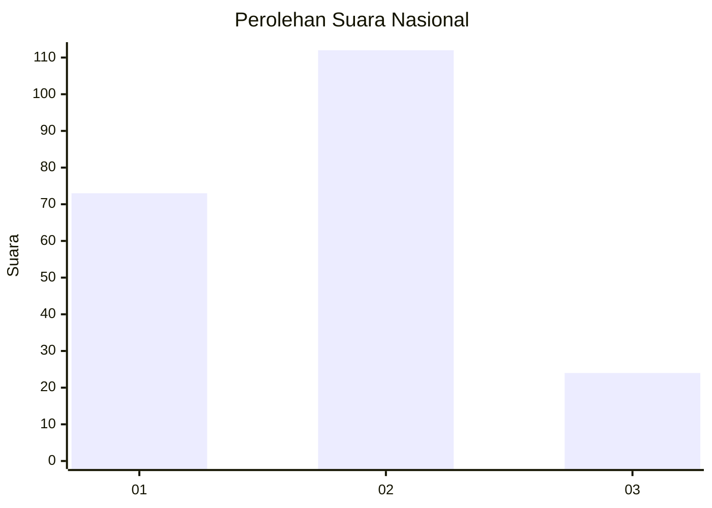
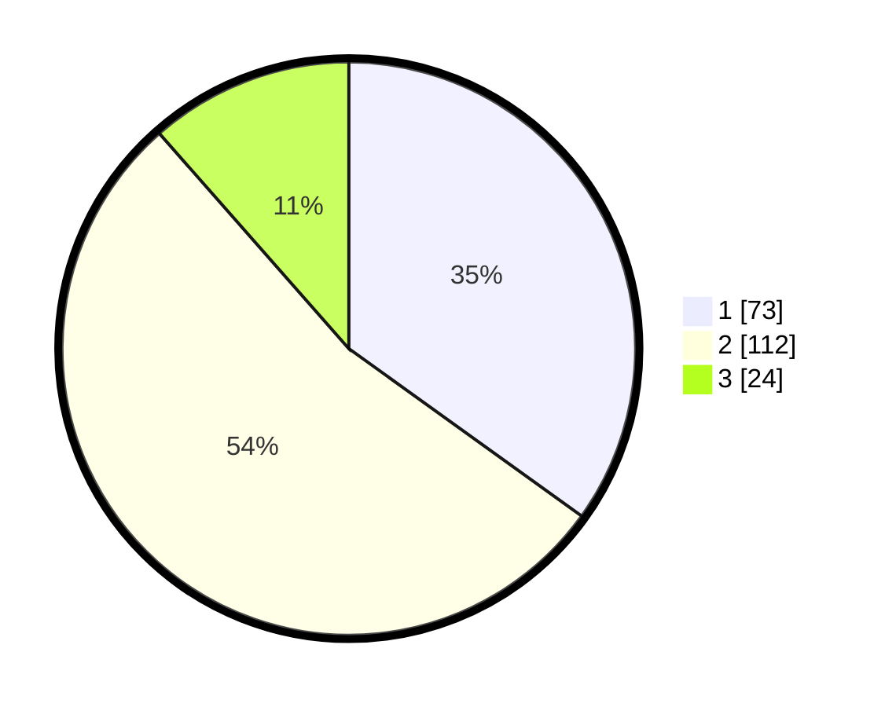

# Hasil

## Grafik

## Tabel

| No.    | Nama Paslon    | Suara | Suara (raw) | Persentase |
|:------ |:-------------- | -----:| -----------:| ----------:|
| 100025 | ANIES MUHAIMIN | 73    | [73][p-1]   | 34,93      |
| 100026 | PRABOWO GIBRAN | 112   | [112][p-2]  | 53,59      |
| 100027 | GANJAR MAHFUD  | 24    | [24][p-3]   | 11,48      |

[p-1]: https://github.com/gigit-pemilu/pemilu-2024/blob/main/pilpres/hitung-suara/sub/31-dki-jakarta/sub/73-jakarta-barat/sub/06-kalideres/sub/1005-pegadungan/sub/184-tps/sub/paslon-1.txt
[p-2]: https://github.com/gigit-pemilu/pemilu-2024/blob/main/pilpres/hitung-suara/sub/31-dki-jakarta/sub/73-jakarta-barat/sub/06-kalideres/sub/1005-pegadungan/sub/184-tps/sub/paslon-2.txt
[p-3]: https://github.com/gigit-pemilu/pemilu-2024/blob/main/pilpres/hitung-suara/sub/31-dki-jakarta/sub/73-jakarta-barat/sub/06-kalideres/sub/1005-pegadungan/sub/184-tps/sub/paslon-3.txt

## Foto C Plano

https://sirekap-obj-formc.kpu.go.id/ac1c/pemilu/ppwp/31/73/06/10/05/3173061005184-20240214-204856--7337d135-1b33-4bad-98fd-2691352943c1.jpg

https://sirekap-obj-formc.kpu.go.id/ac1c/pemilu/ppwp/31/73/06/10/05/3173061005184-20240214-205056--d6d1d1c4-c85d-41c8-8ad8-c0490cc4465a.jpg

https://sirekap-obj-formc.kpu.go.id/ac1c/pemilu/ppwp/31/73/06/10/05/3173061005184-20240214-205158--2cc949e8-f15b-477e-ad42-38e4a1f8d5a0.jpg

## Metadata

| Key        | Value               |
| ---------- | ------------------- |
| Time Stamp | 2024-02-19 14:00:00 |

