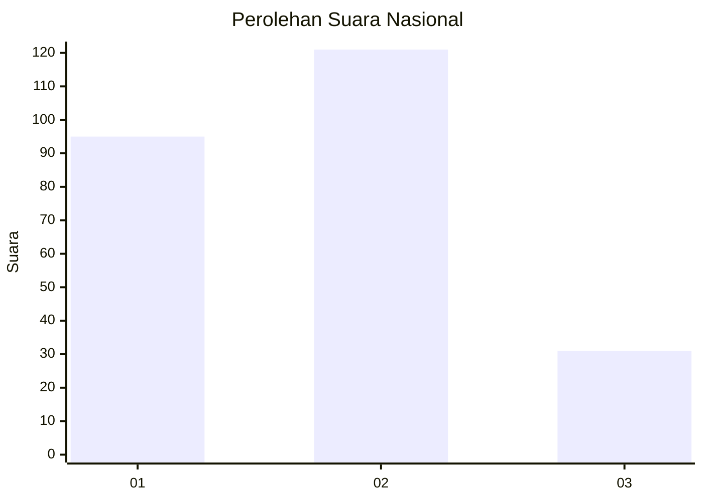
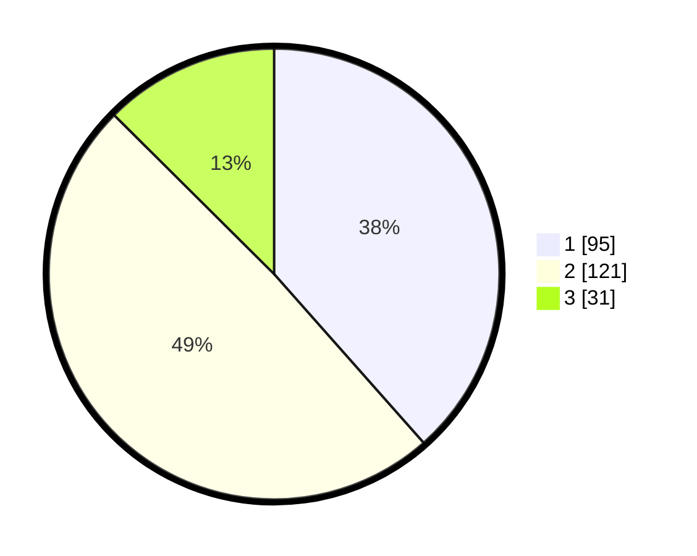

# Hasil

## Grafik

## Tabel

| No.    | Nama Paslon    | Suara | Suara (raw) | Persentase |
|:------ |:-------------- | -----:| -----------:| ----------:|
| 100025 | ANIES MUHAIMIN | 95    | [95][p-1]   | 38,46      |
| 100026 | PRABOWO GIBRAN | 121   | [121][p-2]  | 48,99      |
| 100027 | GANJAR MAHFUD  | 31    | [31][p-3]   | 12,55      |

[p-1]: https://github.com/gigit-pemilu/pemilu-2024/blob/main/pilpres/hitung-suara/sub/31-dki-jakarta/sub/73-jakarta-barat/sub/06-kalideres/sub/1005-pegadungan/sub/189-tps/sub/paslon-1.txt
[p-2]: https://github.com/gigit-pemilu/pemilu-2024/blob/main/pilpres/hitung-suara/sub/31-dki-jakarta/sub/73-jakarta-barat/sub/06-kalideres/sub/1005-pegadungan/sub/189-tps/sub/paslon-2.txt
[p-3]: https://github.com/gigit-pemilu/pemilu-2024/blob/main/pilpres/hitung-suara/sub/31-dki-jakarta/sub/73-jakarta-barat/sub/06-kalideres/sub/1005-pegadungan/sub/189-tps/sub/paslon-3.txt

## Foto C Plano

https://sirekap-obj-formc.kpu.go.id/1155/pemilu/ppwp/31/73/06/10/05/3173061005189-20240214-223952--4bcc915c-d72f-44ae-ba9b-8b454f20fb12.jpg

https://sirekap-obj-formc.kpu.go.id/1155/pemilu/ppwp/31/73/06/10/05/3173061005189-20240214-224548--81d3aca5-a36b-497e-9f41-dcd21fae87c6.jpg

https://sirekap-obj-formc.kpu.go.id/1155/pemilu/ppwp/31/73/06/10/05/3173061005189-20240214-225000--3dd3a9e6-ecc5-48c9-bf13-a8ad8a918c63.jpg

## Metadata

| Key        | Value               |
| ---------- | ------------------- |
| Time Stamp | 2024-02-19 15:00:00 |

