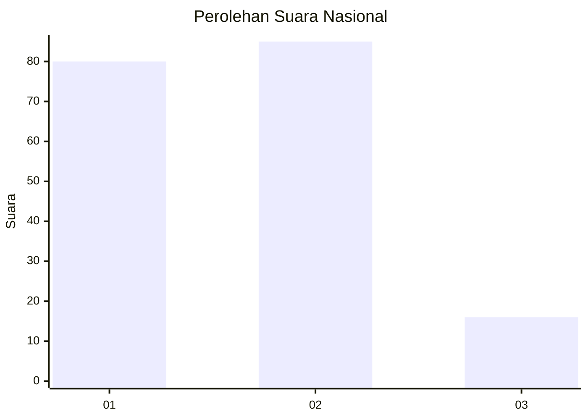
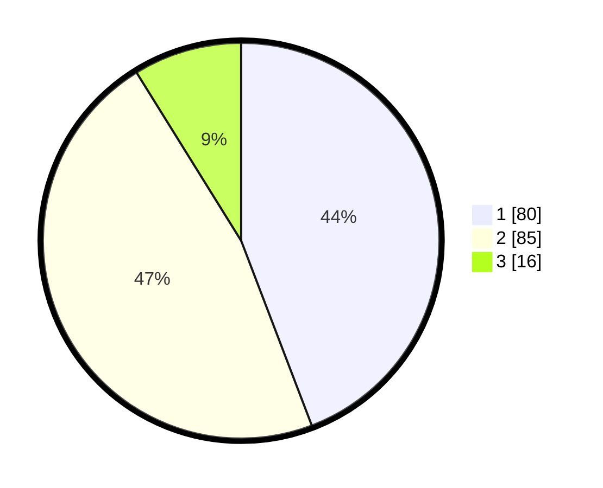

# Hasil

## Grafik

## Tabel

| No.    | Nama Paslon    | Suara | Suara (raw) | Persentase |
|:------ |:-------------- | -----:| -----------:| ----------:|
| 100025 | ANIES MUHAIMIN | 80    | [80][p-1]   | 44,20      |
| 100026 | PRABOWO GIBRAN | 85    | [85][p-2]   | 46,96      |
| 100027 | GANJAR MAHFUD  | 16    | [16][p-3]   | 8,84       |

[p-1]: https://github.com/gigit-pemilu/pemilu-2024/blob/main/pilpres/hitung-suara/sub/31-dki-jakarta/sub/73-jakarta-barat/sub/06-kalideres/sub/1005-pegadungan/sub/192-tps/sub/paslon-1.txt
[p-2]: https://github.com/gigit-pemilu/pemilu-2024/blob/main/pilpres/hitung-suara/sub/31-dki-jakarta/sub/73-jakarta-barat/sub/06-kalideres/sub/1005-pegadungan/sub/192-tps/sub/paslon-2.txt
[p-3]: https://github.com/gigit-pemilu/pemilu-2024/blob/main/pilpres/hitung-suara/sub/31-dki-jakarta/sub/73-jakarta-barat/sub/06-kalideres/sub/1005-pegadungan/sub/192-tps/sub/paslon-3.txt

## Foto C Plano

https://sirekap-obj-formc.kpu.go.id/9261/pemilu/ppwp/31/73/06/10/05/3173061005192-20240214-224846--0767d184-f053-45fd-9240-91b7e605ba49.jpg

https://sirekap-obj-formc.kpu.go.id/9261/pemilu/ppwp/31/73/06/10/05/3173061005192-20240214-225024--f5b175d2-5d4c-4ec5-9852-1ba1c13f9bd4.jpg

https://sirekap-obj-formc.kpu.go.id/9261/pemilu/ppwp/31/73/06/10/05/3173061005192-20240214-225125--c2a4c9f7-1614-44fe-94cd-8271dbe288aa.jpg

## Metadata

| Key        | Value               |
| ---------- | ------------------- |
| Time Stamp | 2024-02-19 15:00:00 |

