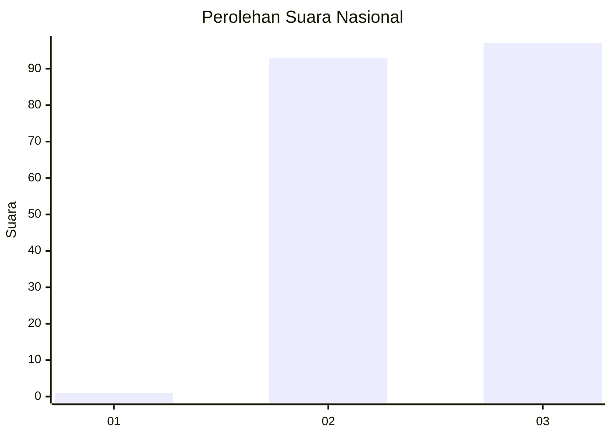
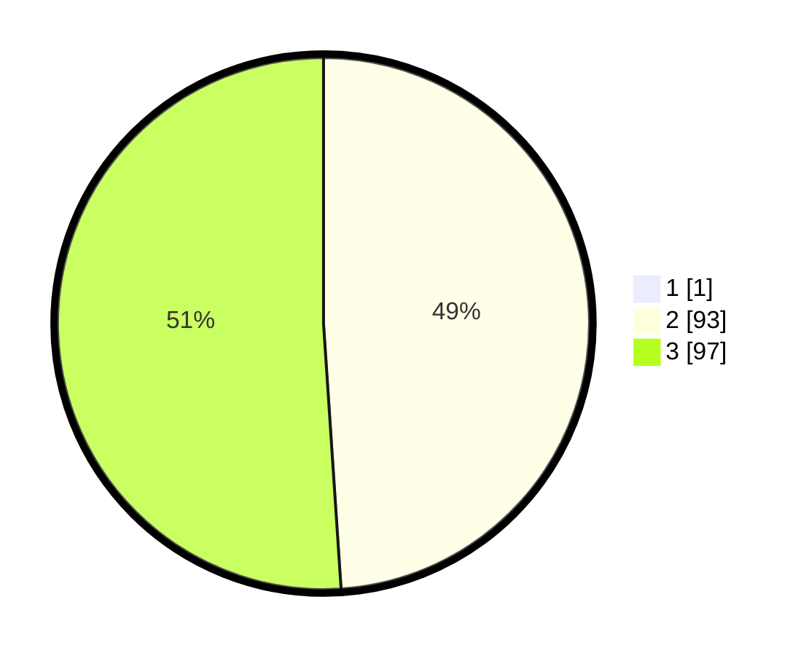

# Hasil

## Grafik

## Tabel

| No.    | Nama Paslon    | Suara | Suara (raw) | Persentase |
|:------ |:-------------- | -----:| -----------:| ----------:|
| 100025 | ANIES MUHAIMIN | 1     | [1][p-1]    | 0,52       |
| 100026 | PRABOWO GIBRAN | 93    | [93][p-2]   | 48,69      |
| 100027 | GANJAR MAHFUD  | 97    | [97][p-3]   | 50,79      |

[p-1]: https://github.com/gigit-pemilu/pemilu-2024/blob/main/pilpres/hitung-suara/sub/31-dki-jakarta/sub/73-jakarta-barat/sub/06-kalideres/sub/1005-pegadungan/sub/241-tps/sub/paslon-1.txt
[p-2]: https://github.com/gigit-pemilu/pemilu-2024/blob/main/pilpres/hitung-suara/sub/31-dki-jakarta/sub/73-jakarta-barat/sub/06-kalideres/sub/1005-pegadungan/sub/241-tps/sub/paslon-2.txt
[p-3]: https://github.com/gigit-pemilu/pemilu-2024/blob/main/pilpres/hitung-suara/sub/31-dki-jakarta/sub/73-jakarta-barat/sub/06-kalideres/sub/1005-pegadungan/sub/241-tps/sub/paslon-3.txt

## Foto C Plano

https://sirekap-obj-formc.kpu.go.id/9cde/pemilu/ppwp/31/73/06/10/05/3173061005241-20240215-124713--d583284c-8a57-438b-95f3-ba1d73efd1c6.jpg

https://sirekap-obj-formc.kpu.go.id/9cde/pemilu/ppwp/31/73/06/10/05/3173061005241-20240214-201201--d0fb312d-b100-42b3-b11f-f86f6abe2753.jpg

https://sirekap-obj-formc.kpu.go.id/9cde/pemilu/ppwp/31/73/06/10/05/3173061005241-20240214-201258--188e36ef-d702-4146-b83b-39e1d229d86c.jpg

## Metadata

| Key        | Value               |
| ---------- | ------------------- |
| Time Stamp | 2024-02-15 15:00:29 |

