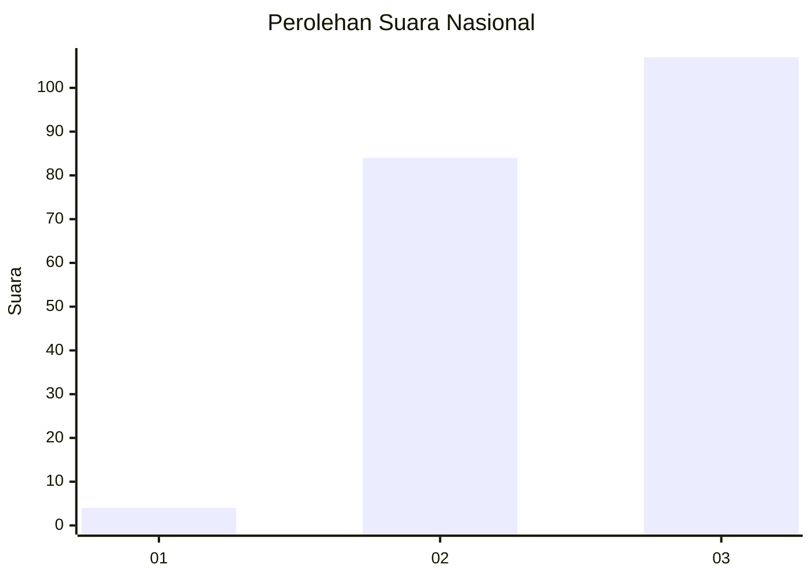
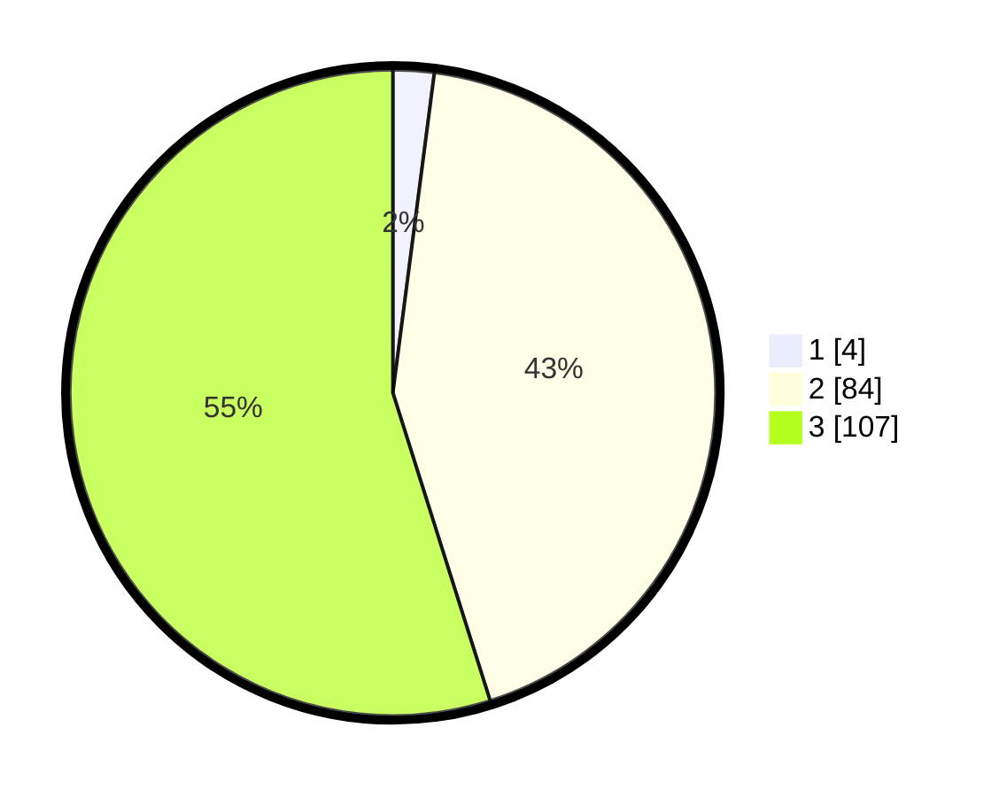

# Hasil

## Grafik

## Tabel

| No.    | Nama Paslon    | Suara | Suara (raw) | Persentase |
|:------ |:-------------- | -----:| -----------:| ----------:|
| 100025 | ANIES MUHAIMIN | 4     | [4][p-1]    | 2,05       |
| 100026 | PRABOWO GIBRAN | 84    | [84][p-2]   | 43,08      |
| 100027 | GANJAR MAHFUD  | 107   | [107][p-3]  | 54,87      |

[p-1]: https://github.com/gigit-pemilu/pemilu-2024/blob/main/pilpres/hitung-suara/sub/31-dki-jakarta/sub/73-jakarta-barat/sub/06-kalideres/sub/1005-pegadungan/sub/245-tps/sub/paslon-1.txt
[p-2]: https://github.com/gigit-pemilu/pemilu-2024/blob/main/pilpres/hitung-suara/sub/31-dki-jakarta/sub/73-jakarta-barat/sub/06-kalideres/sub/1005-pegadungan/sub/245-tps/sub/paslon-2.txt
[p-3]: https://github.com/gigit-pemilu/pemilu-2024/blob/main/pilpres/hitung-suara/sub/31-dki-jakarta/sub/73-jakarta-barat/sub/06-kalideres/sub/1005-pegadungan/sub/245-tps/sub/paslon-3.txt

## Foto C Plano

https://sirekap-obj-formc.kpu.go.id/2764/pemilu/ppwp/31/73/06/10/05/3173061005245-20240214-221059--f2df1958-8e34-44e2-8493-9024de53e5bf.jpg

https://sirekap-obj-formc.kpu.go.id/2764/pemilu/ppwp/31/73/06/10/05/3173061005245-20240214-221153--e3d5ec2f-73a7-4b96-b375-9fa61d8927d1.jpg

https://sirekap-obj-formc.kpu.go.id/2764/pemilu/ppwp/31/73/06/10/05/3173061005245-20240214-221229--ce407cae-85aa-4b38-ac13-cca7193b7b98.jpg

## Metadata

| Key        | Value               |
| ---------- | ------------------- |
| Time Stamp | 2024-02-19 15:00:00 |

